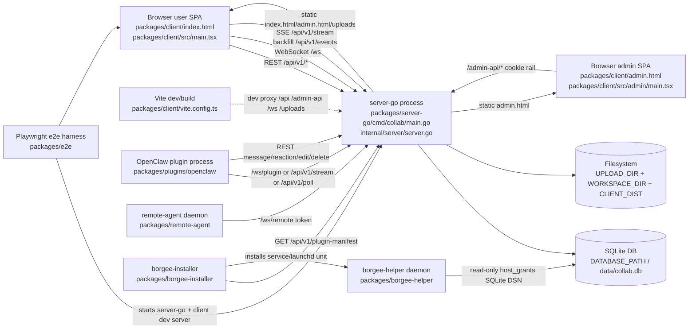

# 02 Runtime Topology

This document describes the current runtime topology as implemented in this worktree. It is code-evidence driven; do not treat older `docs/current/*` pages as source of truth unless the cited code still matches.

## Process Graph

## Browser SPAs

The user SPA is the `index.html` Vite entry, renders `src/main.tsx`, and mounts `App` from `src/App.tsx`. `App` authenticates through `fetchMe`, loads current user/permissions/channels/online users, then opens realtime through `useWebSocket` and subscribes to joined channels. Evidence: `packages/client/index.html`, `packages/client/src/main.tsx`, `packages/client/src/App.tsx`, `packages/client/src/hooks/useWebSocket.ts`.

The admin SPA is a separate Vite entry, `admin.html`, rendering `src/admin/main.tsx`. It mounts `AdminApp` under `AdminAuthProvider`; `AdminApp` routes `/admin/*` pages such as dashboard, users, channels, runtimes, heartbeat lag, audit log, and multi-source audit. Evidence: `packages/client/admin.html`, `packages/client/src/admin/main.tsx`, `packages/client/src/admin/AdminApp.tsx`, `packages/client/src/admin/api.ts`.

In dev and e2e, Vite proxies `/api`, `/admin-api`, `/health`, `/ws`, and `/uploads` to server-go. Production server-go serves static assets from `CLIENT_DIST`, selecting `admin.html` for `/admin` and `/admin/*`, otherwise falling back to `index.html` for extensionless SPA paths. Evidence: `packages/client/vite.config.ts`, `packages/server-go/internal/server/server.go` (`handleStatic`).

## server-go

The server process starts from `packages/server-go/cmd/collab/main.go`: it loads env config, opens SQLite, runs legacy and versioned migrations, bootstraps admin auth, constructs `server.New`, and listens on `HOST:PORT`. Evidence: `packages/server-go/cmd/collab/main.go`, `packages/server-go/internal/config/config.go`, `packages/server-go/internal/store/db.go`, `packages/server-go/internal/migrations/*`.

`server.New` constructs the `ws.Hub`, wires presence tracking, data-layer bundle, BPP plugin frame dispatchers, heartbeat watchdog, then calls `SetupRoutes`. The three websocket endpoints are mounted at `/ws`, `/ws/plugin`, and `/ws/remote`; REST handlers include auth, messages, channels, agents, runtimes, plugin manifest, remote nodes, poll/SSE/events, uploads, workspace files, artifacts, and admin rails. Evidence: `packages/server-go/internal/server/server.go`, `packages/server-go/internal/ws/*`, `packages/server-go/internal/api/*`.

server-go owns the primary SQLite database through `store.Open(DATABASE_PATH)`. File-backed SQLite enables WAL, foreign keys, and busy timeout; `:memory:` is single-connection for tests. Evidence: `packages/server-go/internal/store/db.go`.

server-go also owns filesystem storage: image uploads go under `UPLOAD_DIR` and are served as `/uploads/*`; workspace file bytes go under `WORKSPACE_DIR/<user>/<channel>/<file>.dat`; built SPA assets are read from `CLIENT_DIST`. Evidence: `packages/server-go/internal/api/upload.go`, `packages/server-go/internal/api/workspace.go`, `packages/server-go/internal/server/server.go`, `packages/server-go/internal/config/config.go`.

## OpenClaw Plugin

The OpenClaw package is `@codetreker/borgee-openclaw-plugin`, publishing `dist`, `openclaw.plugin.json`, and `skills`; the OpenClaw extension entry is `./dist/index.js`. Evidence: `packages/plugins/openclaw/package.json`, `packages/plugins/openclaw/openclaw.plugin.json`, `packages/plugins/openclaw/src/index.ts`.

Its channel plugin registers channel id `borgee`, supports group and direct chats, resolves account config, starts a gateway per account, and sends outbound text through Borgee REST or `/ws/plugin` RPC when a WS client is available. Evidence: `packages/plugins/openclaw/src/channel.ts`, `packages/plugins/openclaw/src/accounts.ts`, `packages/plugins/openclaw/src/gateway.ts`, `packages/plugins/openclaw/src/outbound.ts`, `packages/plugins/openclaw/src/ws-client.ts`.

Inbound OpenClaw transport is selected by account config: `auto` probes SSE and falls back to poll, `sse` forces SSE retry, `poll` forces long-poll, and code also has a `ws` branch to `/ws/plugin`. Note: `types.ts` includes `"ws"`, but `config-schema.ts` only allows `auto/sse/poll`; this is a current code mismatch. Evidence: `packages/plugins/openclaw/src/types.ts`, `packages/plugins/openclaw/src/config-schema.ts`, `packages/plugins/openclaw/src/gateway.ts`.

## remote-agent

`borgee-remote-agent` is a Node CLI that takes `--server`, `--token`, and `--dirs`, then connects to `${server}/ws/remote?token=...`. It sends client-side pings every 30s, reconnects with exponential backoff up to 30s, and responds to server `request` frames for `ls`, `read`, and `stat` against allowed local directories. Evidence: `packages/remote-agent/src/index.ts`, `packages/remote-agent/src/agent.ts`, `packages/remote-agent/src/fs-ops.ts`.

server-go creates/list/deletes remote nodes and bindings over REST, tracks online status from `Hub.remotes`, and proxies `ls`/`read` through a `RemoteConn.SendRequest` round trip. Evidence: `packages/server-go/internal/api/remote.go`, `packages/server-go/internal/ws/remote.go`, `packages/server-go/internal/server/server.go`, `packages/server-go/internal/store/queries_phase2b.go`.

Implementation note: `hubRemoteAdapter.ProxyRequest` currently sends `{action, params:{path}}`, while `remote-agent/src/agent.ts` reads `data.path` directly. That shape mismatch should be confirmed before documenting remote file proxy as fully working end to end. Evidence: `packages/server-go/internal/server/server.go` (`hubRemoteAdapter.ProxyRequest`), `packages/remote-agent/src/agent.ts` (`handleRequest`).

## borgee-helper And Installer

`borgee-helper` is a separate Go daemon for host-bridge IPC. On Linux/macOS it listens on a Unix domain socket, requires `--grants-db`, reads `host_grants` from SQLite in read-only mode, applies sandbox restrictions, then serves JSON-line IPC requests after a first-line `{agent_id}` handshake. Evidence: `packages/borgee-helper/cmd/borgee-helper/main.go`, `packages/borgee-helper/internal/ipc/ipc.go`, `packages/borgee-helper/internal/grants/sqlite_consumer.go`, `packages/borgee-helper/internal/sandbox/*`.

The helper is read-oriented at the file IO layer: `read_file` and `list_files` use real OS reads with max-byte/list-entry caps after ACL approval. Audit is JSON-line and records every request. Evidence: `packages/borgee-helper/internal/fileio/file_actions.go`, `packages/borgee-helper/internal/acl/acl.go`, `packages/borgee-helper/internal/audit/audit.go`.

The installer fetches the signed plugin/helper manifest from server-go, verifies an ed25519 detached signature, asks for permission confirmation, then runs platform deployment commands. Linux uses `.deb` plus systemd; macOS uses `.pkg` plus launchd/sandbox-exec. Evidence: `packages/borgee-installer/internal/manifest/fetcher.go`, `packages/borgee-installer/internal/dialog/dialog.go`, `packages/borgee-installer/internal/deploy/deploy.go`, `packages/borgee-installer/cmd/borgee-installer-linux/main.go`, `packages/borgee-installer/cmd/borgee-installer-darwin/main.go`, `packages/borgee-helper/install/borgee-helper.service`, `packages/borgee-helper/install/cloud.borgee.host-bridge.plist`.

## E2E Harness

Playwright e2e starts two web servers: server-go on `E2E_SERVER_PORT` default `4901` and Vite client on `E2E_CLIENT_PORT` default `5174`, with temp SQLite, upload, and workspace directories under `packages/e2e/.playwright-data`. Evidence: `packages/e2e/playwright.config.ts`, `packages/e2e/package.json`.

Browser tests exercise app load, realtime fanout/backfill, admin audit, agents, permissions, remote/host bridge coverage, and UI workflows. Helper integration tests with build tag `integration` build and start `borgee-helper`, wait for UDS readiness, perform IPC handshake, and validate sandbox/startup behavior. Evidence: `packages/e2e/tests/*`, `packages/borgee-helper/e2e/daemon_startup_test.go`, `packages/borgee-helper/e2e/ipc_handshake_test.go`, `packages/borgee-helper/e2e/sandbox_apply_test.go`.

