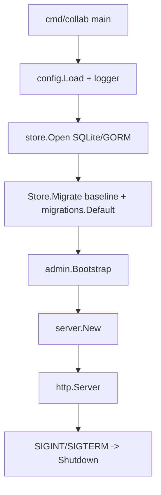
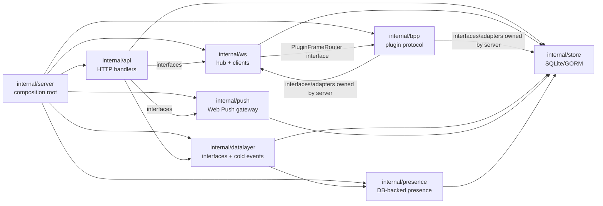

# 03. Server Architecture

This document describes the current `server-go` runtime as implemented in code. It is written for maintainers changing the server, routing, realtime, plugin, or data-layer seams.

## Startup Flow

`packages/server-go/cmd/collab/main.go` is the production entry point. It loads config, builds a text logger in development or JSON logger otherwise, opens the SQLite-backed `store.Store`, runs `Store.Migrate()`, then runs the forward-only migration engine again through `migrations.Default(s.DB()).Run(0)`. That second run is idempotent because applied versions are recorded in `schema_migrations`. Evidence: `packages/server-go/cmd/collab/main.go`, `packages/server-go/internal/store/db.go`, `packages/server-go/internal/store/migrations.go`, `packages/server-go/internal/migrations/migrations.go`.

After database migration, startup bootstraps the env-configured admin, creates a process-lifetime context, calls `server.New(ctx, cfg, logger, s)`, and serves `srv.Handler()` through `http.Server`. Shutdown waits for `SIGINT` or `SIGTERM` and calls `httpServer.Shutdown` with a 15 second timeout. Evidence: `packages/server-go/cmd/collab/main.go`, `packages/server-go/internal/admin/auth.go`.

## `server.New`

`server.New` is the composition root for server-go. It constructs the WebSocket hub, wires DB-backed presence writes into the hub, builds the `datalayer.DataLayer` bundle, creates the `Server` struct, mounts routes, and then wires plugin/BPP and background liveness jobs. Evidence: `packages/server-go/internal/server/server.go`, `packages/server-go/internal/ws/hub.go`, `packages/server-go/internal/datalayer/factory.go`, `packages/server-go/internal/presence/tracker.go`.

Construction order matters:

1. `ws.NewHub(s, logger, cfg)` creates the in-memory hub, command store, plugin and remote connection maps, event waiters, and cursor allocator seeded from `store.GetLatestCursor()`. Evidence: `packages/server-go/internal/ws/hub.go`, `packages/server-go/internal/ws/cursor.go`, `packages/server-go/internal/store/queries_phase3.go`.
2. `presence.NewSessionsTracker(s.DB())` is installed as `hub.SetPresenceWriter`; this lets `/ws` register/unregister hooks write `presence_sessions`. Evidence: `packages/server-go/internal/server/server.go`, `packages/server-go/internal/ws/hub.go`, `packages/server-go/internal/presence/tracker.go`.
3. `datalayer.NewDataLayer` builds the v1 bundle: DB-backed storage placeholder, presence wrapper, in-process event bus with SQLite cold-store consumer, and SQLite user/channel/message repositories. Evidence: `packages/server-go/internal/datalayer/factory.go`, `packages/server-go/internal/datalayer/v1_sqlite.go`, `packages/server-go/internal/datalayer/events_store.go`.
4. `SetupRoutes()` mounts all HTTP and WS routes on one `http.ServeMux`; `hub.SetHandler(srv.Handler())` then lets plugin `api_request` frames invoke the same server handler through an in-process recorder. Evidence: `packages/server-go/internal/server/server.go`, `packages/server-go/internal/ws/plugin.go`.
5. BPP plugin upstream frames are routed by `bpp.PluginFrameDispatcher`, adapted into `ws.PluginFrameRouter`, and installed on the hub. Registered frames currently include config ack, reconnect, cold-start, task started, and task finished. Evidence: `packages/server-go/internal/server/server.go`, `packages/server-go/internal/bpp/plugin_frame_dispatcher.go`, `packages/server-go/internal/ws/plugin.go`.
6. Background goroutines started from `server.New` are `hub.StartHeartbeat(ctx)` and `bpp.HeartbeatWatchdog.Run(ctx)`. More ctx-aware background jobs are started during route setup for retention, threshold monitoring, and archive offload. Evidence: `packages/server-go/internal/server/server.go`, `packages/server-go/internal/ws/hub.go`, `packages/server-go/internal/bpp/heartbeat_watchdog.go`, `packages/server-go/internal/datalayer/events_retention.go`, `packages/server-go/internal/datalayer/events_threshold.go`, `packages/server-go/internal/datalayer/events_archive_offloader.go`.

## Route Registration

All route registration is centralized in `Server.SetupRoutes`. The server package owns the mux and constructs handler structs from `internal/api`, passing only the dependencies each handler needs: `store.Store`, `datalayer.DataLayer`, logger, config, and small pusher/proxy interfaces backed by hub adapters. Evidence: `packages/server-go/internal/server/server.go`, `packages/server-go/internal/api/*`.

Major route families are:

- Public and session routes: `GET /health`, auth login/register/logout, `GET /api/v1/pwa/manifest`, static files, and uploads. Evidence: `packages/server-go/internal/server/server.go`, `packages/server-go/internal/api/auth.go`, `packages/server-go/internal/api/pwa_manifest.go`.
- User rail `/api/v1/*`: users, channels, DMs, messages, reactions, agents, runtimes, agent config, host grants, workspace, remote nodes, poll/SSE/events, push subscriptions, artifacts, anchors, artifact comments, and iterations. Evidence: `packages/server-go/internal/server/server.go`, `packages/server-go/internal/api/channels.go`, `packages/server-go/internal/api/messages.go`, `packages/server-go/internal/api/agents.go`, `packages/server-go/internal/api/runtimes.go`, `packages/server-go/internal/api/artifacts.go`, `packages/server-go/internal/api/iterations.go`.
- Admin rail `/admin-api/*`: admin auth, stats/users/invites/channels, runtime metadata, audit log, multi-source audit, retention overrides, heartbeat lag, and selected read-only admin views. Evidence: `packages/server-go/internal/server/server.go`, `packages/server-go/internal/admin/auth.go`, `packages/server-go/internal/admin/middleware.go`, `packages/server-go/internal/api/admin.go`, `packages/server-go/internal/api/admin_endpoints.go`, `packages/server-go/internal/api/admin_audit_query.go`.
- WebSocket endpoints: `/ws` for browser clients, `/ws/plugin` for plugin/agent runtime connections, and `/ws/remote` for remote nodes. Evidence: `packages/server-go/internal/server/server.go`, `packages/server-go/internal/ws/client.go`, `packages/server-go/internal/ws/plugin.go`, `packages/server-go/internal/ws/remote.go`.

The final mux fallbacks are `respondNotImplemented` for `/api/v1/`, `/uploads/` file serving, and SPA/static serving. API-like unknown paths under `/api/`, `/admin-api`, or `/ws` return JSON 404 from `handleStatic`. Evidence: `packages/server-go/internal/server/server.go`, `packages/server-go/internal/server/helpers.go`.

## Middleware And Auth Rails

Incoming HTTP requests pass through this wrapper order before the mux: recover, request ID, request logger, CORS, security headers, rate limiter, then route handler. This is the reverse of the assignment order in `Server.Handler`. Evidence: `packages/server-go/internal/server/server.go`, `packages/server-go/internal/server/middleware.go`.

User rail authentication is `auth.AuthMiddleware`. It accepts the `borgee_token` JWT cookie, `Authorization: Bearer <api_key>`, and, in development with `DevAuthBypass`, `X-Dev-User-Id` or the first member user fallback. It attaches `*store.User` to request context. Evidence: `packages/server-go/internal/auth/middleware.go`, `packages/server-go/internal/api/auth.go`.

User rail authorization uses row-based permissions from `user_permissions`. `RequirePermission` checks exact permission/scope, wildcard scope, or `(*, *)`; it explicitly does not short-circuit on `users.role == admin`. The newer ABAC helper also applies an org boundary when scope resolves to a channel or artifact. Evidence: `packages/server-go/internal/auth/permissions.go`, `packages/server-go/internal/auth/abac.go`, `packages/server-go/internal/store/queries.go`.

Admin rail authentication is separate. `admin.RequireAdmin` requires the `borgee_admin_session` cookie and resolves it through `admin_sessions` to an `admins` row; it does not use `users` records. Evidence: `packages/server-go/internal/admin/auth.go`, `packages/server-go/internal/admin/middleware.go`, `packages/server-go/internal/migrations/admin_admins.go`, `packages/server-go/internal/migrations/admin_sessions.go`.

WebSocket auth is endpoint-specific. Browser `/ws` accepts bearer API key through `Sec-WebSocket-Protocol`, `Authorization`, query `token`, user JWT cookie, or development bypass. `/ws/plugin` accepts an agent API key through bearer auth or `apiKey` query and registers the agent as a plugin connection. `/ws/remote` authenticates with a remote node connection token. Evidence: `packages/server-go/internal/ws/client.go`, `packages/server-go/internal/ws/plugin.go`, `packages/server-go/internal/ws/remote.go`.

## Layering And Call Direction

`internal/server` is allowed to import and glue together all server-side packages. It owns adapter types such as `hubBroadcastAdapter`, `hubPluginAdapter`, `hubArtifactAdapter`, `pluginFrameRouterAdapter`, `hubLivenessAdapter`, `channelScopeAdapter`, and `channelMemberFetcherAdapter`. These adapters keep `internal/api` and `internal/bpp` from importing `internal/ws` directly for most realtime pushes. Evidence: `packages/server-go/internal/server/server.go`.

`internal/api` owns HTTP request parsing, validation, permission checks, and response shapes. Most handlers call `store.Store` directly; selected newer paths accept `datalayer.DataLayer` repositories or event/storage seams while falling back to store behavior where appropriate. Realtime side effects use small interfaces such as artifact, iteration, anchor, mention, and command pushers. Evidence: `packages/server-go/internal/api/agents.go`, `packages/server-go/internal/api/users.go`, `packages/server-go/internal/api/artifacts.go`, `packages/server-go/internal/api/iterations.go`, `packages/server-go/internal/api/mention_dispatch.go`.

`internal/store` owns SQLite/GORM access, baseline schema creation, backfills, and query helpers. It is the current source of truth for core rows, permissions, hot events, remote nodes, agent invitations, admin actions, and agent state log. Evidence: `packages/server-go/internal/store/db.go`, `packages/server-go/internal/store/models.go`, `packages/server-go/internal/store/migrations.go`, `packages/server-go/internal/store/queries.go`, `packages/server-go/internal/store/agent_invitation.go`, `packages/server-go/internal/store/admin_actions.go`, `packages/server-go/internal/store/agent_state_log.go`.

`internal/ws` owns live browser clients, plugin connections, remote node connections, the event waiter channel used by poll/SSE, and cursor-allocation for realtime frames. It reads store for authentication, channel subscription checks, plugin API proxying, and remote-node lookup. Evidence: `packages/server-go/internal/ws/hub.go`, `packages/server-go/internal/ws/client.go`, `packages/server-go/internal/ws/plugin.go`, `packages/server-go/internal/ws/remote.go`, `packages/server-go/internal/ws/cursor.go`.

`internal/bpp` owns plugin protocol frame schemas, validation, and dispatch logic. It should not call REST or import API handlers directly; semantic actions route through `ActionHandler`, plugin upstream frames route through `PluginFrameDispatcher`, and server wiring supplies concrete adapters. Evidence: `packages/server-go/internal/bpp/envelope.go`, `packages/server-go/internal/bpp/dispatcher.go`, `packages/server-go/internal/bpp/plugin_frame_dispatcher.go`, `packages/server-go/internal/server/server.go`.

`internal/datalayer` is the canonical seam for future storage/event swaps. In v1 it wraps the existing `store.Store` and `presence.PresenceTracker`, and its event bus provides in-process fanout plus asynchronous persistence into cold `channel_events`/`global_events`. Evidence: `packages/server-go/internal/datalayer/doc.go`, `packages/server-go/internal/datalayer/factory.go`, `packages/server-go/internal/datalayer/v1_sqlite.go`, `packages/server-go/internal/datalayer/events_store.go`.

`internal/push` is a leaf gateway for Web Push. It reads VAPID keys from env, loads `web_push_subscriptions`, sends encrypted browser pushes, deletes dead 410/404 subscriptions, and exposes adapters for mention and agent-task notifications. Evidence: `packages/server-go/internal/push/gateway.go`, `packages/server-go/internal/push/mention_notifier.go`, `packages/server-go/internal/api/push_subscriptions.go`.

`internal/presence` is split into read and write interfaces. The DB-backed `SessionsTracker` reads and writes `presence_sessions`; the hub is the legal writer through `TrackOnline` and `TrackOffline`, while readers use `IsOnline` and `Sessions`. Evidence: `packages/server-go/internal/presence/contract.go`, `packages/server-go/internal/presence/writer.go`, `packages/server-go/internal/presence/tracker.go`, `packages/server-go/internal/ws/hub.go`.

## Realtime And BPP Paths

Browser realtime has three related paths: live WebSocket frames through `/ws`, long-poll/SSE waiters awakened by `Hub.SignalNewEvents`, and synchronous cursor backfill through `GET /api/v1/events?since=...`. The hot cursor source is the `events` table plus the hub cursor allocator. Evidence: `packages/server-go/internal/ws/hub.go`, `packages/server-go/internal/ws/cursor.go`, `packages/server-go/internal/api/poll.go`, `packages/server-go/internal/store/queries_phase3.go`.

Plugin realtime uses `/ws/plugin`. RPC-style frames (`api_request`, `api_response`, `response`, `ping`, `pong`) stay in `ws/plugin.go`; plugin-upstream BPP frames with payload-direct shape are forwarded to `PluginFrameDispatcher`. Evidence: `packages/server-go/internal/ws/plugin.go`, `packages/server-go/internal/bpp/plugin_frame_dispatcher.go`.

BPP task lifecycle frames (`task_started`, `task_finished`) are validated in `internal/bpp`, then fan out as `agent_task_state_changed` through the hub and as best-effort Web Push through `push.AgentTaskNotifier`. The task path does not write a separate device-specific channel. Evidence: `packages/server-go/internal/bpp/task_lifecycle.go`, `packages/server-go/internal/bpp/task_lifecycle_handler.go`, `packages/server-go/internal/ws/agent_task_state_changed_frame.go`, `packages/server-go/internal/push/mention_notifier.go`, `packages/server-go/internal/server/server.go`.

Reconnect and cold-start BPP frames are also plugin-upstream dispatchers. Reconnect uses RT resume logic and clears in-memory agent error state; cold-start does not replay history, appends state-log transition where needed, and clears the tracker. Evidence: `packages/server-go/internal/bpp/reconnect_handler.go`, `packages/server-go/internal/bpp/cold_start_handler.go`, `packages/server-go/internal/bpp/session_resume.go`, `packages/server-go/internal/store/agent_state_log.go`.

## Background Jobs

Background jobs are ctx-aware and are launched from the server lifetime context. Current jobs include hub heartbeat pings, BPP heartbeat watchdog, permission retention sweeper, heartbeat retention sweeper, data-layer event retention sweeper, DB threshold monitor, and cold archive offloader. Evidence: `packages/server-go/internal/server/server.go`, `packages/server-go/internal/ws/hub.go`, `packages/server-go/internal/bpp/heartbeat_watchdog.go`, `packages/server-go/internal/auth/expires_sweeper.go`, `packages/server-go/internal/auth/heartbeat_retention_sweeper.go`, `packages/server-go/internal/datalayer/events_retention.go`, `packages/server-go/internal/datalayer/events_threshold.go`, `packages/server-go/internal/datalayer/events_archive_offloader.go`.

