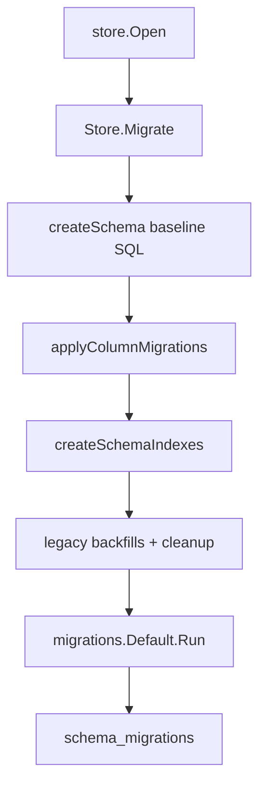

# 04. Data Model And Migrations

This document describes the current SQLite/GORM store, migration layers, and event boundaries in `server-go`. It only documents behavior verified against code.

## Store Runtime

`store.Open` creates a GORM SQLite connection. File-backed databases enable WAL; all databases enable foreign keys and a 5s busy timeout. In-memory SQLite uses a single open connection because each SQLite in-memory connection would otherwise see a separate database. Evidence: `packages/server-go/internal/store/db.go`.

`Store` exposes the underlying `*gorm.DB` through `DB()`. Many handlers still use typed query helpers, while artifact, runtime, admin, and data-layer code also issue raw SQL against this handle for tables that do not yet have full GORM models. Evidence: `packages/server-go/internal/store/db.go`, `packages/server-go/internal/api/artifacts.go`, `packages/server-go/internal/api/runtimes.go`, `packages/server-go/internal/datalayer/events_store.go`.

## Migration Layers



There are two migration systems in the current server:

- The legacy baseline migration in `Store.Migrate()` creates the original tables, applies guarded column additions, creates indexes, runs backfills, and does cleanup of legacy duplicate DMs. Evidence: `packages/server-go/internal/store/migrations.go`.
- The forward-only migration engine in `internal/migrations` registers immutable numbered migrations, creates `schema_migrations`, skips already-applied versions, and runs each pending migration in its own transaction. Evidence: `packages/server-go/internal/migrations/migrations.go`, `packages/server-go/internal/migrations/registry.go`.

The production entry point calls both: `Store.Migrate()` already invokes `migrations.Default(s.db).Run(0)`, and `cmd/collab/main.go` invokes `migrations.Default(s.DB()).Run(0)` again after that. The second forward-only call is safe because `schema_migrations` records applied versions. Evidence: `packages/server-go/internal/store/migrations.go`, `packages/server-go/cmd/collab/main.go`, `packages/server-go/internal/migrations/migrations.go`.

The baseline schema creates `channels`, `users`, `messages`, `channel_members`, `mentions`, `events`, `user_permissions`, `invite_codes`, `message_reactions`, `workspace_files`, `remote_nodes`, `remote_bindings`, and `channel_groups`. Evidence: `packages/server-go/internal/store/migrations.go`.

The forward-only registry currently starts with an inert marker and then adds organizations, agent invitations, admins, admin sessions, onboarding/default permissions/org backfills, channel org scoping, presence sessions, artifacts, message mentions, agent runtime/config/status/state tables, admin audit tables, web push subscriptions, edit history, channel/global cold events, and capability backfills. Evidence: `packages/server-go/internal/migrations/registry.go`, `packages/server-go/internal/migrations/*`.

Forward-only migration rules are strict: versions must be positive and unique, names and `Up` functions are required, already-applied migrations are not edited, and there is no `Down()`. Evidence: `packages/server-go/internal/migrations/migrations.go`, `packages/server-go/internal/migrations/registry.go`.

## Core Models

| Area | Current storage | Notes and evidence |
| --- | --- | --- |
| User and Agent | `users` GORM model | Humans and agents share `users`; agents use `role='agent'`, `owner_id`, and API key. Users carry `org_id`, soft-delete, disabled flag, auth fields, and display metadata. Evidence: `packages/server-go/internal/store/models.go`, `packages/server-go/internal/api/agents.go`, `packages/server-go/internal/store/queries.go`. |
| Channel | `channels`, `channel_members`, `channel_groups`, `user_channel_layout` | Channels carry name/topic/visibility/type/creator/org/position/group/archive/description-history. Members are `(channel_id,user_id)` and include `silent` and `org_id_at_join`; layout is per-user channel preference. Evidence: `packages/server-go/internal/store/models.go`, `packages/server-go/internal/migrations/channel_channels_org_scoped.go`, `packages/server-go/internal/migrations/channel_user_channel_layout.go`, `packages/server-go/internal/api/channels.go`. |
| Message | `messages`, `message_reactions`, legacy `mentions`, new `message_mentions` | Messages are channel-scoped and org-stamped. `CreateMessageFull` writes a message, legacy mentions, and hot `events`; DM-2 mention dispatch writes `message_mentions` for `@<id>` targets. Evidence: `packages/server-go/internal/store/models.go`, `packages/server-go/internal/store/queries.go`, `packages/server-go/internal/migrations/message_mentions.go`, `packages/server-go/internal/api/mention_dispatch.go`. |
| Mention | `mentions` and `message_mentions` | `mentions` is part of the baseline model and stores `message_id/user_id/channel_id`; `message_mentions` is the forward-only DM-2 table with `target_user_id`, created-at, and uniqueness on `(message_id,target_user_id)`. Evidence: `packages/server-go/internal/store/models.go`, `packages/server-go/internal/store/migrations.go`, `packages/server-go/internal/migrations/message_mentions.go`. |
| Hot Event | `events` | Hot realtime events use an autoincrement `cursor`, `kind`, `channel_id`, JSON payload, and `created_at`. Poll/SSE/backfill query this table by cursor and channel membership. Evidence: `packages/server-go/internal/store/models.go`, `packages/server-go/internal/store/migrations.go`, `packages/server-go/internal/store/queries_phase3.go`, `packages/server-go/internal/api/poll.go`. |
| Cold Event | `channel_events`, `global_events` | Cold data-layer events use ULID-like `lex_id`, kind, JSON payload, created-at, optional `retention_days`, and either `channel_id` or global scope. Evidence: `packages/server-go/internal/migrations/channel_events.go`, `packages/server-go/internal/migrations/global_events.go`, `packages/server-go/internal/datalayer/events_store.go`. |
| Remote Node | `remote_nodes`, `remote_bindings` | Remote nodes belong to a user, carry a connection token and org stamp, and are exposed over `/ws/remote`; bindings attach node paths to channels. Evidence: `packages/server-go/internal/store/models.go`, `packages/server-go/internal/store/queries_phase2b.go`, `packages/server-go/internal/ws/remote.go`, `packages/server-go/internal/api/remote.go`. |
| Artifact | `artifacts`, `artifact_versions`, `artifact_anchors`, `anchor_comments`, message-backed comments | Artifacts are channel-scoped Markdown docs with current body/version and lock columns; versions are append-only. Anchors and comments use their own tables. Artifact comments are stored as `messages` in virtual `artifact:<id>` channels. Evidence: `packages/server-go/internal/migrations/canvas_artifacts.go`, `packages/server-go/internal/migrations/canvas_anchor_comments.go`, `packages/server-go/internal/api/artifacts.go`, `packages/server-go/internal/api/anchors.go`, `packages/server-go/internal/api/artifact_comments.go`. |
| Iteration | `artifact_iterations` | Iterations are per-artifact agent work requests with target agent, state (`pending/running/completed/failed`), created artifact version, error reason, and completion timestamp. Evidence: `packages/server-go/internal/migrations/canvas_artifact_iterations.go`, `packages/server-go/internal/api/iterations.go`. |
| Admin | `admins`, `admin_sessions`, `admin_actions`, `impersonation_grants` | Admins are not users. Admin sessions are opaque cookie tokens. Admin actions are forward-only audit rows with actor admin, target user, action enum, metadata, and timestamp; impersonation grants are separate. Evidence: `packages/server-go/internal/migrations/admin_admins.go`, `packages/server-go/internal/migrations/admin_sessions.go`, `packages/server-go/internal/migrations/admin_actions.go`, `packages/server-go/internal/migrations/admin_impersonation_grants.go`, `packages/server-go/internal/store/admin_actions.go`, `packages/server-go/internal/admin/middleware.go`. |
| Agent State | `agent_runtimes`, `agent_status`, `agent_state_log`, `agent_configs`, `presence_sessions`, `agent_invitations` | Runtime process metadata, busy/idle task state, forward-only state transitions, Borgee-owned config blob, live sessions, and cross-channel invitations are separate tables. Evidence: `packages/server-go/internal/migrations/agent_runtimes.go`, `packages/server-go/internal/migrations/agent_status.go`, `packages/server-go/internal/migrations/agent_state_log.go`, `packages/server-go/internal/migrations/agent_configs.go`, `packages/server-go/internal/migrations/agent_presence_sessions.go`, `packages/server-go/internal/migrations/community_agent_invitations.go`, `packages/server-go/internal/store/agent_state_log.go`, `packages/server-go/internal/store/agent_invitation.go`. |

## Store Query Conventions

Typed store helpers are the main business data boundary for users, channels, messages, permissions, remote nodes, invitations, admin actions, and agent state logs. Evidence: `packages/server-go/internal/store/queries.go`, `packages/server-go/internal/store/queries_phase2b.go`, `packages/server-go/internal/store/queries_phase3.go`, `packages/server-go/internal/store/agent_invitation_queries.go`, `packages/server-go/internal/store/admin_actions.go`, `packages/server-go/internal/store/agent_state_log.go`.

Org ownership is stamped onto resource rows and checked by direct `org_id` helpers rather than joins through owner IDs. The code treats empty org IDs as legacy/permissive and only rejects when both sides are non-empty and different. Evidence: `packages/server-go/internal/store/models.go`, `packages/server-go/internal/store/queries_cm3.go`, `packages/server-go/internal/auth/abac.go`.

Permission reads use `ListUserPermissions`, which filters out `revoked_at IS NOT NULL`. `RequirePermission` and `HasCapability` sit above that list and do not read expired grants directly. Evidence: `packages/server-go/internal/store/queries.go`, `packages/server-go/internal/auth/permissions.go`, `packages/server-go/internal/auth/abac.go`, `packages/server-go/internal/migrations/permission_user_permissions_revoked.go`.

## Agent State Model

There are three separate state concepts and they should not be collapsed:

- Live connection state is derived from hub plugin presence plus in-memory `agent.Tracker` errors. Evidence: `packages/server-go/internal/agent/state.go`, `packages/server-go/internal/server/server.go`, `packages/server-go/internal/ws/hub.go`.
- Process/runtime state is persisted in `agent_runtimes` with `registered/running/stopped/error`, heartbeat, endpoint, process kind, and last error reason. Evidence: `packages/server-go/internal/migrations/agent_runtimes.go`, `packages/server-go/internal/api/runtimes.go`.
- Task busy/idle state is represented by BPP `task_started/task_finished`, WS `agent_task_state_changed`, and `agent_status`/`agent_state_log` support tables; task validation lives in `internal/bpp`. Evidence: `packages/server-go/internal/bpp/task_lifecycle.go`, `packages/server-go/internal/bpp/task_lifecycle_handler.go`, `packages/server-go/internal/ws/agent_task_state_changed_frame.go`, `packages/server-go/internal/migrations/agent_status.go`, `packages/server-go/internal/store/agent_state_log.go`.

The canonical agent state-log graph accepts initial online/offline, online to busy/idle/error/offline, busy to idle/error/offline, idle to busy/error/offline, error to online/offline, and offline to online. Error transitions require one of the six reason literals from `internal/agent/reasons`. Evidence: `packages/server-go/internal/store/agent_state_log.go`, `packages/server-go/internal/agent/reasons/reasons.go`.

## Hot Events Versus Cold DataLayer Events

```mermaid
flowchart LR
  write[API or WS write]
  store[store.Event in events table]
  hub[ws.Hub SignalNewEvents]
  clients[/ws + poll/SSE + /events backfill]
  bus[datalayer.EventBus.Publish]
  subs[in-process subscribers]
  cold[channel_events/global_events]
  retention[retention + archive jobs]

  write --> store --> hub --> clients
  write --> bus --> subs
  bus --> cold --> retention
```

The hot realtime stream is the legacy `events` table plus `ws.Hub` signaling. `events.cursor` is an autoincrement integer; `CursorAllocator` seeds from `MAX(events.cursor)` and then hands out monotonic in-memory cursors for WS frames. Poll, SSE, and backfill read `events` with `cursor > since` and channel membership filters. Evidence: `packages/server-go/internal/store/models.go`, `packages/server-go/internal/store/queries_phase3.go`, `packages/server-go/internal/ws/cursor.go`, `packages/server-go/internal/api/poll.go`.

Hot writes are not all implemented the same way. `CreateMessageFull` inserts a message and hot `events` rows in one transaction; some WS frame pushes allocate a cursor and signal waiters without necessarily inserting a matching `events` row at that call site. Maintainers should inspect the caller before assuming a pushed frame is replayable from `events`. Evidence: `packages/server-go/internal/store/queries.go`, `packages/server-go/internal/ws/mention_pushed_frame.go`, `packages/server-go/internal/ws/agent_task_state_changed_frame.go`, `packages/server-go/internal/ws/cursor.go`.

The cold data-layer stream is only on the `datalayer.EventBus.Publish` path. Publish first performs best-effort in-process fanout to topic subscribers; then, when constructed with an `EventStore`, it asynchronously persists to `channel_events` or `global_events`. Evidence: `packages/server-go/internal/datalayer/eventbus.go`, `packages/server-go/internal/datalayer/v1_sqlite.go`, `packages/server-go/internal/datalayer/events_store.go`, `packages/server-go/internal/datalayer/factory.go`.

Cold event routing is kind-based. `channel.*` and `message.*` kinds go to `channel_events` when a channel id is available in topic form `<kind>:<channelID>`; everything else goes to `global_events`. Evidence: `packages/server-go/internal/datalayer/events_store.go`, `packages/server-go/internal/datalayer/v1_sqlite.go`.

The cold event policy defines must-persist prefixes (`perm.`, `impersonate.`, `agent.state`, `admin.force_`) and default retention windows: channel/message 30 days, agent_task/artifact 60 days, other 90 days, must-persist never. Evidence: `packages/server-go/internal/datalayer/must_persist_kinds.go`.

Implementation note: current SQLite `EventStore` inserts do not set `retention_days`, while `EventsRetentionSweeper.RunOnce` only deletes rows where `retention_days IS NOT NULL AND retention_days >= 0`. The per-kind retention policy exists in code, but the current write path does not apply it to inserted rows. Evidence: `packages/server-go/internal/datalayer/events_store.go`, `packages/server-go/internal/datalayer/events_retention.go`, `packages/server-go/internal/datalayer/must_persist_kinds.go`.

Cold archive offload is separate from retention. It watches `channel_events` row count, attaches an archive SQLite database when over threshold, copies old rows into `events_archive_<yyyy-mm>.db`, deletes copied source rows, and emits an `events.archive_offload` audit through `EventBus`. Evidence: `packages/server-go/internal/datalayer/events_archive_offloader.go`, `packages/server-go/internal/server/server.go`.

## Migration Checklist For Maintainers

When adding schema, append a new migration under `packages/server-go/internal/migrations/`, register it in `registry.go`, and do not edit already-applied migration bodies. The engine validates version uniqueness and records completed versions in `schema_migrations`. Evidence: `packages/server-go/internal/migrations/migrations.go`, `packages/server-go/internal/migrations/registry.go`.

When changing baseline model structs, verify both the legacy baseline SQL and any forward-only migrations that later alter the same table. For example, `store.Channel` includes fields from baseline `channels`, legacy column migrations, and forward-only migrations for org scoping, archive, and description history. Evidence: `packages/server-go/internal/store/models.go`, `packages/server-go/internal/store/migrations.go`, `packages/server-go/internal/migrations/channel_channels_org_scoped.go`, `packages/server-go/internal/migrations/channels_description_edit_history.go`.

When adding realtime features, decide explicitly whether the event belongs to hot `events`, cold `channel_events/global_events`, both, or neither. A WS frame alone is not automatically a cold data-layer event, and an `EventBus.Publish` call is not automatically a legacy `events.cursor` row. Evidence: `packages/server-go/internal/ws/hub.go`, `packages/server-go/internal/ws/cursor.go`, `packages/server-go/internal/datalayer/v1_sqlite.go`, `packages/server-go/internal/datalayer/events_store.go`.

