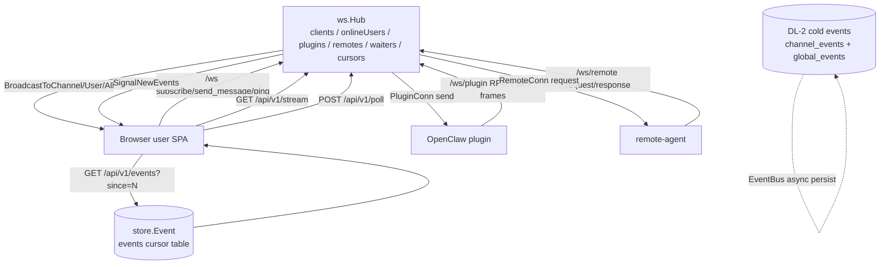
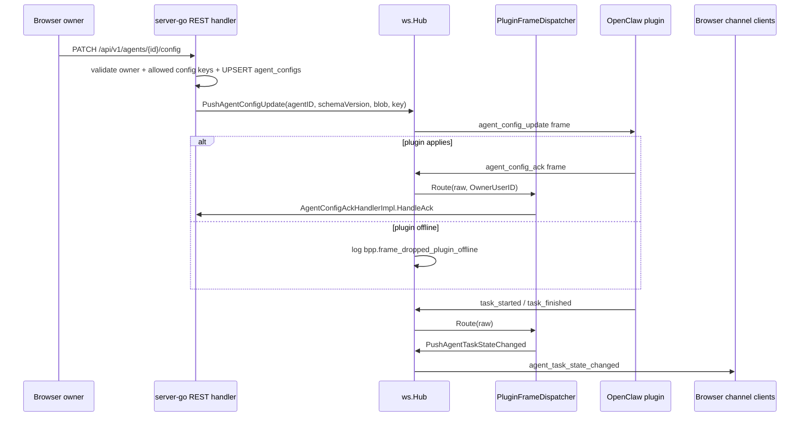

# 06 Realtime And BPP

This document covers the current realtime planes: browser websocket, plugin websocket, remote-agent websocket, event cursor fallback, and BPP frame handling.

## Endpoint Topology

## Hub Object Model

`ws.Hub` owns five in-memory coordination maps: browser `clients`, `onlineUsers`, plugin connections by `agentID`, remote connections by `nodeID`, and long-poll/SSE event waiters. It also owns the shared `CursorAllocator`, command store, presence writer, and plugin BPP frame router. Evidence: `packages/server-go/internal/ws/hub.go`.

Browser clients are `Client` objects with user id, session id, optional agent id, subscribed channel set, send queue, and heartbeat liveness flag. Register/unregister updates in-memory maps and, when wired, `presence_sessions` through the presence writer. Evidence: `packages/server-go/internal/ws/client.go`, `packages/server-go/internal/ws/hub.go`, `packages/server-go/internal/server/server.go`.

Plugin connections are `PluginConn` objects with agent id, API key, send queue, pending request map, and `lastSeenAt`. Every inbound frame updates `lastSeenAt`; the BPP heartbeat watchdog reads a snapshot through `Hub.SnapshotPluginLastSeen`. Evidence: `packages/server-go/internal/ws/plugin.go`, `packages/server-go/internal/ws/hub.go`, `packages/server-go/internal/bpp/heartbeat_watchdog.go`.

Remote connections are `RemoteConn` objects with node id, user id, send queue, and pending request map. REST remote-node handlers call `hubRemoteAdapter`, which checks `Hub.GetRemote` and uses `RemoteConn.SendRequest`. Evidence: `packages/server-go/internal/ws/remote.go`, `packages/server-go/internal/server/server.go`, `packages/server-go/internal/api/remote.go`.

## `/ws` Browser Socket

`/ws` authenticates by WebSocket subprotocol `Bearer,<api_key>`, `Authorization: Bearer`, `?token=`, auth cookie, or development bypass. After accept, the server registers a `Client`, updates last seen, broadcasts presence, starts a write pump, then reads JSON messages. Evidence: `packages/server-go/internal/ws/client.go`.

Supported browser inbound message types are `ping`, `pong`, `subscribe`, `unsubscribe`, `typing`, `send_message`, and `register_commands`. `send_message` validates channel membership/content type, writes the message, inserts a `store.Event`, calls `SignalNewEvents`, and broadcasts `new_message` to subscribed clients. Evidence: `packages/server-go/internal/ws/client.go`, `packages/server-go/internal/store/models.go`, `packages/server-go/internal/store/queries.go`.

The Hub heartbeat ticks every 30s. On each tick it calls `CheckAlive`; alive clients receive `{"type":"ping"}`, and stale clients are closed asynchronously. Evidence: `packages/server-go/internal/ws/hub.go` (`StartHeartbeat`, `heartbeatTick`).

## `/ws/plugin` Plugin Socket

`/ws/plugin` authenticates by `Authorization: Bearer` or `?apiKey=`, resolves the API key to a user, registers that user id as the plugin `agentID`, and reads frames. Evidence: `packages/server-go/internal/ws/plugin.go`.

There are two wire shapes on this socket. RPC frames use `{type,id,data}` for `api_request`, `api_response`, and `response`; `api_request` is replayed into the server HTTP handler with the plugin API key as bearer auth. BPP frames use `{type,...payload-fields}` and are sent to `PluginFrameDispatcher` through the Hub's `PluginFrameRouter` seam. Evidence: `packages/server-go/internal/ws/plugin.go`, `packages/server-go/internal/server/server.go`, `packages/server-go/internal/bpp/plugin_frame_dispatcher.go`.

Current server boot registers plugin-upstream BPP dispatchers for `agent_config_ack`, `reconnect_handshake`, `cold_start_handshake`, `task_started`, and `task_finished`. Unknown BPP frame types are logged and soft-skipped for forward compatibility. Evidence: `packages/server-go/internal/server/server.go`, `packages/server-go/internal/bpp/plugin_frame_dispatcher.go`, `packages/server-go/internal/bpp/agent_config_ack_dispatcher.go`, `packages/server-go/internal/bpp/reconnect_handler.go`, `packages/server-go/internal/bpp/cold_start_handler.go`, `packages/server-go/internal/bpp/task_lifecycle_handler.go`.

## `/ws/remote` Remote-Agent Socket

`/ws/remote` authenticates a remote node by bearer token or `?token=`, looks up `remote_nodes.connection_token`, updates `last_seen_at`, registers a `RemoteConn`, and handles `ping`, `pong`, and `response`. Server REST routes for `ls` and `read` send `request` frames through this connection and map remote error strings to HTTP errors. Evidence: `packages/server-go/internal/ws/remote.go`, `packages/server-go/internal/api/remote.go`, `packages/server-go/internal/store/queries_phase3.go`.

The Node remote-agent connects to `/ws/remote?token=...`, sends pings every 30s, reconnects with exponential backoff, and handles `request` actions `ls`, `read`, and `stat` against allowed directories. Evidence: `packages/remote-agent/src/agent.ts`, `packages/remote-agent/src/fs-ops.ts`.

## Event Cursor, SSE, Poll, Backfill

The hot fallback cursor is the `store.Event.Cursor` primary key with SQLite autoincrement. `Store.GetEventsSince`, `GetEventsSinceWithChanges`, `GetLatestCursor`, and `GetEventCursorForMessage` back `/poll`, `/stream`, and `/events`. Evidence: `packages/server-go/internal/store/models.go`, `packages/server-go/internal/store/queries_phase3.go`, `packages/server-go/internal/api/poll.go`.

`CursorAllocator` is a separate in-memory allocator seeded from `Store.GetLatestCursor()`. It is used for typed push frames such as `artifact_updated`, `agent_config_update`, `permission_denied`, and `agent_task_state_changed`; artifact pushes also dedupe `(artifact_id, version)` to a stable cursor. Evidence: `packages/server-go/internal/ws/cursor.go`, `packages/server-go/internal/ws/agent_config_push.go`, `packages/server-go/internal/ws/permission_denied_frame.go`, `packages/server-go/internal/ws/agent_task_state_changed_frame.go`.

`POST /api/v1/poll` accepts bearer/body API key/cookie auth, `cursor` or `since_id`, optional `timeout_ms`, and optional `channel_ids`. It filters to accessible channels, fetches up to 100 events, and if empty waits on `Hub.SubscribeEvents` until signal, request cancel, or timeout; timeout is clamped to 60s. Evidence: `packages/server-go/internal/api/poll.go`.

`GET /api/v1/stream` is SSE. It subscribes to Hub event waiters and snapshots `Store.GetLatestCursor()` before writing the `:connected` comment, so client writes cannot fall into the subscribe/snapshot race. It sends 15s heartbeat events, refreshes channel membership every 60s, supports `Last-Event-ID` backfill, and emits `event: <kind>`, `id: <cursor>`, `data: <payload>`. Evidence: `packages/server-go/internal/api/poll.go`.

`GET /api/v1/events?since=N&limit=M` is synchronous reconnect backfill. It requires `since`, returns only `cursor > since`, filters to the user's channels, clamps limit to 500, and uses the same response shape as poll. Evidence: `packages/server-go/internal/api/poll.go`, `packages/server-go/internal/api/events_backfill_test.go`.

The data-layer EventBus is a separate hot/cold stream. `InProcessEventBus.Publish` fans out in memory and asynchronously persists to `channel_events` or `global_events`; this supports admin/multi-source audit and retention/offload paths, not the `/poll` `store.Event` cursor path. Evidence: `packages/server-go/internal/datalayer/eventbus.go`, `packages/server-go/internal/datalayer/v1_sqlite.go`, `packages/server-go/internal/datalayer/events_store.go`, `packages/server-go/internal/api/admin_audit_query.go`.

## BPP Envelope And Frame Lifecycle

BPP frame structs and direction locks live in `internal/bpp/envelope.go`. Server-to-plugin frames include `connect`, `agent_register`, `runtime_schema_advertise`, `agent_config_update`, `agent_toggle`, `inbound_message`, and `permission_denied`; plugin-to-server frames include `heartbeat`, `semantic_action`, `error_report`, `agent_config_ack`, `task_started`, `task_finished`, `reconnect_handshake`, and `cold_start_handshake`. Evidence: `packages/server-go/internal/bpp/envelope.go`.

The server does not currently register a handler for every plugin-to-server envelope. Liveness is updated for every inbound `/ws/plugin` frame before dispatch, but BPP `heartbeat` itself is not registered as a `PluginFrameDispatcher` handler in `server.New`; the watchdog uses `PluginConn.lastSeenAt`. Evidence: `packages/server-go/internal/ws/plugin.go`, `packages/server-go/internal/server/server.go`, `packages/server-go/internal/bpp/heartbeat_watchdog.go`.

`session.resume` and `session.resume_ack` are modeled separately in `internal/bpp/frame_schemas.go`; `ResolveResume` implements `incremental`, `none`, and explicit `full` replay over `Store.GetEventsSince`, defaulting unknown modes to incremental, never full. Evidence: `packages/server-go/internal/bpp/frame_schemas.go`, `packages/server-go/internal/bpp/session_resume.go`.

## Heartbeat, Reconnect, Cold Start

The browser `/ws` heartbeat is server-driven every 30s and closes stale browser clients. Evidence: `packages/server-go/internal/ws/hub.go`.

Plugin liveness is watchdog-driven: `HeartbeatWatchdog` scans `Hub.SnapshotPluginLastSeen()` every 10s and marks stale plugin agents as error with `network_unreachable` after 30s. The watchdog does not cancel in-flight tasks. Evidence: `packages/server-go/internal/bpp/heartbeat_watchdog.go`, `packages/server-go/internal/server/server.go`, `packages/server-go/internal/agent/state.go`.

BPP reconnect is a plugin-upstream `reconnect_handshake` carrying `last_known_cursor`. The handler verifies owner, logs cursor regression but does not reject it, resolves resume in incremental mode through `ResolveResume`, then clears the agent error state. Evidence: `packages/server-go/internal/bpp/reconnect_handler.go`, `packages/server-go/internal/bpp/session_resume.go`, `packages/server-go/internal/server/server.go`.

BPP cold start is a plugin-upstream `cold_start_handshake` with no cursor. The handler verifies owner, derives the current state from agent state log, appends a transition to `online` with reason `runtime_crashed` when needed, clears in-memory error state, and intentionally does not replay history. Evidence: `packages/server-go/internal/bpp/cold_start_handler.go`, `packages/server-go/internal/bpp/envelope.go`, `packages/server-go/internal/agent/reasons/reasons.go`.

The in-tree Go SDK mirrors these flows: `sdk/bpp.Client` can connect, send heartbeat, reconnect with `lastKnownCursor`, cold-start with reset cursor, run a heartbeat loop, and perform grant retry. Current `/ws/plugin` server auth is API-key-at-WebSocket-handshake; the SDK's `Connect` also sends a BPP `ConnectFrame`, but the server plugin read loop currently routes `connect` as an unregistered server-to-plugin frame. Evidence: `packages/server-go/sdk/bpp/client.go`, `packages/server-go/sdk/bpp/reconnect.go`, `packages/server-go/internal/ws/plugin.go`, `packages/server-go/internal/bpp/plugin_frame_dispatcher.go`.

