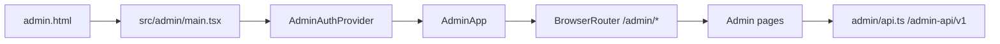

# 08. Admin SPA

This document describes the current admin SPA from source. It focuses on the frontend/admin rail and the privacy boundary visible in client code.

Source set checked for this page: `packages/client/vite.config.ts`, `packages/client/admin.html`, `packages/client/src/admin/main.tsx`, `packages/client/src/admin/AdminApp.tsx`, `packages/client/src/admin/api.ts`, and `packages/client/src/admin/*`.

## Scope And Entry

| Area | Current behavior | Code evidence |
| --- | --- | --- |
| HTML entry | The admin app has its own `admin.html` with `#root` and a module script pointing to `/src/admin/main.tsx`. | `packages/client/admin.html` |
| Vite build | Vite builds both user and admin HTML entries: `main: index.html` and `admin: admin.html`. | `packages/client/vite.config.ts` |
| Dev proxy | `/admin-api` is proxied to the same backend target as `/api`, but the client code uses a separate admin API base. | `packages/client/vite.config.ts`, `packages/client/src/admin/api.ts` |
| React entry | `src/admin/main.tsx` imports `../index.css`, wraps `<AdminApp />` in `AdminAuthProvider`, and mounts under `React.StrictMode`. | `packages/client/src/admin/main.tsx` |



The admin SPA does not mount the user `App`, `AppProvider`, `useWebSocket`, `Sidebar`, `ChannelView`, or user `lib/api.ts`. The only shared frontend asset visible in the entry is `../index.css`. Evidence: `packages/client/src/admin/main.tsx`, `packages/client/src/admin/AdminApp.tsx`, `packages/client/src/App.tsx`, `packages/client/src/context/AppContext.tsx`, `packages/client/src/hooks/useWebSocket.ts`.

## Admin Auth And Session

`AdminAuthProvider` owns the admin session. On mount it calls `fetchAdminMe`, stores `AdminSession | null`, and sets `checked` so `AdminApp` can distinguish “still checking” from “unauthenticated.” Evidence: `packages/client/src/admin/auth.ts`, `packages/client/src/admin/api.ts`.

Admin login calls `adminLogin(login, password)`, then immediately calls `fetchAdminMe` and stores the returned session. Logout calls `adminLogout` and clears session in a `finally` block. Evidence: `packages/client/src/admin/auth.ts`, `packages/client/src/admin/pages/LoginPage.tsx`, `packages/client/src/admin/api.ts`.

The session shape is intentionally minimal: `{ id, login }`. The admin client comments document that role, username, token, and expiry are not read from the response; the cookie is carried by `credentials: 'include'`. Evidence: `packages/client/src/admin/api.ts`.

```text
AdminLoginPage
  -> useAdminAuth().login(login, password)
  -> POST /admin-api/v1/auth/login
  -> GET  /admin-api/v1/auth/me
  -> session { id, login }
  -> /admin/dashboard
```

## Admin API Client

The admin API client is isolated in `packages/client/src/admin/api.ts` with `BASE = '/admin-api/v1'`. It uses `credentials: 'include'`, JSON `Content-Type` when the request has a non-`FormData` body, and throws `AdminApiError` on non-2xx responses. Evidence: `packages/client/src/admin/api.ts`.

Admin API groups:

| Group | Functions | Current boundary | Code evidence |
| --- | --- | --- | --- |
| Auth | `adminLogin`, `adminLogout`, `fetchAdminMe` | Cookie-backed admin session; response session is `{id, login}`. | `packages/client/src/admin/api.ts`, `packages/client/src/admin/auth.ts` |
| Stats | `fetchStats` | Dashboard counts and optional per-org visibility rows. | `packages/client/src/admin/api.ts`, `packages/client/src/admin/pages/DashboardPage.tsx` |
| Users | `fetchUsers`, `createUser`, `patchUser`, `deleteUser`, `fetchUserAgents` | Admin user management; create forces `role: 'member'`; patch supports display name, password reset, disabled flag, role, and require-mention. | `packages/client/src/admin/api.ts`, `packages/client/src/admin/pages/UsersPage.tsx`, `packages/client/src/admin/pages/UserDetailPage.tsx` |
| Permissions | `fetchUserPermissions`, `grantUserPermission`, `revokeUserPermission` | Admin grants/revokes capability and scope rows through `/admin-api/v1/users/:id/permissions`. | `packages/client/src/admin/api.ts`, `packages/client/src/admin/pages/UserDetailPage.tsx` |
| Channels | `fetchChannels`, `forceDeleteChannel` | Lists admin channel metadata and can force-delete non-deleted non-DM non-general channels. | `packages/client/src/admin/api.ts`, `packages/client/src/admin/pages/ChannelsPage.tsx` |
| Invites | `fetchInvites`, `createInvite`, `deleteInvite` | Invite code list/create/revoke with optional expiry hours and note. | `packages/client/src/admin/api.ts`, `packages/client/src/admin/pages/InvitesPage.tsx` |
| Audit log | `fetchAdminAuditLog` | Admin-visible action rows with filters for actor, target, action, and archived state. | `packages/client/src/admin/api.ts`, `packages/client/src/admin/pages/AdminAuditLogPage.tsx` |
| Multi-source audit | `fetchMultiSourceAudit` | Merged query over source enum `server`, `plugin`, `host_bridge`, `agent`; admin-only path. | `packages/client/src/admin/api.ts`, `packages/client/src/admin/pages/MultiSourceAuditPage.tsx` |
| Runtimes | `fetchAdminRuntimes` | Read-only runtime metadata list; client type omits `last_error_reason`. | `packages/client/src/admin/api.ts`, `packages/client/src/admin/pages/RuntimesPage.tsx` |
| Heartbeat lag | `fetchAdminHeartbeatLag` | Read-only lag snapshot. | `packages/client/src/admin/api.ts`, `packages/client/src/admin/pages/HeartbeatLagPage.tsx` |
| Archived channels | `fetchAdminArchivedChannels` | Read-only full-org archived channel list with counts. | `packages/client/src/admin/api.ts`, `packages/client/src/admin/pages/ArchivedChannelsPage.tsx` |
| Description history | `fetchAdminChannelDescriptionHistory` | Read-only channel description edit history rows. | `packages/client/src/admin/api.ts`, `packages/client/src/admin/pages/ChannelDescriptionHistoryPage.tsx` |

## Routes And Pages

`AdminApp` uses `BrowserRouter`. `/admin` renders the login page when unauthenticated and redirects authenticated sessions to `/admin/dashboard`; `/admin/*` renders `AdminLayout` only when a session exists and otherwise redirects to `/admin`. Unknown routes redirect back to the admin entry or dashboard depending on nesting. Evidence: `packages/client/src/admin/AdminApp.tsx`.

The side navigation is hard-coded in `AdminApp` and maps to these pages:

| Route | Page | Purpose | Code evidence |
| --- | --- | --- | --- |
| `/admin/dashboard` | `DashboardPage` | Loads global stats and optional per-org stats. | `packages/client/src/admin/AdminApp.tsx`, `packages/client/src/admin/pages/DashboardPage.tsx` |
| `/admin/users` | `UsersPage` | Lists users, creates member users, toggles disabled state, deletes non-admin users, and links to detail pages. | `packages/client/src/admin/AdminApp.tsx`, `packages/client/src/admin/pages/UsersPage.tsx` |
| `/admin/users/:id` | `UserDetailPage` | Shows selected user, owned agents, permissions, password reset, role change, disabled toggle, and permission grant/revoke controls. | `packages/client/src/admin/AdminApp.tsx`, `packages/client/src/admin/pages/UserDetailPage.tsx` |
| `/admin/channels` | `ChannelsPage` | Lists channel metadata and exposes force delete where the UI allows it. | `packages/client/src/admin/AdminApp.tsx`, `packages/client/src/admin/pages/ChannelsPage.tsx` |
| `/admin/channels-archived` | `ArchivedChannelsPage` | Read-only archived channel list; links to description history. | `packages/client/src/admin/AdminApp.tsx`, `packages/client/src/admin/pages/ArchivedChannelsPage.tsx` |
| `/admin/channels/:id/description-history` | `ChannelDescriptionHistoryPage` | Read-only description edit history for a channel. | `packages/client/src/admin/AdminApp.tsx`, `packages/client/src/admin/pages/ChannelDescriptionHistoryPage.tsx` |
| `/admin/runtimes` | `RuntimesPage` | Read-only runtime metadata table. | `packages/client/src/admin/AdminApp.tsx`, `packages/client/src/admin/pages/RuntimesPage.tsx` |
| `/admin/heartbeat-lag` | `HeartbeatLagPage` | Read-only lag snapshot. | `packages/client/src/admin/AdminApp.tsx`, `packages/client/src/admin/pages/HeartbeatLagPage.tsx` |
| `/admin/invites` | `InvitesPage` | Lists, creates, and revokes invite codes. | `packages/client/src/admin/AdminApp.tsx`, `packages/client/src/admin/pages/InvitesPage.tsx` |
| `/admin/audit-log` | `AdminAuditLogPage` | Filterable admin action audit table. | `packages/client/src/admin/AdminApp.tsx`, `packages/client/src/admin/pages/AdminAuditLogPage.tsx` |
| `/admin/audit-multi-source` | `MultiSourceAuditPage` | Source-filtered multi-source audit table. | `packages/client/src/admin/AdminApp.tsx`, `packages/client/src/admin/pages/MultiSourceAuditPage.tsx` |
| `/admin/settings` | `SettingsPage` | Placeholder admin settings page. | `packages/client/src/admin/AdminApp.tsx`, `packages/client/src/admin/pages/SettingsPage.tsx` |

`AdminLayout` renders a dedicated admin sidebar and footer with the current admin login plus a logout button. It does not share the user `Sidebar` component or the user app's `mainView` state. Evidence: `packages/client/src/admin/AdminApp.tsx`, `packages/client/src/components/Sidebar.tsx`, `packages/client/src/lib/mainView.ts`.

## Isolation From The User Rail

The admin rail is separated by entry point, provider, API base, and route tree:

| Boundary | Admin side | User side | Code evidence |
| --- | --- | --- | --- |
| HTML entry | `admin.html` | `index.html` | `packages/client/admin.html`, `packages/client/index.html`, `packages/client/vite.config.ts` |
| React entry | `src/admin/main.tsx` | `src/main.tsx` | `packages/client/src/admin/main.tsx`, `packages/client/src/main.tsx` |
| Provider | `AdminAuthProvider` | `ThemeProvider`, `ToastProvider`, `AppProvider` | `packages/client/src/admin/main.tsx`, `packages/client/src/App.tsx`, `packages/client/src/context/AppContext.tsx` |
| API client | `src/admin/api.ts`, base `/admin-api/v1` | `src/lib/api.ts`, base `''` with `/api/v1` paths | `packages/client/src/admin/api.ts`, `packages/client/src/lib/api.ts` |
| Router | `BrowserRouter` routes under `/admin/*` | Top-level conditional rendering via `mainView`; no React Router in user `App.tsx` | `packages/client/src/admin/AdminApp.tsx`, `packages/client/src/App.tsx`, `packages/client/src/lib/mainView.ts` |
| Realtime | No admin WS hook in admin entry | `useWebSocket` mounted by user `AppInner` | `packages/client/src/admin/main.tsx`, `packages/client/src/admin/AdminApp.tsx`, `packages/client/src/App.tsx`, `packages/client/src/hooks/useWebSocket.ts` |

Admin pages import from `../api`, not from the user `../lib/api`. The admin tests also encode this separation expectation, but the primary source evidence is the page imports and `admin/api.ts` base. Evidence: `packages/client/src/admin/pages/*.tsx`, `packages/client/src/admin/api.ts`, `packages/client/src/lib/api.ts`.

User-facing admin-awareness goes through user-owned paths, not the admin client: settings loads `/api/v1/me/admin-actions` and `/api/v1/me/impersonation-grant`, while the admin SPA audit log uses `/admin-api/v1/audit-log`. Evidence: `packages/client/src/lib/api.ts`, `packages/client/src/components/Settings/SettingsPage.tsx`, `packages/client/src/components/Settings/AdminActionsList.tsx`, `packages/client/src/admin/api.ts`, `packages/client/src/admin/pages/AdminAuditLogPage.tsx`.

## Metadata-Only And Safety Boundaries

The strongest privacy boundary visible in frontend source is that admin APIs and admin pages are designed around metadata tables, not message/file/artifact content rendering. The user settings UI states the product promise that admin can see usernames, channel names/lists, message counts, and login time, but cannot see message bodies, file/artifact contents, built-in owner-agent DMs, or raw API keys unless the user grants temporary impersonation. Evidence: `packages/client/src/components/Settings/PrivacyPromise.tsx`, `packages/client/src/components/Settings/SettingsPage.tsx`.

Admin audit rows expose `metadata` as a JSON string and are rendered as code in the audit table. The admin client comment says server omits body/content/text/artifact fields from this metadata. The frontend does not parse or render message bodies from audit rows. Evidence: `packages/client/src/admin/api.ts`, `packages/client/src/admin/pages/AdminAuditLogPage.tsx`.

Runtime admin visibility is read-only metadata. `AdminRuntime` includes `id`, `agent_id`, `endpoint_url`, `process_kind`, `status`, heartbeat and timestamps; the client type comment explicitly says `last_error_reason` is omitted, and `RuntimesPage` only lists these fields with refresh. Evidence: `packages/client/src/admin/api.ts`, `packages/client/src/admin/pages/RuntimesPage.tsx`.

Archived channels and description history are read-only admin views in the current UI. `ArchivedChannelsPage` loads archived channel rows and links to description history; it does not expose unarchive controls. `ChannelDescriptionHistoryPage` loads `old_content`, timestamp, and reason rows for description history only. Evidence: `packages/client/src/admin/api.ts`, `packages/client/src/admin/pages/ArchivedChannelsPage.tsx`, `packages/client/src/admin/pages/ChannelDescriptionHistoryPage.tsx`.

Admin powerful mutations are limited to explicit pages and admin API calls: user create/delete/disable/role/password/permission operations in Users/UserDetail, channel force delete in Channels, and invite create/revoke in Invites. These use `/admin-api/v1` and do not reuse user rail actions. Evidence: `packages/client/src/admin/api.ts`, `packages/client/src/admin/pages/UsersPage.tsx`, `packages/client/src/admin/pages/UserDetailPage.tsx`, `packages/client/src/admin/pages/ChannelsPage.tsx`, `packages/client/src/admin/pages/InvitesPage.tsx`.

Impersonation is visible to the user rail through a red banner and user-controlled grant/revoke UI. The user SPA fetches and revokes the grant from `/api/v1/me/impersonation-grant`; the admin SPA code read here does not include an impersonation page or route. Evidence: `packages/client/src/components/Settings/BannerImpersonate.tsx`, `packages/client/src/components/Settings/SettingsPage.tsx`, `packages/client/src/lib/api.ts`, `packages/client/src/admin/AdminApp.tsx`.

## Maintenance Notes

- Keep admin route additions in `packages/client/src/admin/AdminApp.tsx` and API additions in `packages/client/src/admin/api.ts`; do not add admin-only calls to `packages/client/src/lib/api.ts` unless the endpoint is intentionally user-owned.
- Keep metadata-only assumptions tied to concrete client/server response shapes. If an admin endpoint begins returning bodies, file content, artifact content, API key values, or agent reasoning text, update this document and the user privacy UI together. Evidence anchors: `packages/client/src/admin/api.ts`, `packages/client/src/components/Settings/PrivacyPromise.tsx`.
- Do not infer admin realtime behavior from the user WS hook. Current admin entry code does not mount `useWebSocket`; admin pages are REST-driven. Evidence: `packages/client/src/admin/main.tsx`, `packages/client/src/admin/AdminApp.tsx`, `packages/client/src/hooks/useWebSocket.ts`.
