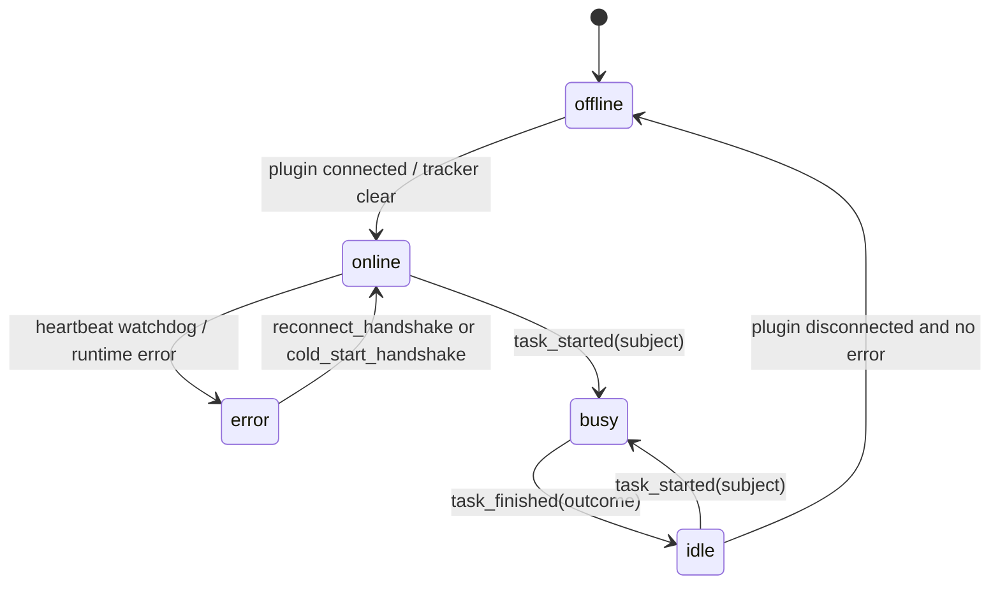

# 09 Agent And Plugin Integration

This document covers OpenClaw plugin packaging/runtime behavior, server BPP internals/SDK, and agent config/status/lifecycle integration.

## OpenClaw Package Shape

The Borgee OpenClaw plugin package is `@codetreker/borgee-openclaw-plugin`, version `0.1.1`, with `openclaw >= 2026.4.15` as peer dependency. It publishes `dist`, `openclaw.plugin.json`, and `skills`; OpenClaw loads `./dist/index.js`. Evidence: `packages/plugins/openclaw/package.json`, `packages/plugins/openclaw/openclaw.plugin.json`.

The entrypoint exports a bundled channel entry with id `borgee`, channel plugin `./channel.js#borgeePlugin`, and runtime setter `./runtime.js#setBorgeeRuntime`. Evidence: `packages/plugins/openclaw/src/index.ts`, `packages/plugins/openclaw/src/runtime.ts`, `packages/plugins/openclaw/src/runtime-api.ts`.

## Channel, Accounts, Status

`channel.ts` creates a chat channel plugin for `borgee`, declares group/direct chat support, maps explicit targets such as `channel:<id>` and `dm:<user_id>`, builds outbound session routes, wires account config resolution, and starts the Borgee gateway per account. Evidence: `packages/plugins/openclaw/src/channel.ts`, `packages/plugins/openclaw/src/inbound.ts`.

Account resolution uses OpenClaw account helpers and `resolveMergedAccountConfig`. A resolved account requires `baseUrl` and `apiKey`, defaults `botUserId` to `openclaw-agent`, defaults `botDisplayName` to `OpenClaw`, defaults `pollTimeoutMs` to 30s, and defaults transport to `auto`. Evidence: `packages/plugins/openclaw/src/accounts.ts`, `packages/plugins/openclaw/src/types.ts`.

The config schema exposes `name`, `enabled`, `baseUrl`, `apiKey`, bot identity fields, `pollTimeoutMs`, `transport`, `allowFrom`, `defaultTo`, per-account overrides, and `defaultAccount`. Current schema accepts only `auto/sse/poll` for transport, while TypeScript and gateway code also include `ws`; treat `ws` as code-present but config-schema-inaccessible until confirmed. Evidence: `packages/plugins/openclaw/src/config-schema.ts`, `packages/plugins/openclaw/src/types.ts`, `packages/plugins/openclaw/src/gateway.ts`.

Runtime status is computed from account snapshots and redacts `apiKey` to `***` when configured. Evidence: `packages/plugins/openclaw/src/status.ts`.

## Gateway, Transport, Cursor

`startBorgeeGateway` validates account config, fetches bot identity from `GET /api/v1/users/me` when missing, sets OpenClaw account runtime status, loads a persisted cursor, and selects transport. Evidence: `packages/plugins/openclaw/src/gateway.ts`, `packages/plugins/openclaw/src/api-client.ts`.

Cursor persistence is a local JSON file at `${OPENCLAW_DATA_DIR || HOME || .}/data/collab-cursor-<accountId>.json`; corrupt/unreadable cursor files are ignored and writes are best effort. Evidence: `packages/plugins/openclaw/src/cursor-store.ts`.

`auto` mode probes `HEAD /api/v1/stream`. If SSE is unavailable it runs long-poll and re-probes SSE every 5 minutes; if SSE returns 401/403 it stops. Forced `sse` retries SSE without falling back; forced `poll` calls `POST /api/v1/poll`; code-present `ws` connects to `/ws/plugin`. Evidence: `packages/plugins/openclaw/src/gateway.ts`, `packages/plugins/openclaw/src/sse-client.ts`, `packages/plugins/openclaw/src/api-client.ts`, `packages/plugins/openclaw/src/ws-client.ts`.

SSE uses `Last-Event-ID` from the persisted cursor, parses `event`, `id`, and `data`, treats any byte arrival as heartbeat liveness, and persists event cursors after dispatch. Poll sends `{cursor, timeout_ms, channel_ids}` and persists the returned `cursor` when events arrive. Evidence: `packages/plugins/openclaw/src/sse-client.ts`, `packages/plugins/openclaw/src/gateway.ts`, `packages/plugins/openclaw/src/api-client.ts`.

The WS transport connects to `/ws/plugin` with bearer auth, dispatches `event` frames to the same inbound path, handles server `request` frames for local file reads, and exposes `apiCall(method,path,body)` over the plugin RPC envelope. Evidence: `packages/plugins/openclaw/src/ws-client.ts`, `packages/plugins/openclaw/src/gateway.ts`, `packages/plugins/openclaw/src/file-access.ts`.

## Inbound And Outbound

Inbound Borgee events are filtered to message/edit/delete/reaction kinds. The plugin skips self messages by bot user id and, for non-DM messages, enforces `requireMention` when the server identity says so. It formats an OpenClaw inbound context, dispatches through `dispatchInboundReplyWithBase`, and sends any generated text back to Borgee. Evidence: `packages/plugins/openclaw/src/gateway.ts`, `packages/plugins/openclaw/src/sse-client.ts`, `packages/plugins/openclaw/src/inbound.ts`.

Outbound text resolves the target, creates/gets a DM channel when needed, then prefers `/ws/plugin` `api_request` if connected and falls back to REST. Message send, reaction add/remove, edit, and delete all follow this WS-first/HTTP-fallback pattern. Evidence: `packages/plugins/openclaw/src/outbound.ts`, `packages/plugins/openclaw/src/api-client.ts`, `packages/plugins/openclaw/src/ws-util.ts`.

File access over the WS plugin request path is local to the plugin process, reads `~/.config/collab/file-access.json`, requires the requested path to be under an allowed path, enforces a 1 MiB default max file size, and returns text plus MIME metadata or error strings. Evidence: `packages/plugins/openclaw/src/file-access.ts`, `packages/plugins/openclaw/src/gateway.ts`.

## Server BPP Internals

`internal/bpp/envelope.go` is the server-side source for BPP frame types, JSON field order, and direction. The plugin-upstream dispatcher only registers plugin-to-server frames; trying to register a server-to-plugin frame panics. Evidence: `packages/server-go/internal/bpp/envelope.go`, `packages/server-go/internal/bpp/plugin_frame_dispatcher.go`.

`/ws/plugin` owns the wire boundary. It handles RPC frames itself, and routes non-RPC frame types to `PluginFrameDispatcher` with `OwnerUserID` from the authenticated API-key user. Evidence: `packages/server-go/internal/ws/plugin.go`, `packages/server-go/internal/server/server.go`.

Registered plugin-upstream BPP handlers are:

| Frame | Effect | Evidence |
| --- | --- | --- |
| `agent_config_ack` | Validate applied/rejected/stale, AL-1a reason values, owner, then log ack outcome. | `packages/server-go/internal/bpp/agent_config_ack_dispatcher.go`, `packages/server-go/internal/api/agent_config_ack_handler.go` |
| `reconnect_handshake` | Verify owner, resolve incremental resume from `last_known_cursor`, clear agent error. | `packages/server-go/internal/bpp/reconnect_handler.go`, `packages/server-go/internal/bpp/session_resume.go` |
| `cold_start_handshake` | Verify owner, append online transition with `runtime_crashed`, clear agent error, no replay. | `packages/server-go/internal/bpp/cold_start_handler.go` |
| `task_started` | Validate non-empty subject, derive busy state, push `agent_task_state_changed`. | `packages/server-go/internal/bpp/task_lifecycle.go`, `packages/server-go/internal/bpp/task_lifecycle_handler.go`, `packages/server-go/internal/ws/agent_task_state_changed_frame.go` |
| `task_finished` | Validate outcome/reason, derive idle state, push `agent_task_state_changed`. | `packages/server-go/internal/bpp/task_lifecycle.go`, `packages/server-go/internal/bpp/task_lifecycle_handler.go` |

Server-to-plugin frames are sent through Hub helpers. `PushAgentConfigUpdate` allocates a shared cursor, builds a BPP `AgentConfigUpdateFrame`, sends it to `h.plugins[agentID]`, and logs a dead-letter audit entry if the plugin is offline. `PushPermissionDenied` follows the same point-to-point pattern without a queue. Evidence: `packages/server-go/internal/ws/agent_config_push.go`, `packages/server-go/internal/ws/permission_denied_frame.go`, `packages/server-go/internal/bpp/dead_letter.go`.

The BPP semantic action dispatcher exists as an internal routing layer with a closed v1 operation allow-list and an `ActionHandler` interface seam, but this worktree's `server.New` does not wire a `semantic_action` handler into `PluginFrameDispatcher`. Evidence: `packages/server-go/internal/bpp/dispatcher.go`, `packages/server-go/internal/server/server.go`, `packages/server-go/internal/bpp/plugin_frame_dispatcher.go`.

## Server BPP SDK

The in-tree Go SDK under `packages/server-go/sdk/bpp` imports server `internal/bpp` structs rather than redefining them. `Client.Connect` dials a websocket and sends `ConnectFrame`; `SendHeartbeat` emits `HeartbeatFrame`; `Reconnect` sends `ReconnectHandshakeFrame` with `lastKnownCursor`; `ColdStart` sends `ColdStartHandshakeFrame` and resets the SDK cursor; `HeartbeatLoop` ticks every 30s; `GrantRetry` uses the server retry constants. Evidence: `packages/server-go/sdk/bpp/client.go`, `packages/server-go/sdk/bpp/reconnect.go`, `packages/server-go/internal/bpp/request_retry_cache.go`.

Current integration caveat: server `/ws/plugin` authenticates at the HTTP/WebSocket upgrade level and routes unknown BPP frame types through `PluginFrameDispatcher`; it does not explicitly process the SDK `ConnectFrame` as a handshake. Evidence: `packages/server-go/internal/ws/plugin.go`, `packages/server-go/internal/bpp/plugin_frame_dispatcher.go`, `packages/server-go/sdk/bpp/client.go`.

## Agent Config

Agent config is stored in `agent_configs` and exposed through owner-only `GET /api/v1/agents/{id}/config` and `PATCH /api/v1/agents/{id}/config`. The PATCH path accepts only Borgee-managed fields (`name`, `avatar`, `prompt`, `model`, `capabilities`, `enabled`, `memory_ref`), rejects runtime-only fields, performs an atomic SQLite upsert that increments `schema_version`, and then best-effort pushes BPP `agent_config_update` when a plugin is connected. Evidence: `packages/server-go/internal/api/agent_config.go`, `packages/server-go/internal/ws/agent_config_push.go`, `packages/server-go/internal/bpp/agent_config_update.go`.

The plugin ack path is plugin-to-server only. `AckDispatcher` validates status enum, optional reason enum, and owner; `AgentConfigAckHandlerImpl` logs applied/stale/rejected. Evidence: `packages/server-go/internal/bpp/agent_config_ack_dispatcher.go`, `packages/server-go/internal/api/agent_config_ack_handler.go`.

## Agent Runtime Status And Lifecycle

`internal/agent.Tracker` stores only error snapshots; online/offline are derived from Hub plugin presence, and clear happens after successful reconnect/recovery paths. The six reason codes are centralized in `internal/agent/reasons`. Evidence: `packages/server-go/internal/agent/state.go`, `packages/server-go/internal/agent/reasons/reasons.go`.

`GET /api/v1/agents/{id}/status` merges state with priority `error > busy > idle > online > offline`. Error comes from the tracker, busy/idle comes from `agent_status` rows written by BPP task lifecycle paths, and online/offline falls back to plugin presence. `PATCH /status` always returns 405 because busy/idle is BPP-driven. Evidence: `packages/server-go/internal/api/agent_status.go`, `packages/server-go/internal/ws/agent_task_state_changed_frame.go`, `packages/server-go/internal/bpp/task_lifecycle_handler.go`.

The runtime registry is separate from presence. Owner-only runtime endpoints register/start/stop/heartbeat/error/get process descriptors in `agent_runtimes`; admin has a read-only metadata list. Runtime process kind includes `openclaw` and reserved `hermes`; status is `registered/running/stopped/error`; heartbeat updates `last_heartbeat_at` rather than presence. Evidence: `packages/server-go/internal/api/runtimes.go`, `packages/server-go/internal/migrations/agent_runtimes.go`, `packages/server-go/internal/api/admin.go`.

Plugin lifecycle/audit readout is owner-only at `GET /api/v1/agents/{agentId}/lifecycle`, and heartbeat decay is owner-only at `GET /api/v1/agents/{agentId}/heartbeat-decay`, derived from runtime heartbeat timestamps. Evidence: `packages/server-go/internal/api/plugin_list.go`, `packages/server-go/internal/api/host_decay_list.go`, `packages/server-go/internal/bpp/heartbeat_decay.go`.

The state diagram is an API merge model, not one persisted table. Evidence: `packages/server-go/internal/agent/state.go`, `packages/server-go/internal/api/agent_status.go`, `packages/server-go/internal/bpp/heartbeat_watchdog.go`, `packages/server-go/internal/bpp/reconnect_handler.go`, `packages/server-go/internal/bpp/cold_start_handler.go`.

