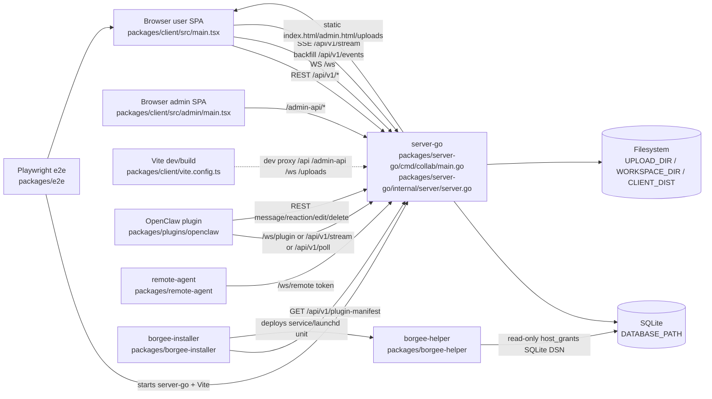

# Current Architecture

| Module | Responsible For | Not Responsible For | Main Interfaces | Code Evidence |
| --- | --- | --- | --- | --- |
| Browser user SPA | User chat UI, channel subscriptions, `/ws` reconnect/backfill handling, signal-only frame dispatch | Admin-only routes, plugin runtime process, host filesystem access | REST `/api/v1/*`, WS `/ws`, backfill `/api/v1/events` | `packages/client/src/main.tsx`, `packages/client/src/hooks/useWebSocket.ts`, `packages/client/src/hooks/useWsHubFrames.ts` |
| Browser admin SPA | Admin UI and `/admin-api/*` cookie rail | User business API authorization, plugin BPP frames | `/admin-api/*`, static `admin.html` | `packages/client/src/admin/main.tsx`, `packages/server-go/internal/server/server.go` |
| server-go | HTTP routing, auth, SQLite-backed state, realtime Hub, BPP frame dispatch, static file serving | Running OpenClaw, remote filesystem IO, helper daemon sandboxing | `/api/v1/*`, `/admin-api/*`, `/ws`, `/ws/plugin`, `/ws/remote`, `/uploads/*` | `packages/server-go/cmd/collab/main.go`, `packages/server-go/internal/server/server.go`, `packages/server-go/internal/ws/*`, `packages/server-go/internal/bpp/*` |
| SQLite and filesystem | Durable server state, uploaded files, workspace file bytes, built client assets | In-memory Hub fanout, plugin cursor files, helper audit log | `DATABASE_PATH`, `UPLOAD_DIR`, `WORKSPACE_DIR`, `CLIENT_DIST` | `packages/server-go/internal/config/config.go`, `packages/server-go/internal/store/db.go`, `packages/server-go/internal/api/upload.go`, `packages/server-go/internal/api/workspace.go` |
| OpenClaw plugin | Borgee channel plugin package, account resolution, inbound event consumption, outbound message actions | Server BPP handler registration, browser UI rendering, admin APIs | `/api/v1/stream`, `/api/v1/poll`, `/ws/plugin`, REST message APIs | `packages/plugins/openclaw/openclaw.plugin.json`, `packages/plugins/openclaw/src/*` |
| remote-agent | Local file `ls/read/stat` responder behind `/ws/remote` | Server ACL/store ownership, helper daemon host grants | `/ws/remote?token=...` request/response frames | `packages/remote-agent/src/agent.ts`, `packages/server-go/internal/ws/remote.go`, `packages/server-go/internal/api/remote.go` |
| borgee-helper and installer | Host bridge daemon, manifest fetch/verify, platform service deployment | OpenClaw channel runtime, browser realtime, server Hub maps | `/api/v1/plugin-manifest`, UDS JSON-line IPC, read-only `host_grants` DB | `packages/borgee-helper/cmd/borgee-helper/main.go`, `packages/borgee-installer/internal/manifest/fetcher.go` |
| E2E harness | Local two-process orchestration for server-go and Vite | Production deployment | Playwright webServer on server `4901` and client `5174` by default | `packages/e2e/playwright.config.ts` |

## Reading Order

Start with `overall/` for the system roles, runtime topology, cross-process flows, and current gaps. Then read server-specific pages for realtime/BPP internals, plugin pages for OpenClaw package/runtime behavior, and the other module directories for client, admin, remote-agent, host-bridge, security, and e2e details.

This documentation is code-evidence driven. When older notes disagree with the paths cited here, the current code paths are the source of truth.
