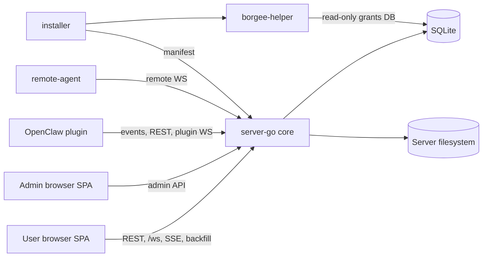

# Current Architecture

## Module Architecture Summary

| Module | Role | Boundary | Primary Interfaces |
| --- | --- | --- | --- |
| User SPA | Chat and collaboration UI | Does not own durable state | REST, `/ws`, SSE/backfill |
| Admin SPA | Operator UI and admin rail | Separate from business-path plugin traffic | admin API, static admin app |
| server-go | Core API, auth, storage, realtime Hub, BPP routing | Does not run plugin/helper/remote-agent processes | HTTP, browser WS, plugin WS, remote WS |
| SQLite and filesystem | Durable rows and server-owned files | Not used for plugin-local cursor files | DB path, uploads, workspace files, client dist |
| OpenClaw plugin | External chat runtime bridge | Does not register server handlers | SSE/poll, REST, plugin WS RPC |
| remote-agent | User-machine file proxy endpoint | Does not own server authorization | remote WS request/response |
| borgee-helper and installer | Host bridge installation and daemon IPC | Separate from chat realtime | manifest fetch, UDS IPC, grants DB |

## Architecture Reading Map

Use these stable links after the diagram; they do not rely on Mermaid node clicks.

| Architecture part | Purpose | Start here | Then drill into |
| --- | --- | --- | --- |
| 1. Entry overview | See the system shape and module boundaries quickly | This page | [System overview](system-overview.md), [known gaps](known-gaps.md) |
| 2. System context | Understand roles, boundaries, and source-of-truth decisions | [System overview](system-overview.md) | [Runtime topology](runtime-topology.md), [security](security/) |
| 3. Module architecture | Read the owner view for each major subsystem | [Server](server/), [client](client/), [admin](admin/), [plugin](plugin/) | [remote-agent](remote-agent/), [host-bridge](host-bridge/) |
| 4. Cross-module flows | Follow traffic that crosses process or module boundaries | [Cross-process flows](cross-process-flows.md) | [server realtime/events](server/realtime-and-events.md), [BPP internals](server/bpp-internals.md), [plugin contracts](plugin/server-contracts.md) |
| 5. Data and state model | Separate durable state, app state, realtime recovery, and audit state | [server durable model](server/data-model-and-migrations.md) | [client app state](client/app-shell-state.md), [realtime reconciliation](client/realtime-sync.md), [admin privacy/audit state](admin/privacy-audit.md) |
| 6. Security and permission boundaries | Review auth, admin rails, remote filesystem, and host grants | [Security](security/) | [API/auth/admin rails](server/api-auth-admin-rails.md), [admin server rail](admin/server-rail.md), [remote filesystem boundary](remote-agent/filesystem-boundary.md), [host grants](host-bridge/host-grants.md) |
| 7. User interface structure reference | Locate UI surfaces without making UI sketches a separate architecture area | [client UI map](client/ui-map.md) | [client UI sketches](client/ui/), [admin SPA](admin/spa.md), [admin UI sketches](admin/ui/), [remote-agent UI sketches](remote-agent/ui/) |
| 8. Verification and release architecture | Understand validation support outside the product runtime topology | [E2E / verification](e2e/) | [runtime topology](runtime-topology.md), [cross-process flows](cross-process-flows.md), [known gaps](known-gaps.md) |
| 9. Implementation Anchors | Jump from architecture areas to stable code ownership anchors | Implementation Anchors sections in each document | [server](server/), [plugin](plugin/), [remote-agent](remote-agent/), [host-bridge](host-bridge/) |
| 10. Known Gaps / Architecture Debt | Track current mismatches and where detailed debt is recorded | [Known gaps](known-gaps.md) | Module-local gap notes in [admin](admin/), [remote-agent](remote-agent/), [host-bridge](host-bridge/), and [E2E](e2e/) |

Server-specific realtime/BPP design lives in [server/](server/); OpenClaw plugin design lives in [plugin/](plugin/). Verification and supporting documentation, including E2E orchestration, lives outside the main runtime topology.

## Implementation Anchors

- Server core: `packages/server-go/cmd/collab/main.go`, `packages/server-go/internal/server/server.go`
- Realtime and BPP: `packages/server-go/internal/ws`, `packages/server-go/internal/bpp`, `packages/server-go/sdk/bpp`
- Browser realtime consumer: `packages/client/src/hooks/useWebSocket.ts`, `packages/client/src/hooks/useWsHubFrames.ts`
- OpenClaw plugin: `packages/plugins/openclaw/openclaw.plugin.json`, `packages/plugins/openclaw/src`
- Remote and host bridge: `packages/remote-agent`, `packages/borgee-helper`, `packages/borgee-installer`
- Verification support: `packages/e2e`
