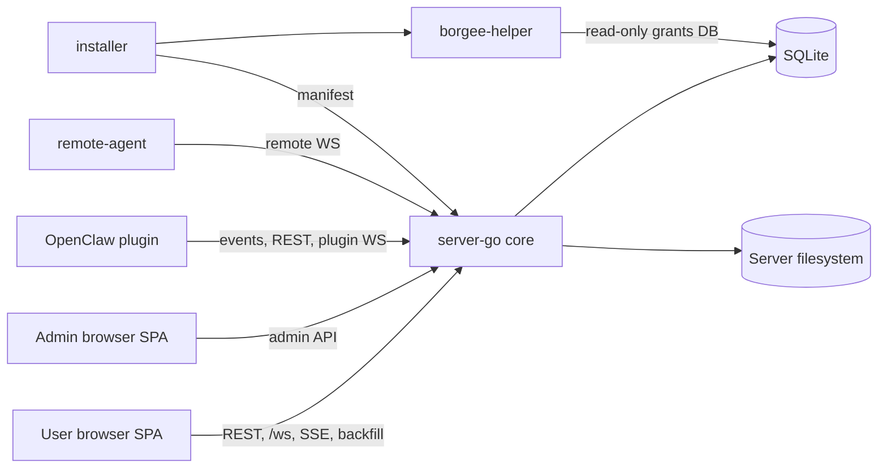

# Current Architecture

## Drill-Down Navigation

Use these stable links after the diagram; they do not rely on Mermaid node clicks.

| Reader path | Start here | Then drill into |
| --- | --- | --- |
| New contributor | [System overview](system-overview.md) | [Runtime topology](runtime-topology.md), [cross-process flows](cross-process-flows.md), [known gaps](known-gaps.md) |
| Backend maintainer | [Server](server/) | [startup/routing](server/startup-routing.md), [API/auth/admin rails](server/api-auth-admin-rails.md), [data model](server/data-model-and-migrations.md), [realtime/events](server/realtime-and-events.md) |
| Frontend maintainer | [Client](client/) | [app shell/state](client/app-shell-state.md), [feature surfaces](client/feature-surfaces.md), [UI map](client/ui-map.md), [client UI sketches](client/ui/) |
| Plugin or host maintainer | [Plugin](plugin/) | [OpenClaw runtime](plugin/openclaw-runtime.md), [plugin transports](plugin/transports.md), [remote-agent](remote-agent/), [host-bridge](host-bridge/) |
| Security reviewer | [Security](security/) | [admin privacy/audit](admin/privacy-audit.md), [remote filesystem boundary](remote-agent/filesystem-boundary.md), [host grants](host-bridge/host-grants.md) |
| Test or release reviewer | [E2E / verification](e2e/) | [cross-process flows](cross-process-flows.md), [runtime topology](runtime-topology.md), [known gaps](known-gaps.md) |

| Area | Entry point |
| --- | --- |
| Core maps | [System overview](system-overview.md), [runtime topology](runtime-topology.md), [cross-process flows](cross-process-flows.md), [known gaps](known-gaps.md) |
| Server | [server/](server/) |
| Client | [client/](client/) |
| Admin | [admin/](admin/) |
| Plugin | [plugin/](plugin/) |
| Remote Agent | [remote-agent/](remote-agent/) |
| Host Bridge | [host-bridge/](host-bridge/) |
| Security | [security/](security/) |
| E2E / verification | [e2e/](e2e/) |
| UI sketches | [client UI](client/ui/), [admin UI](admin/ui/), [remote-agent UI](remote-agent/ui/) |

| Module | Role | Boundary | Primary Interfaces |
| --- | --- | --- | --- |
| User SPA | Chat and collaboration UI | Does not own durable state | REST, `/ws`, SSE/backfill |
| Admin SPA | Operator UI and admin rail | Separate from business-path plugin traffic | admin API, static admin app |
| server-go | Core API, auth, storage, realtime Hub, BPP routing | Does not run plugin/helper/remote-agent processes | HTTP, browser WS, plugin WS, remote WS |
| SQLite and filesystem | Durable rows and server-owned files | Not used for plugin-local cursor files | DB path, uploads, workspace files, client dist |
| OpenClaw plugin | External chat runtime bridge | Does not register server handlers | SSE/poll, REST, plugin WS RPC |
| remote-agent | User-machine file proxy endpoint | Does not own server authorization | remote WS request/response |
| borgee-helper and installer | Host bridge installation and daemon IPC | Separate from chat realtime | manifest fetch, UDS IPC, grants DB |

Read `system-overview.md` first, then `runtime-topology.md`, `cross-process-flows.md`, and `known-gaps.md`. Server-specific realtime/BPP design lives in `server/`; OpenClaw plugin design lives in `plugin/`.

Verification and supporting documentation, including E2E orchestration, lives outside the main runtime topology.

## Implementation Anchors

- Server core: `packages/server-go/cmd/collab/main.go`, `packages/server-go/internal/server/server.go`
- Realtime and BPP: `packages/server-go/internal/ws`, `packages/server-go/internal/bpp`, `packages/server-go/sdk/bpp`
- Browser realtime consumer: `packages/client/src/hooks/useWebSocket.ts`, `packages/client/src/hooks/useWsHubFrames.ts`
- OpenClaw plugin: `packages/plugins/openclaw/openclaw.plugin.json`, `packages/plugins/openclaw/src`
- Remote and host bridge: `packages/remote-agent`, `packages/borgee-helper`, `packages/borgee-installer`
- Verification support: `packages/e2e`
