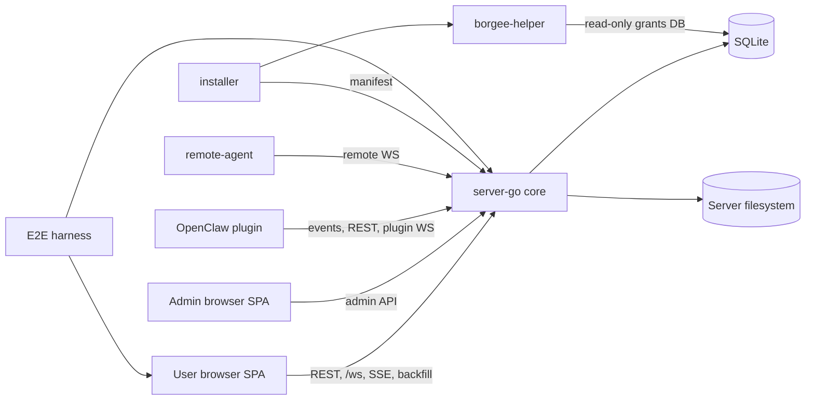

# Current Architecture

| Module | Role | Boundary | Primary Interfaces |
| --- | --- | --- | --- |
| User SPA | Chat and collaboration UI | Does not own durable state | REST, `/ws`, SSE/backfill |
| Admin SPA | Operator UI and admin rail | Separate from business-path plugin traffic | admin API, static admin app |
| server-go | Core API, auth, storage, realtime Hub, BPP routing | Does not run plugin/helper/remote-agent processes | HTTP, browser WS, plugin WS, remote WS |
| SQLite and filesystem | Durable rows and server-owned files | Not used for plugin-local cursor files | DB path, uploads, workspace files, client dist |
| OpenClaw plugin | External chat runtime bridge | Does not register server handlers | SSE/poll, REST, plugin WS RPC |
| remote-agent | User-machine file proxy endpoint | Does not own server authorization | remote WS request/response |
| borgee-helper and installer | Host bridge installation and daemon IPC | Separate from chat realtime | manifest fetch, UDS IPC, grants DB |
| E2E harness | Local test orchestration | Not production topology | Playwright web servers |

Read `system-overview.md` first, then `runtime-topology.md`, `cross-process-flows.md`, and `known-gaps.md`. Server-specific realtime/BPP design lives in `server/`; OpenClaw plugin design lives in `plugin/`.

## Implementation Anchors

- Server core: `packages/server-go/cmd/collab/main.go`, `packages/server-go/internal/server/server.go`
- Realtime and BPP: `packages/server-go/internal/ws`, `packages/server-go/internal/bpp`, `packages/server-go/sdk/bpp`
- Browser realtime consumer: `packages/client/src/hooks/useWebSocket.ts`, `packages/client/src/hooks/useWsHubFrames.ts`
- OpenClaw plugin: `packages/plugins/openclaw/openclaw.plugin.json`, `packages/plugins/openclaw/src`
- Remote and host bridge: `packages/remote-agent`, `packages/borgee-helper`, `packages/borgee-installer`
- E2E orchestration: `packages/e2e/playwright.config.ts`
