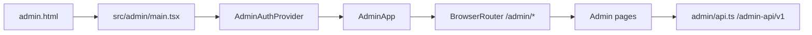

# Admin SPA

This module documents the frontend admin SPA in `packages/client/src/admin`. Server rail behavior is owned by the sibling `server-rail.md`; this page only describes the browser entry, auth/session provider, admin API client, route/page composition, and separation from the user rail.

## Module Overview

The admin SPA is built by the same Vite package as the user SPA, but as a separate HTML input. `packages/client/vite.config.ts` declares both `index.html` and `admin.html`; `admin.html` loads `/src/admin/main.tsx` (`packages/client/vite.config.ts`, `packages/client/admin.html`, `packages/client/src/admin/main.tsx`).

The admin entry imports shared CSS, wraps `AdminApp` in `AdminAuthProvider`, and mounts under `React.StrictMode`. It does not mount the user `AppProvider`, `ThemeProvider`, `ToastProvider`, `Sidebar`, `ChannelView`, or `useWebSocket` (`packages/client/src/admin/main.tsx`, `packages/client/src/admin/AdminApp.tsx`, `packages/client/src/App.tsx`, `packages/client/src/context/AppContext.tsx`, `packages/client/src/hooks/useWebSocket.ts`).

`AdminApp` owns the browser route tree under `/admin/*`. It gates routes on `useAdminAuth().checked` and `session`, redirecting unauthenticated users to `/admin` and authenticated users from `/admin` to `/admin/dashboard` (`packages/client/src/admin/AdminApp.tsx`, `packages/client/src/admin/auth.ts`).

## Responsibilities

The admin SPA module is responsible for the admin browser rail: admin login/logout session handling, protected admin layout, admin page routing, admin navigation, page-level REST calls, and admin-only API client types (`packages/client/src/admin/main.tsx`, `packages/client/src/admin/auth.ts`, `packages/client/src/admin/AdminApp.tsx`, `packages/client/src/admin/api.ts`, `packages/client/src/admin/pages/*`).

The admin SPA module is not responsible for server implementation, server-side auth enforcement, audit persistence, ACL checks, or response sanitization. Those belong to the server rail documented separately in `server-rail.md`; this frontend doc only states what the current client calls and renders (`packages/client/src/admin/api.ts`, `packages/client/src/admin/pages/*`).

The admin SPA module is not responsible for user app state, user WebSocket sync, channel/DM chat, workspace/artifact editing, or user settings privacy UI. Those live under `packages/client/src/App.tsx`, `packages/client/src/context/AppContext.tsx`, `packages/client/src/hooks/useWebSocket.ts`, and `packages/client/src/components/*` and are documented under `../client/` (`packages/client/src/App.tsx`, `packages/client/src/lib/api.ts`, `packages/client/src/admin/api.ts`).

## Interfaces To Other Modules

| Interface | Direction | Contract | Evidence |
| --- | --- | --- | --- |
| Build entry | Vite -> admin SPA | `admin.html` is a Rollup input and loads `/src/admin/main.tsx`. | `packages/client/vite.config.ts`, `packages/client/admin.html`, `packages/client/src/admin/main.tsx` |
| Admin REST rail | Admin SPA -> backend | `admin/api.ts` uses `BASE = '/admin-api/v1'` and includes cookies. | `packages/client/src/admin/api.ts` |
| Admin session | Pages -> `AdminAuthProvider` | Session is `AdminSession | null`; `checked` gates initial auth check. | `packages/client/src/admin/auth.ts`, `packages/client/src/admin/AdminApp.tsx` |
| User rail isolation | Admin SPA vs user SPA | Admin pages import `../api`; user pages import `../lib/api` or `./lib/api`; providers and routes are separate. | `packages/client/src/admin/pages/*.tsx`, `packages/client/src/admin/api.ts`, `packages/client/src/lib/api.ts` |
| Server rail docs | Admin SPA docs -> server rail docs | Server endpoint behavior and enforcement belong in the sibling `server-rail.md`, not this SPA overview. | `packages/client/src/admin/api.ts` |

## Document Index

| Document | What to read it for |
| --- | --- |
| `spa.md` | Admin entry, auth provider/session, API client, route/page map, user rail isolation, metadata/safety boundaries. |
| `server-rail.md` | Server-side admin rail behavior and enforcement; maintained by another teammate. |
| `privacy-audit.md` | Privacy/audit details where they intersect admin behavior; maintained separately from this SPA page. |
