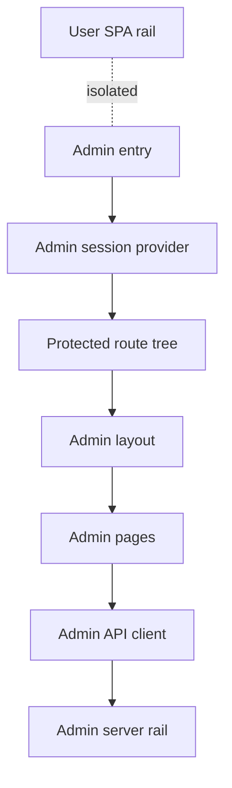

# Admin SPA

The admin SPA is a separate browser application for operational administration. It shares the frontend package with the user SPA, but it has its own HTML entry, session provider, route tree, API client, and page surfaces.

## Architecture At A Glance

| Layer | Architectural role | Boundary |
| --- | --- | --- |
| Entry | Boot the admin app independently from the user app. | Shares build assets, not user providers or user state. |
| Session | Convert admin cookie state into a small browser session model. | Session is minimal and cookie-backed. |
| Router/layout | Protect admin pages and provide admin navigation. | Admin routes live under the admin path space. |
| Pages | Present operational views and explicit admin actions. | Pages call only the admin API client. |
| Admin API client | Centralize admin endpoint paths, request behavior, and response types. | Uses the admin rail prefix, not user endpoints. |
| Server rail | Enforce admin auth, ACL, privacy, and persistence. | Owned by the server architecture docs, not this SPA module. |

## Responsibilities

The admin SPA owns admin browser composition: login, session refresh, logout, protected routing, admin navigation, page-level view state, admin API request shapes, and frontend-visible metadata/action surfaces.

It does not own server enforcement, audit persistence, privacy sanitization, backend migrations, or user SPA workflows. Server rail details belong to `server-rail.md`.

## Interfaces

| Interface | Contract |
| --- | --- |
| Build entry | Admin is a second frontend entry inside the client build. |
| Admin REST rail | Admin pages call the admin API client, which targets the admin endpoint prefix. |
| Admin session | Browser session state is derived from admin auth endpoints and cookies. |
| User rail isolation | Admin does not mount user app context, user WebSocket, channel shell, or user API client. |
| Server rail | Backend owns authorization and privacy; the SPA renders the sanitized shapes it receives. |

## Subdocuments

| Document | Scope |
| --- | --- |
| `spa.md` | Admin SPA design: entry, session, API client, route/page layering, isolation, and safety boundaries. |
| `server-rail.md` | Admin server rail behavior and enforcement, maintained separately. |
| `privacy-audit.md` | Privacy and audit concerns that cross admin behavior, maintained separately. |

## Implementation Anchors

| Concern | Anchors |
| --- | --- |
| Vite entry split | `packages/client/vite.config.ts`, `packages/client/admin.html` |
| Admin app entry | `packages/client/src/admin/main.tsx` |
| Session provider | `packages/client/src/admin/auth.ts`, `AdminAuthProvider`, `AdminSession` |
| Admin route tree | `packages/client/src/admin/AdminApp.tsx` |
| Admin API client | `packages/client/src/admin/api.ts`, `AdminApiError` |
| Admin pages | `packages/client/src/admin/pages/` |
| User rail contrast | `packages/client/src/App.tsx`, `packages/client/src/context/AppContext.tsx`, `packages/client/src/lib/api.ts` |
