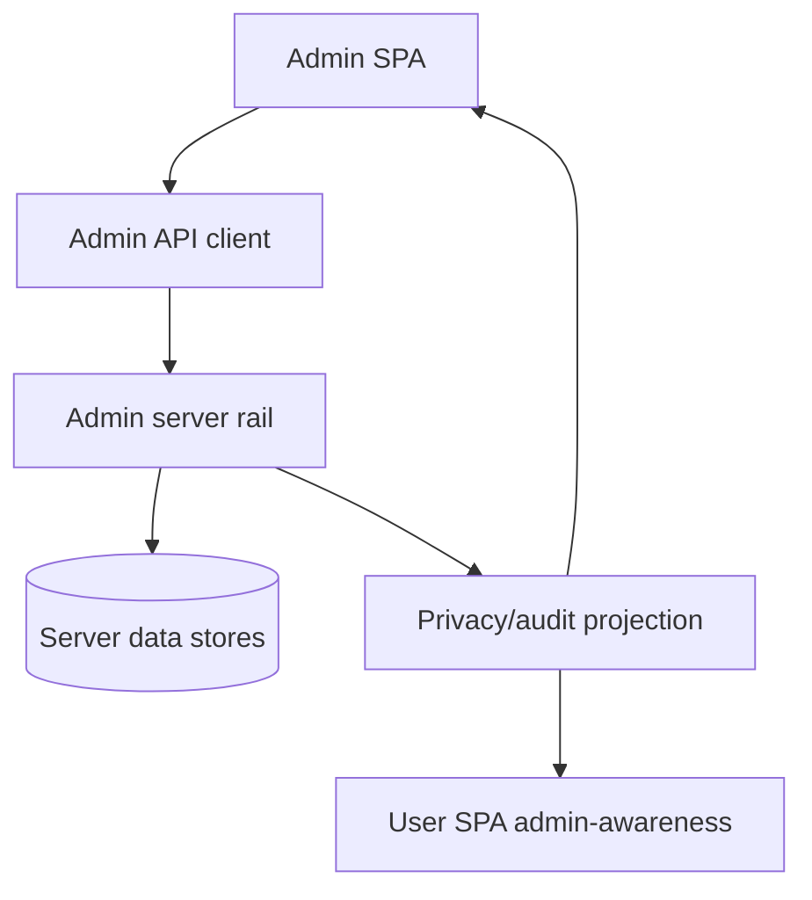

# Admin Architecture

Admin architecture is the operational control plane for Borgee. It has a browser SPA, a dedicated admin API client, a server-side admin rail, and privacy/audit projections that make admin impact observable without turning user content into an admin browsing surface.

## Architecture At A Glance

| Layer | Role | Owns | Does not own |
| --- | --- | --- | --- |
| Admin SPA | Browser console for operators. | Entry, session provider, protected routes, page surfaces. | Server enforcement or persistence. |
| Admin API client | Frontend boundary for admin endpoints. | Admin path prefix, request shape, response types, admin errors. | User API calls or server authorization. |
| Admin server rail | Server control plane. | Admin auth, middleware, handlers, serializers, audit writes, retention endpoints. | User session authority or user feature UI. |
| Privacy/audit projection | Shared visibility model for admin impact. | Admin audit views, user-scoped impact view, impersonation grant state. | A guarantee that every local/helper audit source is ingested. |

## Responsibilities

This section owns the architecture contract between admin browser surfaces, admin server endpoints, and privacy/audit visibility. The SPA subdocument explains browser composition; the server rail subdocument explains server surfaces; the privacy/audit subdocument explains audience-specific projections.

It does not own user SPA feature behavior, remote node execution, host helper authority, or plugin transport behavior.

## Primary Boundaries

| Boundary | Architectural rule |
| --- | --- |
| Session | Admin authority comes from the admin session cookie and admin session table, not from user cookies or user roles. |
| API prefix | Admin endpoints live on the admin rail and are consumed through the admin API client. |
| Metadata | Admin read surfaces are intentionally metadata-oriented unless a server contract explicitly exposes more. |
| User awareness | Users see only their own admin-impact projection and impersonation grant state on the user rail. |
| Audit | Durable server audit is the authority for admin impact records; notification is secondary. |

## Subdocuments

| Document | Scope |
| --- | --- |
| `spa.md` | Admin SPA entry, session, API client, route/page layering, and user rail isolation. |
| `server-rail.md` | Admin server rail surfaces, auth boundary, route classes, and server-only/admin API-only endpoints. |
| `privacy-audit.md` | Audit projection, user privacy view, admin audit view, impersonation grant, and current gaps. |
| `ui/` | Interaction and layout reference sketches for core admin pages; they do not define the complete route inventory or server contract. |

## Implementation Anchors

| Concern | Anchors |
| --- | --- |
| Admin SPA | `packages/client/src/admin/` |
| Admin API client | `packages/client/src/admin/api.ts` |
| Admin server rail | `packages/server-go/internal/admin/`, `packages/server-go/internal/api/` |
| Admin route wiring | `packages/server-go/internal/server/server.go` |
| Privacy/audit store | `packages/server-go/internal/store/admin_actions.go` |
