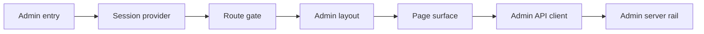

# Admin SPA Design

The admin SPA is an operational console. Its design goal is separation: separate browser entry, separate session model, separate API client, separate route tree, and separate page surfaces from the user SPA.

## Architecture



| Decision | Design effect |
| --- | --- |
| Separate entry | Admin can evolve without participating in user shell state or user PWA assumptions. |
| Cookie-backed session | Browser state stays minimal; server remains session authority. |
| Protected route tree | Pages are inaccessible until initial session check completes and a session exists. |
| Dedicated API client | Admin request paths, errors, and response types stay out of the user API client. |
| Page-level REST loading | Admin pages are pull-driven; no admin WebSocket rail is mounted in the current SPA. |

## Responsibilities

The admin SPA owns the browser-side admin shell: session refresh, login/logout, protected routing, navigation, page composition, admin request types, and rendering of admin metadata and explicit admin operations.

It does not own backend enforcement, endpoint implementation, audit storage, server-side privacy filtering, or user-facing feature workflows. Those belong to the admin server rail or user SPA modules.

## Entry And Session

The admin entry starts with an auth provider, then renders the admin app. The provider performs an initial session refresh so routing can distinguish “checking” from “unauthenticated.”

The session model is intentionally small: an admin identity with login information, backed by a cookie. The browser does not model admin role hierarchy, token strings, or expiry as primary SPA state.

Login is a two-step browser flow: submit credentials to the admin auth endpoint, then refresh the current admin session. Logout calls the admin logout endpoint and clears browser session state even if the request fails.

## Routing And Page Layers

```text
/admin
  unauthenticated -> login
  authenticated   -> dashboard

/admin/*
  unauthenticated -> login redirect
  authenticated   -> admin layout
```

Admin pages are grouped by operational domain:

| Page group | Purpose | Mutation posture |
| --- | --- | --- |
| Dashboard | Operational counts and high-level status. | Read-only. |
| Users and user detail | User lifecycle, account controls, permissions, and owned agents. | Explicit admin mutations. |
| Channels and archived channels | Channel metadata, force-delete controls, archived visibility, description history. | Mixed: force-delete in active channel view; archived/history are read-only. |
| Invites | Invite code creation and revocation. | Explicit admin mutations. |
| Audit log and multi-source audit | Admin/audit visibility across server and related sources. | Read-only in the SPA. |
| Runtimes and heartbeat lag | Runtime and host-lag operational metadata. | Read-only in the SPA. |
| Settings | Current admin session summary and logout. | Session operation only. |

The admin layout owns admin navigation and nested page selection. Individual pages own their local filters, loading states, and forms; durable results come from the admin API client.

## Admin API Client Boundary

The admin API client is the only frontend boundary for admin endpoint calls. It centralizes the admin path prefix, cookie inclusion, JSON request behavior, typed response shapes, and admin-specific error type.

This keeps user features from accidentally depending on admin endpoints and keeps admin page types from leaking into the user API client. When an admin endpoint shape changes, the admin API client is the place to update the browser contract before page code changes.

## User Rail Isolation

| Boundary | Admin SPA | User SPA |
| --- | --- | --- |
| Entry | Admin HTML and admin React entry. | User HTML and user React entry. |
| Session/state | Admin auth provider and minimal admin session. | User app context with channels, DMs, messages, permissions, presence. |
| Navigation | Browser routes under the admin path space. | Shell view mode plus selected channel/tab state. |
| API | Admin endpoint prefix through the admin API client. | User endpoint paths through the user API client. |
| Realtime | No admin realtime hook mounted. | User WebSocket for chat, presence, and signals. |
| PWA | No dedicated admin PWA registration in the admin entry. | User entry registers service-worker behavior. |

User-facing admin-awareness is not an admin SPA feature. The normal user shell can show the user's own admin-impact history and impersonation grant through user-owned endpoints, without creating an admin session.

## Metadata And Safety Design

The admin SPA is designed around metadata and explicit operational actions. It can render powerful controls, but it should not become a viewer for user message bodies, file bodies, artifact contents, raw API keys, or agent private reasoning unless the server rail intentionally exposes such a contract and the privacy model is updated.

Current page posture:

| Area | Safety posture |
| --- | --- |
| Audit metadata | Rendered as metadata rows; body/content fields are expected to be server-sanitized. |
| Runtime metadata | Read-only operational fields; detailed private failure content is not modeled as page state. |
| Archived channels | Read-only archived list; description history is a narrow history surface. |
| User mutations | Explicit forms/buttons for password, role, disabled state, permission grants, create/delete. |
| Channel mutations | Force delete is explicit and limited to the channel management page. |
| Invites | Create/revoke is explicit and scoped to invite code management. |

The SPA must not treat frontend hiding as enforcement. Security and privacy are server rail responsibilities; the frontend design keeps the boundary visible and avoids mixing user and admin data clients.

## Relationship To Admin Server Rail

The admin SPA is a consumer of the admin server rail. The server rail owns auth, cookie issuance, request authorization, response sanitization, audit writes, and database effects. The SPA owns presentation, local form state, route protection based on the current session, and request composition.

When adding an admin capability, update the architecture in this order: server rail contract, admin API client type/function, page surface, and user-facing admin-awareness surface if the action affects a user's privacy or account state.

## Interfaces To Other Modules

| Interface | Contract |
| --- | --- |
| Build/PWA | Admin shares the client build but not the user PWA registration path. |
| Admin server rail | Server is authority for auth, privacy, audit, and mutations. |
| User SPA | Isolated runtime; only user-owned admin-awareness metadata crosses into the user rail. |
| Privacy/audit docs | Should stay aligned when admin-visible metadata or user-facing promises change. |

## Implementation Anchors

| Concern | Anchors |
| --- | --- |
| Admin entry | `packages/client/admin.html`, `packages/client/src/admin/main.tsx` |
| Admin app boundary | `packages/client/src/admin/` |
| Session boundary | `packages/client/src/admin/auth.ts` |
| Admin API boundary | `packages/client/src/admin/api.ts` |
| Admin route tree | `packages/client/src/admin/AdminApp.tsx` |
| Page surfaces | `packages/client/src/admin/pages/` |
