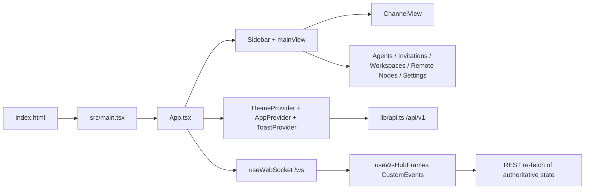

# Client User SPA

This module documents the user-facing React SPA in `packages/client`. The admin SPA is a separate rail documented under `../admin/`; the shared Vite build emits both HTML entries, but the user app and admin app keep separate entries, providers, API clients, and routing/state models (`packages/client/vite.config.ts`, `packages/client/index.html`, `packages/client/admin.html`, `packages/client/src/main.tsx`, `packages/client/src/admin/main.tsx`).

## Module Overview

The user SPA is a Vite React application mounted from `packages/client/src/main.tsx` through `packages/client/index.html`. The entry renders `<App />` under `React.StrictMode` and registers `/sw.js` on window load when service workers are available (`packages/client/src/main.tsx`, `packages/client/index.html`).

`App.tsx` owns the user shell. It wraps `AppInner` with `ThemeProvider`, `AppProvider`, and `ToastProvider`; after auth it loads current user, permissions, channels, and online users before marking the app initialized (`packages/client/src/App.tsx`, `packages/client/src/context/AppContext.tsx`, `packages/client/src/lib/api.ts`).

`AppContext` is the user SPA state boundary. It stores channels, groups, DMs, selected channel, per-channel messages, pagination/loading flags, current user, permissions, online users, connection state, typing users, pending messages, channel member version counters, and initialization status (`packages/client/src/context/AppContext.tsx`, `packages/client/src/types.ts`).

`lib/api.ts` is the same-origin user REST client. It calls `/api/v1/*`, includes cookies, adds `X-Dev-User-Id` only in dev after `setDevUserId`, and avoids forcing `Content-Type` for `FormData` uploads (`packages/client/src/lib/api.ts`).

Realtime is a wake-up and optimistic-delivery layer, not the sole source of truth. `useWebSocket` connects to `/ws`, updates reducer-owned state for chat/presence/channel frames, and bridges signal-only frames through `useWsHubFrames`; consumers then pull authoritative REST data (`packages/client/src/hooks/useWebSocket.ts`, `packages/client/src/hooks/useWsHubFrames.ts`, `packages/client/src/components/MessageList.tsx`, `packages/client/src/components/ArtifactPanel.tsx`).

## Responsibilities

The client module is responsible for the browser-side user experience: auth gating, app shell state, sidebar/channel navigation, message display and composition, DM rail, channel canvas/artifact view, channel workspace browsing/editing, remote node browsing from user-owned bindings, agent management, invitations inbox, settings privacy/impersonation awareness, service-worker registration, and user REST/WS client wiring (`packages/client/src/App.tsx`, `packages/client/src/components/Sidebar.tsx`, `packages/client/src/components/ChannelView.tsx`, `packages/client/src/components/AgentManager.tsx`, `packages/client/src/components/Settings/SettingsPage.tsx`).

The client module is not responsible for admin routing or admin auth. It does not mount `AdminAuthProvider`, `AdminApp`, or the admin `/admin-api/v1` client; those live under `packages/client/src/admin/*` and are documented in `../admin/README.md` and `../admin/spa.md` (`packages/client/src/App.tsx`, `packages/client/src/admin/main.tsx`, `packages/client/src/admin/api.ts`).

The client module is not the authority for persistence, ACLs, admin privacy boundaries, artifact/workspace storage, remote node execution, or audit-log content. It renders and mutates through backend APIs and treats REST responses as the authoritative state (`packages/client/src/lib/api.ts`, `packages/client/src/hooks/useWebSocket.ts`, `packages/client/src/components/Settings/PrivacyPromise.tsx`).

## Interfaces To Other Modules

| Interface | Direction | Contract | Evidence |
| --- | --- | --- | --- |
| Vite/build | Browser entry -> built assets | `index.html` loads `/src/main.tsx`; Vite builds both user and admin HTML inputs. | `packages/client/index.html`, `packages/client/vite.config.ts` |
| User REST rail | SPA -> backend | All user data and mutations go through `/api/v1/*` via `lib/api.ts`. | `packages/client/src/lib/api.ts` |
| WebSocket rail | SPA <-> backend | `/ws` carries chat/presence/channel frames plus signal-only frames; missed data is reconciled by REST. | `packages/client/src/hooks/useWebSocket.ts`, `packages/client/src/hooks/useWsHubFrames.ts` |
| Static uploads | Browser -> backend/static | Dev proxy forwards `/uploads`; image creation uses `POST /api/v1/upload`. | `packages/client/vite.config.ts`, `packages/client/src/lib/api.ts`, `packages/client/src/components/MessageInput.tsx` |
| Admin awareness | User SPA -> user-owned admin metadata endpoints | Settings and impersonation banner use `/api/v1/me/admin-actions` and `/api/v1/me/impersonation-grant`, not `/admin-api/v1`. | `packages/client/src/lib/api.ts`, `packages/client/src/components/Settings/SettingsPage.tsx`, `packages/client/src/components/Settings/BannerImpersonate.tsx` |
| PWA/cache | Browser -> public assets | User entry links the manifest and registers `/sw.js`; admin entry does not link the manifest. | `packages/client/index.html`, `packages/client/admin.html`, `packages/client/src/main.tsx`, `packages/client/public/sw.js` |

## Submodule Documents

| Document | What to read it for |
| --- | --- |
| `app-shell-state.md` | Entry, providers, auth bootstrap, `mainView`, `AppContext`, reducer state, and user shell boundaries. |
| `realtime-sync.md` | User REST client, `/ws` hook, reconnect/backfill, pending-message ack/nack, and WS signal -> REST pull pattern. |
| `feature-surfaces.md` | Maintainer view of chat, channel, DM, artifact, workspace, remote, settings, agent, and invitation surfaces. |
| `ui-map.md` | Locator map from user-visible areas to components/hooks/API files; it is not a design spec. |
| `build-pwa-cache.md` | Vite dual entry, package scripts, dev proxy, PWA manifest, service worker cache, push, and cache boundaries. |
