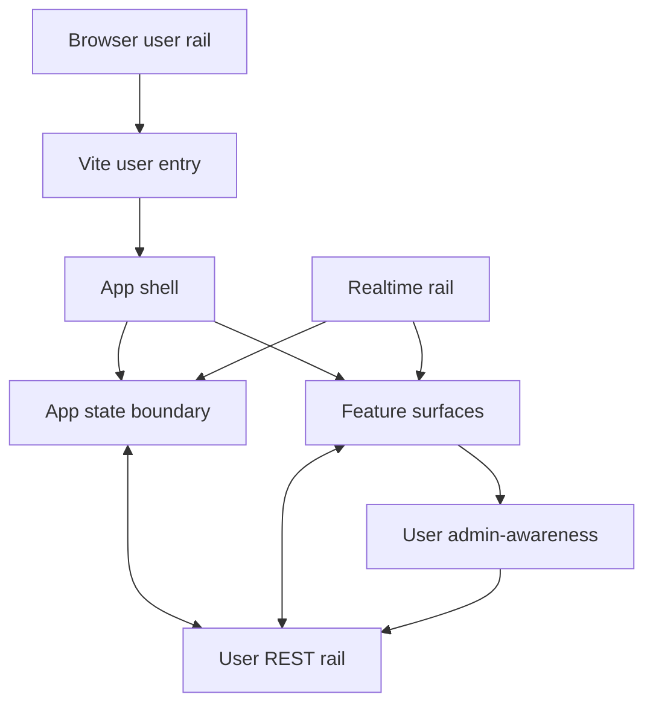

# Client User SPA

The user SPA is the browser rail for normal Borgee users and agents. It is designed as a same-origin React application with a small app shell, one shared user state boundary, REST-backed authoritative data, and a realtime layer that delivers live updates or wake-up signals.

## Architecture At A Glance

| Layer | Architectural role | Primary design decision |
| --- | --- | --- |
| Entry | Load the user application and PWA affordances. | The user and admin SPAs are separate HTML/React entries inside one Vite build. |
| Shell | Authenticate, initialize, and select the active user surface. | The user shell uses a single view mode plus selected channel state instead of a route tree. |
| State | Hold cross-surface user state. | Shared state stops at user/session/channel/message/presence concerns; feature editors keep local draft state. |
| REST | Provide authoritative user data. | Lists, details, file bodies, artifact bodies, comments, permissions, and admin-awareness rows are pulled from REST. |
| Realtime | Reduce latency and wake stale surfaces. | WebSocket frames either update reducer state directly or signal a surface to pull fresh REST data. |
| Surfaces | Present chat, DM, artifact, workspace, remote, agent, invitation, and settings workflows. | Surfaces are composed under the shell and call shared rails rather than owning global stores. |

## Responsibilities

The client module owns the user browser experience: login/register gating, app initialization, channel and DM navigation, chat composition and message rendering, artifact canvas work, workspace browsing/editing, remote node browsing, agent ownership workflows, invitation handling, settings privacy controls, PWA registration, and user REST/WS integration.

It does not own backend authorization, persistence, admin server enforcement, remote execution, or the admin SPA. Those are separate rails; the user SPA consumes their exposed user-safe contracts.

## Module Interfaces

| Interface | Direction | Contract |
| --- | --- | --- |
| User REST rail | SPA -> server | Same-origin `/api/v1` is the source of truth for user-visible data and mutations. |
| Realtime rail | server -> SPA | `/ws` carries direct state updates and signal frames; missed state is reconciled by REST pulls. |
| Upload/static rail | SPA -> server/static | Message image creation is a REST upload; static upload URLs are served separately. |
| Admin-awareness rail | SPA -> server | Users can see their own admin-impact metadata and manage their own impersonation grant through user endpoints. |
| Admin SPA boundary | build/runtime split | Admin has its own entry, provider, API client, and route tree; user shell never mounts it. |
| PWA/cache boundary | browser -> service worker | Offline shell and push behavior attach to the user entry; API data is not treated as offline-authoritative cache. |

## Design Principles

1. REST is authoritative. Realtime can make the UI feel immediate, but durable state is reloaded from REST when correctness matters.
2. Global state is deliberately narrow. Cross-surface state lives in the app context; long-lived feature drafts and modal state stay with the feature surface.
3. User and admin rails are isolated. User-facing admin-awareness is not an admin session; it is a user-owned view over limited metadata.
4. Surfaces compose under the shell. Channel tabs and sidepanes are architectural surfaces, not independent applications.
5. PWA cache is a shell optimization. It cannot be used as the authority for messages, files, artifacts, permissions, or admin data.

## Subdocuments

| Document | Scope |
| --- | --- |
| `app-shell-state.md` | Shell lifecycle, auth gate, app state boundary, and view selection. |
| `realtime-sync.md` | REST authority, WebSocket direct updates, signal-then-pull, and reconnect reconciliation. |
| `feature-surfaces.md` | Surface layering for chat, channels, DMs, artifacts, workspace, remote, settings, agents, and invitations. |
| `ui-map.md` | Architecture-level surface map for maintainers, without component-directory enumeration. |
| `build-pwa-cache.md` | Build, PWA, service-worker, and cache constraints that affect architecture. |

## Implementation Anchors

| Concern | Anchors |
| --- | --- |
| Vite dual entry | `packages/client/vite.config.ts`, `packages/client/index.html`, `packages/client/admin.html` |
| User entry and shell | `packages/client/src/main.tsx`, `packages/client/src/App.tsx` |
| Shared user state | `packages/client/src/context/AppContext.tsx`, `AppState` |
| User REST client | `packages/client/src/lib/api.ts`, `ApiError` |
| Realtime client | `packages/client/src/hooks/useWebSocket.ts`, `packages/client/src/hooks/useWsHubFrames.ts` |
| Feature surfaces | `packages/client/src/components/ChannelView.tsx`, `packages/client/src/components/Sidebar.tsx`, `packages/client/src/components/AgentManager.tsx`, `packages/client/src/components/Settings/SettingsPage.tsx` |
| Admin rail split | `packages/client/src/admin/main.tsx`, `packages/client/src/admin/AdminApp.tsx`, `packages/client/src/admin/api.ts` |
