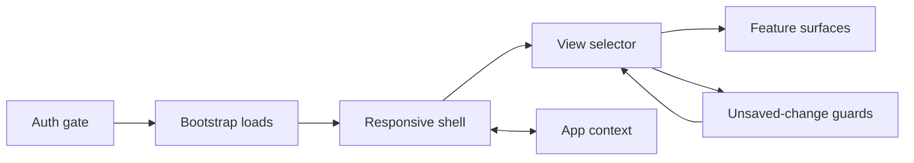

# App Shell And State

The app shell is the user SPA's runtime boundary. It turns an authenticated browser session into an initialized workspace, then coordinates a small set of global state that multiple surfaces need to share.

## Architecture

| Phase | Purpose | Architectural constraint |
| --- | --- | --- |
| Auth gate | Decide whether to show login/register or the workspace. | The shell does not render authenticated surfaces until session check completes. |
| Bootstrap | Load current user, permissions, channels, and online users. | Only the data required for first workspace render blocks `initialized=true`. |
| Shell layout | Hold responsive sidebar state and authenticated banner placement. | Layout state stays in the shell because it is view orchestration, not domain state. |
| View selection | Choose one sidepane or the selected channel view. | A single view mode prevents overlapping sidepanes and stale stacked UI. |
| Shared state | Store data that must be consistent across surfaces. | App context owns shared user state; feature-specific drafts stay local. |

## Responsibilities

The shell owns authentication gating, initial user data loading, view-mode selection, responsive sidebar behavior, global impersonation banner placement, WebSocket send/ack wiring, and channel auto-selection after bootstrap.

The shell does not own feature editing workflows, backend authorization, or admin routing. It delegates feature behavior to surfaces and data authority to REST.

## State Boundary

Global app state is intentionally scoped to data that multiple surfaces or rails must coordinate:

| State category | Why it is global |
| --- | --- |
| Channels and groups | Sidebar, channel view, realtime frames, and navigation all need the same channel rail model. |
| DMs | DM channels share the selected-channel model, but the DM rail refreshes lazily after the sidebar mounts. |
| Selected channel | The shell, sidebar, chat, tabs, and read-marker behavior share one active channel identity. |
| Message pages and pending messages | Chat rendering, optimistic send, retry, ack/nack, and reconnect reconciliation share message state. |
| Current user and permissions | Navigation, permission-gated controls, and user-owned settings depend on the same identity. |
| Online users and connection state | Sidebar, DM presence, banners, and realtime diagnostics need a single connection view. |
| Typing users and channel member version | Transient collaboration UI and member-dependent lists need coordinated invalidation. |
| Initialization flag | Prevents authenticated surfaces from rendering before required bootstrap state exists. |

Feature-local state stays outside the shared context when it is not required across surfaces: editor drafts, modal state, selected files, selected remote bindings, artifact edit forms, filter fields, and local loading/error state.

## View Model

The user shell has one primary view mode: channel, agents, invitations, workspaces, remote nodes, Helper status, or settings. Channel mode then delegates to the selected channel and its tab state. This keeps app-level navigation shallow and avoids using browser routes for normal user workflow.

View mode is backed by a navigation stack rather than a single value. `NavigationProvider` owns the stack; `useNavigation` exposes `push`, `back`, `close`, `current`, and `canGoBack`. `push` is dedupe-on-top so repeated entry clicks never inflate the stack. `back` pops one layer and falls back to channel when the stack is one deep; `close` always clears the stack to channel. Channel is the only implicit home; the stack is in-memory only and is not persisted to URL or storage.

Sidepane page headers render through the shared `PageHeader` component (back arrow on the left, close on the right, optional actions slot). Back drives `nav.back` so users can step out of a sub-page (for example, Remote Nodes opened from Settings) without losing the parent page; close drives `nav.close` for an explicit return-to-channel exit.

The sidebar footer separates account/session behavior, repeated primary entries, and secondary actions. The primary row exposes the avatar account trigger plus Agents, Workspaces, Settings, and a More toggle for Invitations when role gates allow it. The avatar opens the account panel, which shows account summary and Logout only. Pending invitation count appears on More for discoverability. Remote Nodes and Helper Status are launched from the Settings Runtime tab as separate entries; that IA move does not merge Remote Agent and Helper rails, expand account settings, or change feature authorization.

Before switching view mode, the shell runs registered unsaved-change guards. Feature forms that can lose user input register with the guard system; the shell treats cancellation as a navigation veto.

## Initialization And Refresh

Initialization follows a simple sequence: validate session, load identity, load permissions, load channel rail, load online users, then mark initialized. DM channels are not part of the initialized gate; the sidebar refreshes the DM rail after it mounts, and the realtime hook subscribes DM channels as they appear. Online users refresh periodically after authentication because presence is useful even without a fresh WS event.

The shell also wires WebSocket send and ack-timer functions into the shared context. Message composition and retry flows can then remain feature-local while using the same realtime transport. The realtime hook accepts an `isAuthenticated` argument; the shell passes its session-check result so the hook is inert (no `/ws` connect) until the session cookie is set. This prevents the pre-auth 401 reconnect loop that would otherwise spam the browser console during fresh signup.

## Interfaces To Other Modules

| Interface | Contract |
| --- | --- |
| REST client | The shell and context actions pull user/session/channel/message/permission data from the user REST rail. |
| Realtime hook | The shell subscribes joined channels and exposes send/ack functions through context. |
| Feature surfaces | Surfaces receive the selected context and call context actions rather than duplicating global state. |
| Settings/admin-awareness | The authenticated shell hosts the active impersonation banner and settings entry point. |
| Admin rail | No admin provider or admin router participates in the user shell. |

## Implementation Anchors

| Concern | Anchors |
| --- | --- |
| User entry | `packages/client/src/main.tsx` |
| Shell and view mode | `packages/client/src/App.tsx`, `MainView`, `MAIN_VIEW_DEFAULT` |
| Navigation stack | `packages/client/src/components/Navigation/NavigationContext.tsx` (`NavigationProvider`, `useNavigation`) |
| Shared page header | `packages/client/src/components/common/PageHeader.tsx` |
| App state boundary | `packages/client/src/context/AppContext.tsx`, `AppState`, `AppProvider` |
| User REST actions | `packages/client/src/lib/api.ts` |
| Realtime wiring | `packages/client/src/hooks/useWebSocket.ts` |
| Unsaved-change guard | `packages/client/src/hooks/useUnsavedChangesGuard.ts` |
| Surface hosts | `packages/client/src/components/Sidebar.tsx`, `packages/client/src/components/ChannelView.tsx` |
