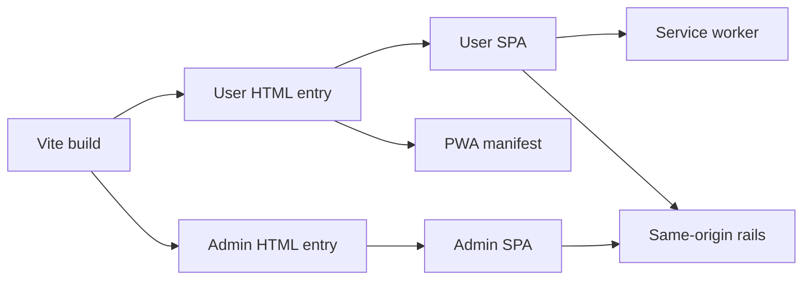

# Build, PWA, And Cache Constraints

This document records architecture constraints created by the frontend build, entry split, service worker, and cache behavior. It is not a build tutorial.

## Architecture

| Constraint | Architectural impact |
| --- | --- |
| One Vite package builds two entries. | User and admin share build tooling and CSS assets but keep separate runtime roots. |
| The user entry owns PWA registration. | Install/offline/push behavior is attached to the user rail, not treated as an admin feature. |
| API rails are same-origin in browser code. | User and admin clients depend on path separation rather than separate frontend hosts. |
| Service worker uses network-first shell caching. | Cache improves app-shell resilience but is not the source of truth for domain data. |
| Dev proxy mirrors production path separation. | `/api`, `/admin-api`, `/ws`, and uploads remain distinct architectural rails during local development. |

## Responsibilities

This module describes build-time and browser-cache constraints that affect the SPA architecture: dual entry, same-origin proxy assumptions, PWA scope, service-worker cache strategy, and push-notification entry point.

It does not own deployment, backend serving, CDN configuration, test commands, or admin route/session design.

## Dual Entry Boundary

The frontend build emits both the user and admin HTML entries. This is a packaging choice, not a runtime merge: the user entry mounts the user shell and PWA registration path; the admin entry mounts the admin session provider and admin route tree.

Because both entries share a package, shared CSS and static assets can be reused. Runtime state, providers, API clients, and navigation remain split by entry.

## Same-Origin Rail Constraint

The browser talks to backend rails through path prefixes on the same origin. The user API rail, admin API rail, WebSocket rail, health endpoint, and upload/static serving are separate by URL prefix.

This means frontend architecture must preserve path ownership: user features call user endpoints, admin pages call admin endpoints, and shared build configuration should not blur the two API clients.

## PWA And Service Worker Constraint

The PWA manifest and service-worker registration are associated with the user entry. The service worker precaches a small app shell, uses network-first behavior for cacheable GETs, and falls back to the shell for offline navigation.

Domain data remains REST-authoritative. Messages, files, artifacts, permissions, admin metadata, and remote reads should not be designed around service-worker cache correctness.

## Cache Safety Boundary

The service worker explicitly skips user API and WebSocket paths. It does not explicitly skip the admin API prefix in current code, so any change that makes admin pages service-worker-controlled should evaluate whether admin GET responses can be cached by the generic network-first handler.

Upload/static URLs are not in the explicit skip list. They should be treated as static asset serving from a browser-cache perspective, separate from upload creation through REST.

## Push Boundary

Browser push handling lives in the service worker and supports mention and agent-task notification payloads. Notification click behavior returns the user to the app root rather than routing to a deep admin or feature page.

## Interfaces To Other Modules

| Interface | Contract |
| --- | --- |
| User SPA | Owns PWA registration and user app shell behavior. |
| Admin SPA | Shares the build but has no separate PWA registration in its entry. |
| REST/realtime sync | Depends on same-origin path prefixes and service-worker skip behavior. |
| Feature surfaces | Must treat service-worker cache as shell/static optimization, not domain authority. |

## Implementation Anchors

| Concern | Anchors |
| --- | --- |
| Build config | `packages/client/vite.config.ts` |
| User entry | `packages/client/index.html`, `packages/client/src/main.tsx` |
| Admin entry | `packages/client/admin.html`, `packages/client/src/admin/main.tsx` |
| User REST client | `packages/client/src/lib/api.ts` |
| Admin REST client | `packages/client/src/admin/api.ts` |
| Service worker | `packages/client/public/sw.js` |
| PWA manifest | `packages/client/public/manifest.json` |
