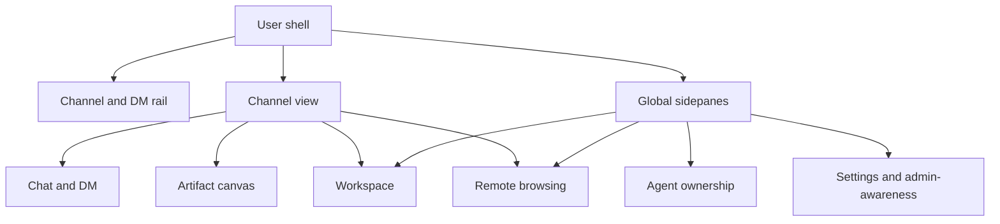

# Feature Surfaces

Feature surfaces are the user SPA's task-oriented areas. They are arranged by shell view and channel tab, but they share the same state, REST, and realtime rails.

## Surface Architecture

| Surface layer | Design role | Data boundary |
| --- | --- | --- |
| Rail | Navigate channels, DMs, and global sidepanes. | Reads shared channel/DM/current-user state and emits shell navigation. |
| Channel view | Host a selected channel or DM. | Owns tab selection and delegates content to chat/canvas/workspace/remote. |
| Chat/DM | Conversation, optimistic send, mentions, reactions, typing. | Uses shared message state and REST/WS send contracts. |
| Canvas/artifact | Channel-scoped durable artifact work. | Pulls artifact heads, versions, anchors, iterations, and comments from REST. |
| Workspace | Channel file workspace plus all-workspaces management. | Pulls file trees and file bodies from REST; editor drafts stay local. |
| Remote | User-owned remote node bindings and read-only remote browsing. | Uses user remote APIs; does not cross into admin rail. |
| Agent/invitation | Owner-side agent management and join approval. | Uses user agent APIs and signal-then-pull invitation updates. |
| Settings | User privacy, admin-impact history, impersonation grant. | Uses user-owned admin-awareness endpoints only. |

## Responsibilities

Feature surfaces own user workflows and local UI state. They coordinate with shared app state only when another surface needs the same information.

They do not own backend ACLs, persistence, admin visibility policy, or realtime frame schemas. They consume shared rails and server-enforced contracts.

## Channel, Chat, And DM

The channel rail separates public/private channels from DMs, but both converge on the selected channel model. A DM is a channel-like conversation without the non-DM tab strip; normal joined channels can switch between chat, canvas, workspace, and remote browsing.

Chat is the only surface that writes messages through the realtime send path. It keeps optimistic pending state globally because message retry, ack/nack, reconnect, and render order cross component boundaries.

Mentions, slash commands, emoji, typing, reactions, edit/delete, and upload are chat capabilities layered around the same message stream. Public channel preview is read-only until join succeeds.

## Artifact Canvas

The artifact surface treats the channel canvas as a durable collaborative document area. It works with a current artifact head, version history, rollback, diff, anchors, comments, and iteration state.

Artifact and comment bodies are not accepted from realtime as authority. Realtime signals only wake the panel or comment surface; content is pulled through REST so version, ACL, and privacy rules stay centralized.

## Workspace

Workspace has two projections over the same file domain: a channel tab for the active channel and a global sidepane for all visible workspaces. The channel tab is optimized for file operations in context; the global sidepane is an index and preview surface across channels.

File upload, rename, move, delete, directory creation, Markdown edit, and preview are REST-backed. File viewer selection is local presentation logic; persisted file content remains server-owned.

## Remote Nodes

Remote nodes are user-side resources. The node-management sidepane handles node lifecycle, connection token visibility, start-command presentation, status, and channel bindings. The channel remote tab consumes those bindings for read-only browsing.

The remote browsing surface reads directory listings and file content through user APIs. It does not provide an admin bypass and does not write remote files in the current UI architecture.

## Agent And Invitation Surfaces

Agent management is an owner workflow: create/delete agents, control permissions, reveal or rotate API keys, add agents to channels, observe runtime state, and edit agent config. Sensitive key material is handled locally and not stored in shared app state.

Invitation handling is a separate owner inbox. Realtime invitation frames do not replace REST state; they wake the inbox and badge to refresh authoritative invitation status.

## Settings And Admin-Awareness

The settings surface is the user-visible privacy boundary. It shows what admin impact the user is allowed to inspect and lets the user create or revoke a temporary impersonation grant.

This is not the admin SPA. It is a user rail surface backed by user endpoints, so it can be visible in the normal shell without granting admin session capabilities.

## Interfaces To Other Modules

| Interface | Contract |
| --- | --- |
| App shell | Selects which sidepane or channel view is visible; surfaces do not own app-level navigation. |
| App state | Supplies shared rail, identity, permission, connection, message, and pending-message state. |
| REST rail | Supplies durable state for all feature domains. |
| Realtime rail | Supplies direct chat/presence updates and wake-up signals for pull refresh. |
| Admin rail | Isolated from user feature surfaces except for user-owned admin-awareness endpoints. |

## Implementation Anchors

| Surface | Anchors |
| --- | --- |
| Rail and channel host | `packages/client/src/components/Sidebar.tsx`, `packages/client/src/components/ChannelView.tsx` |
| Chat and DM | `packages/client/src/components/MessageInput.tsx`, `packages/client/src/components/MessageList.tsx`, `packages/client/src/components/DMThread.tsx` |
| Commands and mentions | `packages/client/src/commands/registry.ts`, `packages/client/src/hooks/useSlashCommands.ts`, `packages/client/src/extensions/mention.ts` |
| Artifact canvas | `packages/client/src/components/ArtifactPanel.tsx`, `packages/client/src/components/ArtifactComments.tsx`, `packages/client/src/components/AnchorThreadPanel.tsx`, `packages/client/src/components/IteratePanel.tsx` |
| Workspace | `packages/client/src/components/WorkspacePanel.tsx`, `packages/client/src/components/WorkspaceManager.tsx`, `packages/client/src/components/FileViewer.tsx` |
| Remote | `packages/client/src/components/NodeManager.tsx`, `packages/client/src/components/RemotePanel.tsx`, `packages/client/src/components/RemoteTree.tsx`, `packages/client/src/components/RemoteFileViewer.tsx` |
| Agents and invitations | `packages/client/src/components/AgentManager.tsx`, `packages/client/src/components/AgentConfigPanel.tsx`, `packages/client/src/components/InvitationsInbox.tsx` |
| Settings/admin-awareness | `packages/client/src/components/Settings/SettingsPage.tsx`, `packages/client/src/components/Settings/PrivacyPromise.tsx`, `packages/client/src/components/Settings/BannerImpersonate.tsx` |
| User API surface | `packages/client/src/lib/api.ts` |
