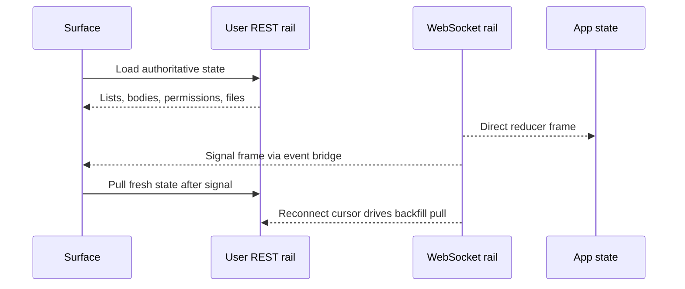

# Realtime Sync

The user SPA sync model is REST-authoritative with WebSocket acceleration. REST owns durable truth; WebSocket reduces latency, carries presence and message acks, and wakes surfaces that then pull fresh state.

## Architecture



| Sync channel | Used for | Not used for |
| --- | --- | --- |
| REST | Authoritative lists, details, file bodies, artifact bodies, comments, permissions, workspace data, remote reads, admin-awareness rows. | Low-latency typing/presence and optimistic message ack state. |
| WebSocket direct frames | New messages, message ack/nack, presence, typing, reactions, channel/group changes, connection state. | Persisting full feature detail models. |
| WebSocket signal frames | Invitations, artifact changes, mention push, anchor/comment/iteration changes. | Rendering full message, comment, artifact, or iteration bodies. |
| Backfill pulls | Repair state after reconnect using cursor and per-channel message reconciliation. | Cold-start full-history loading. |

## Responsibilities

Realtime sync owns connection lifecycle, subscription state, frame normalization, reducer updates, signal dispatch, pending-message resolution, and reconnect repair.

It does not own server event storage, frame schema evolution, backend authorization, or admin realtime behavior. Admin pages are REST-driven in the current design.

## REST Authority

The REST rail is the single source of truth for any data that must survive reloads or be privacy/ACL correct: channel membership, messages, files, artifact content, comments, agent configuration, remote file reads, permissions, audit visibility, and impersonation grants.

Surfaces should prefer a pull after any signal that does not contain a complete safe payload. This is especially important for body-bearing resources such as messages, comments, artifact content, workspace files, and iteration details.

## WebSocket Direct Updates

Some frames are small enough and safe enough to apply directly to shared state. These frames update the app reducer or lightweight presence caches because their payload is already the UI state being represented.

| Direct update family | State effect |
| --- | --- |
| Message delivery and ack/nack | Adds server messages and resolves optimistic pending messages. |
| Message edit/delete and reactions | Updates existing message rows or reaction aggregates. |
| Presence and typing | Updates transient user/agent availability and typing indicators. |
| Channel and group lifecycle | Adds, removes, reorders, or updates rail metadata. |
| Membership changes | Updates member count and invalidates member-dependent UI. |
| Command refresh | Wakes command-loading logic without storing command state globally. |

## Signal Then Pull

Signal frames intentionally carry minimal data. They answer “something changed” rather than “here is the new authority.” The receiving surface decides whether the signal applies to its current scope and then pulls the relevant REST endpoint.

| Signal | Pull target | Reason |
| --- | --- | --- |
| Agent invitation pending/decided | Invitation list | Inbox and bell count should reflect server-side state and expiration/decision logic. |
| Artifact updated | Artifact head and version list | Artifact body, committer, and versions are authoritative through REST. |
| Mention pushed | Channel messages | The push preview is not the rendered message body. |
| Anchor comment added | Anchor threads and comments | Comment bodies and thread state are pulled through ACL-aware REST. |
| Iteration state changed | Iteration detail/list | Intent and result details are not treated as push authority. |
| Artifact comment added | Artifact comments | Comment body preview is not the rendered comment text. |

## Pending Message Flow

```text
compose message
  -> create pending item in shared state
  -> send over WebSocket with client message id
  -> ack inserts server message and clears pending item
  -> nack or timeout marks pending item failed
  -> retry creates a new pending item
```

Image messages add one preliminary step: upload through REST, then send the returned URL as message content over the realtime rail. The upload result is not inserted as a durable message until the send flow completes.

## Reconnect Repair

The client persists a high-water cursor when frames include one. After a dropped connection reconnects, it asks the REST rail for events after that cursor, replays them through the same frame handler, and advances the cursor only when the server returns a newer one.

Cursor backfill is not a cold-start history mechanism. If no cursor exists, normal bootstrap and per-surface loads provide state. In addition, subscribed channels reconcile missed messages by pulling messages after the last observed timestamp.

## Interfaces To Other Modules

| Interface | Contract |
| --- | --- |
| App state | Direct frames dispatch reducer actions; pending messages and connection state are shared through the app context. |
| Feature surfaces | Signal subscribers pull authoritative data and keep body-bearing resource state local. |
| REST client | Backfill, message reconciliation, uploads, artifact/comment refresh, and invitation refresh use REST. |
| Build/proxy | `/ws` must be proxied as WebSocket in development and must stay separate from REST caching assumptions. |

## Implementation Anchors

| Concern | Anchors |
| --- | --- |
| User REST client | `packages/client/src/lib/api.ts`, `BackfillEvent` |
| Realtime hook | `packages/client/src/hooks/useWebSocket.ts`, `flattenWsFrame` |
| Signal bridge | `packages/client/src/hooks/useWsHubFrames.ts` |
| Cursor persistence | `packages/client/src/lib/lastSeenCursor.ts` |
| Shared state reducer | `packages/client/src/context/AppContext.tsx`, `AppState` |
| Frame types | `packages/client/src/types/ws-frames.ts` |
| Message surfaces | `packages/client/src/components/MessageInput.tsx`, `packages/client/src/components/MessageList.tsx` |
| Signal consumers | `packages/client/src/components/ArtifactPanel.tsx`, `packages/client/src/components/ArtifactComments.tsx`, `packages/client/src/components/InvitationsInbox.tsx` |
