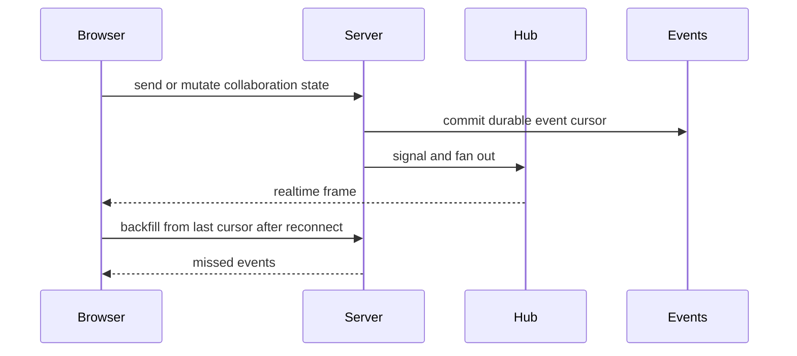
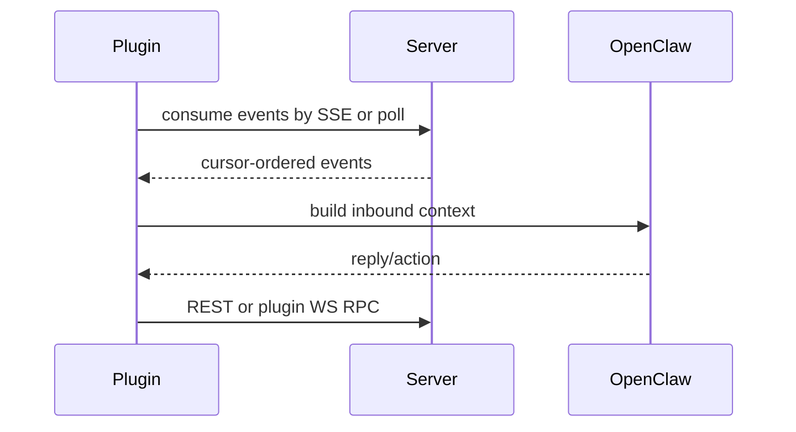
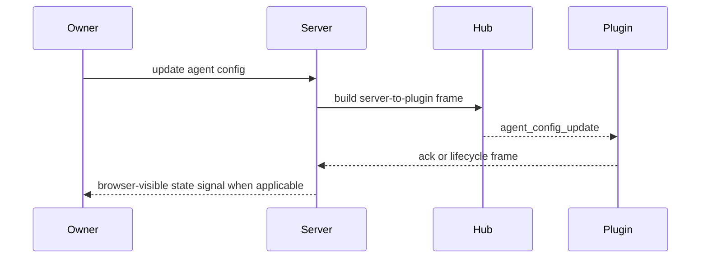
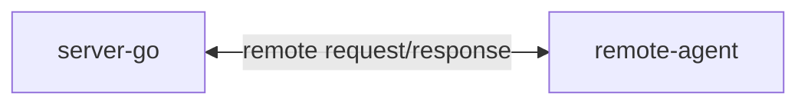

# Cross-Process Flows

This page shows the main traffic paths that cross process boundaries. It focuses on architecture flows, not handler-by-handler code behavior.

## Flow Index

This index points each cross-process flow to its owner documents. The sections below only summarize the highest-impact paths.

| Flow | Boundary | Owner docs |
| --- | --- | --- |
| Browser realtime | Browser, server Hub, event cursor recovery | [server realtime/events](server/realtime-and-events.md), [client realtime sync](client/realtime-sync.md) |
| Plugin event bridge | OpenClaw plugin, server event paths, outbound actions | [plugin runtime](plugin/openclaw-runtime.md), [plugin transports](plugin/transports.md), [server realtime/events](server/realtime-and-events.md) |
| BPP control | server-go BPP handlers and live plugin connection | [BPP internals](server/bpp-internals.md), [plugin server contracts](plugin/server-contracts.md) |
| Remote file read | server remote socket and user-machine remote-agent | [remote-agent protocol](remote-agent/protocol.md), [remote filesystem boundary](remote-agent/filesystem-boundary.md) |
| Admin privacy audit | admin browser, admin rail, audit/privacy state | [admin privacy/audit](admin/privacy-audit.md), [admin server rail](admin/server-rail.md) |
| Validation harness | local verification orchestration outside product runtime | [E2E / verification](e2e/) |

## Browser Realtime And Recovery

The browser path combines push and recovery. `/ws` gives low-latency updates; cursor backfill is the convergence path after reconnect. The server remains authoritative for writes and event ordering.

## Plugin Event Bridge

The OpenClaw plugin is an adapter. It consumes Borgee events, translates them into OpenClaw sessions, and sends OpenClaw actions back to Borgee APIs. It does not become a second event store.

## BPP Control Flow

BPP is the plugin control plane. It carries config updates, permission signals, reconnect/cold-start handshakes, and task lifecycle signals. It is not the only realtime path; browser-facing frames and event backfill still exist.

## Remote File Read Path

The remote-agent path proxies read-only file operations through a user-owned remote node connection. It stays outside server-go's process.

## Implementation Anchors

- Browser realtime consumer: `packages/client/src/hooks/useWebSocket.ts`, `packages/client/src/hooks/useWsHubFrames.ts`
- Server realtime endpoints: `packages/server-go/internal/ws`, `packages/server-go/internal/api/poll.go`
- BPP control plane: `packages/server-go/internal/bpp`, `packages/server-go/internal/ws/agent_config_push.go`, `packages/server-go/internal/ws/agent_task_state_changed_frame.go`
- Plugin bridge: `packages/plugins/openclaw/src/gateway.ts`, `packages/plugins/openclaw/src/inbound.ts`, `packages/plugins/openclaw/src/outbound.ts`
- Remote path: `packages/borgee/internal/remotews`, `packages/server-go/internal/ws/remote.go`
