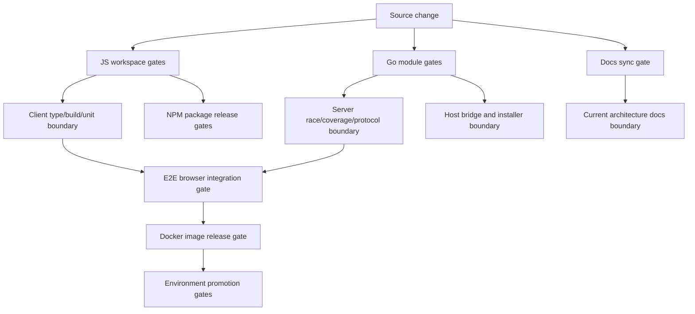
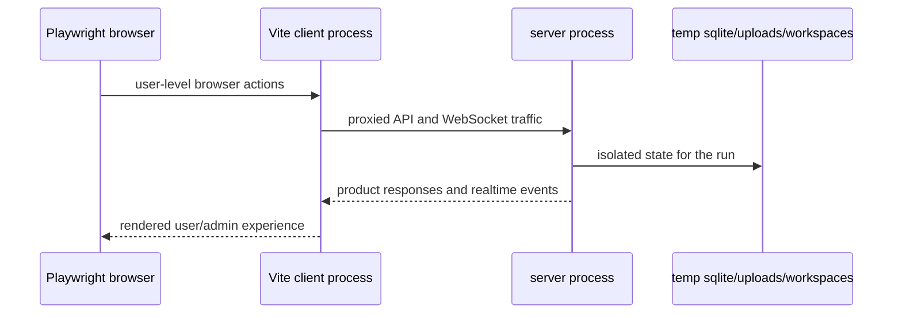

# E2E, Build, And Release Quality Gates

This module describes the architecture that proves Borgee can be built, tested, packaged, and released. It is not a runbook. The important design question is which system boundary is protected by which quality gate, and what failures are expected to stop before merge or release.

## Validation Architecture

| Protected Boundary | Gate Layer | What It Catches | What It Does Not Try To Catch |
|---|---|---|---|
| Client build boundary | JS workspace gate | TypeScript/build regressions and client-side unit behavior before browser integration | Server storage correctness or production host wiring |
| Server runtime boundary | Go module gate | API/storage regressions, data races, coverage drops, and protocol-envelope drift | Browser layout or npm package release readiness |
| Cross-process product boundary | E2E browser gate | Real browser plus real server behavior across HTTP, WebSocket, auth, admin, channel, DM, artifact, realtime, and host-bridge flows | Exhaustive server branch coverage or visual design review |
| Release artifact boundary | Docker gate | Whether the deployable image contains a compatible client bundle and server binary | Host-side compose/env correctness beyond workflow health checks |
| External integration boundary | NPM publish gate | Whether public integration packages build and can be published independently | Main web app deployability |
| Documentation freshness boundary | Docs sync gate | Whether behavior-changing paths update the matching current architecture docs | Deep semantic correctness of every doc statement |

The core design is layered rather than redundant: unit and module gates catch local failures cheaply, the E2E gate proves the browser/server contract, and release gates prove packaging and promotion artifacts. A failure at a lower layer should block before a higher layer spends time assembling or deploying artifacts.

## Dual Track Repository Organization

Borgee uses two build systems because it has two kinds of runtime units. The JavaScript workspace owns browser code, browser tests, and public TypeScript packages. The Go modules own server, helper daemon, and installer binaries. This separation keeps Node package resolution from becoming the source of truth for Go binaries, while still allowing CI and release gates to compose both tracks.

The JavaScript track is workspace-oriented: packages are selected by workspace membership and package name. That lets client build, E2E, remote-agent, and OpenClaw plugin checks run with targeted installs and targeted publishes.

The Go track is module-oriented: server, helper, and installer remain separately versioned dependency graphs. That matters architecturally because the server container, host-bridge daemon, and installer artifacts have different runtime constraints and should not share one binary dependency surface just for monorepo convenience.

## CI As Boundary Protection

CI is organized around failure domains, not around one monolithic test command. Client build and unit tests protect the browser package boundary. Server race and coverage jobs protect concurrent server behavior and coverage budgets. Protocol linting protects realtime/BPP envelope compatibility. Host-bridge checks protect platform IPC assumptions. Installer jobs protect packaged helper installation flows.

This split makes the signal actionable: a race failure points at server concurrency, a coverage failure points at Go test coverage policy, an E2E failure points at cross-process product behavior, and a publish workflow failure points at external package release readiness.

## E2E Harness Design

The E2E harness is intentionally a two-process local system. Playwright drives a real browser against a Vite-served client, while Vite proxies API and WebSocket traffic to a real server process. The server uses isolated temporary SQLite and file-storage directories for each harness run.

This design protects the contract that matters to users: the built client code, browser runtime, server API, realtime transport, auth state, admin rail, and storage side effects must work together. It deliberately avoids binding tests to a shared local server or a production-like host; shared state would make the gate less deterministic and harder to run safely in CI.

## Build And Release Gates

The Docker release path is the product release artifact. It binds the client bundle and the server binary into one container image, then promotion workflows move that image through testing, staging, and production checks. Architecturally, Docker is the compatibility boundary between browser assets and the server process: if either side cannot build or cannot fit into the image, release stops.

Deploy workflows are promotion gates, not configuration owners. They build, push, retag, recreate containers, and perform health checks; runtime secrets and compose topology live on the target hosts. This keeps environment ownership outside the repo while still making stale image and health failures visible during promotion.

NPM publish gates are separate from Docker because remote-agent and OpenClaw plugin are external integration artifacts. They are public TypeScript packages with their own build and provenance flow. Their release readiness is related to the monorepo but not coupled to web app deployment.

## Module Interfaces

This module owns the quality-gate architecture for build, test, E2E, Docker deploy, and npm publish. It consumes server, client, plugin, remote-agent, helper, and installer modules only through their build/test/release surfaces.

It does not own server API semantics, client component design, plugin protocol behavior, host permissions, installer UX, or production host configuration. Those modules define behavior; this module defines where that behavior is verified or packaged.

## Implementation Anchors

Root orchestration and workspace shape:

- `package.json`
- `pnpm-workspace.yaml`
- `Makefile`

JavaScript package boundaries:

- `packages/client/package.json`
- `packages/client/vite.config.ts`
- `packages/client/vitest.config.ts`
- `packages/e2e/package.json`
- `packages/remote-agent/package.json`
- `packages/plugins/openclaw/package.json`

Go module boundaries:

- `packages/server-go/go.mod`
- `packages/server-go/Makefile`
- `packages/borgee-helper/go.mod`
- `packages/borgee-installer/go.mod`

E2E harness and test surface:

- `packages/e2e/playwright.config.ts`
- `packages/e2e/tests/`

Container and deployment release surface:

- `packages/server-go/Dockerfile`
- `.github/workflows/deploy-test.yml`
- `.github/workflows/deploy.yml`

CI, docs sync, installer, and package publication gates:

- `.github/workflows/ci.yml`
- `.github/workflows/lint.yml`
- `.github/workflows/installer.yml`
- `.github/workflows/publish-openclaw-plugin.yml`
- `.github/workflows/publish-remote-agent.yml`
