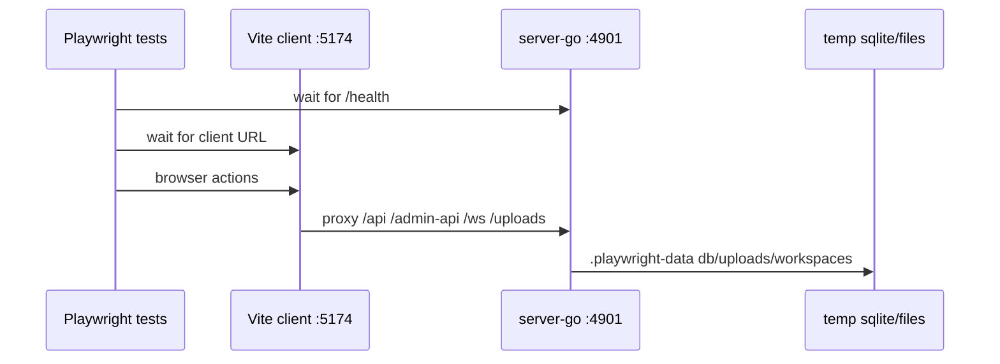

# Testing, Build, CI, Deploy Overview

This module documents how Borgee proves, builds, packages, and releases the codebase. It owns the testing/build/CI view across the repository; it does not define product behavior, server API contracts, client UI architecture, or plugin protocol semantics. Those modules consume this one when they need to know which command, workflow, or harness protects a change.

Evidence rule: every operational claim below points at the code or config file that makes it true.

## Architecture Map

```mermaid
flowchart LR
  dev[Developer / PR] --> root[root package.json + Makefile]
  root --> pnpm[pnpm workspace]
  root --> gomod[Go modules]
  pnpm --> client[@borgee/client Vite build + Vitest]
  pnpm --> e2e[@borgee/e2e Playwright]
  pnpm --> npm[NPM publish packages]
  gomod --> server[server-go tests + Docker binary]
  gomod --> helper[host-bridge helper / installer tests]
  e2e --> harness[Playwright webServer harness]
  harness --> srv[server-go :4901]
  harness --> vite[Vite :5174 proxy]
  client --> docker[server-go Dockerfile]
  server --> docker
  docker --> deploy[deploy-test / deploy staging / deploy prod]
  npm --> publish[publish workflows]
```

| Layer | What It Proves Or Builds | Primary Entrypoints | Evidence |
|---|---|---|---|
| Root orchestration | Lightweight repository-level scripts and precheck shortcuts | `pnpm dev`, `pnpm build`, `pnpm typecheck`, `make precheck` | `package.json`, `Makefile` |
| JS workspace | Vite client, Playwright package, publishable CLIs/plugins | `pnpm --filter ...` packages under workspace globs | `pnpm-workspace.yaml`, `packages/*/package.json`, `packages/plugins/openclaw/package.json` |
| Go modules | Server, helper daemon, installer are separate modules, not pnpm packages | `go test`, `go build`, module-local Makefile | `packages/server-go/go.mod`, `packages/borgee-helper/go.mod`, `packages/borgee-installer/go.mod`, `packages/server-go/Makefile` |
| CI | PR gates for client build/test, Go race/coverage, BPP lint, E2E, host-bridge IPC | GitHub Actions jobs | `.github/workflows/ci.yml`, `.github/workflows/lint.yml`, `.github/workflows/installer.yml` |
| E2E harness | Browser-level tests against real server-go plus Vite proxy | `@borgee/e2e` Playwright config and tests | `packages/e2e/package.json`, `packages/e2e/playwright.config.ts`, `packages/e2e/tests/*` |
| Release paths | Docker image deploys and npm package publication | deploy and publish workflows | `packages/server-go/Dockerfile`, `.github/workflows/deploy*.yml`, `.github/workflows/publish-*.yml` |

## Responsibility Boundary

This document is responsible for:

- Build and test topology: which package manager, module boundary, harness, or workflow runs each class of check. Evidence: `package.json`, `pnpm-workspace.yaml`, `packages/*/package.json`, `packages/*/go.mod`, `.github/workflows/ci.yml`.
- E2E execution model: Playwright starts server-go and Vite as two `webServer` entries, then runs browser tests from `packages/e2e/tests`. Evidence: `packages/e2e/playwright.config.ts`, `packages/e2e/tests/*`.
- Deploy and publish overview: Docker image build/deploy and npm package publish workflows. Evidence: `packages/server-go/Dockerfile`, `.github/workflows/deploy.yml`, `.github/workflows/deploy-test.yml`, `.github/workflows/publish-openclaw-plugin.yml`, `.github/workflows/publish-remote-agent.yml`.

This document is not responsible for:

- Server domain/API details beyond the commands that build or test server-go. Interface only: `packages/server-go/Makefile`, `.github/workflows/ci.yml`.
- Client UI/component architecture beyond Vite/Vitest/build behavior. Interface only: `packages/client/package.json`, `packages/client/vite.config.ts`, `packages/client/vitest.config.ts`.
- Plugin or remote-agent runtime protocol behavior beyond package build/publish shape. Interface only: `packages/plugins/openclaw/package.json`, `packages/remote-agent/package.json`, `.github/workflows/publish-*.yml`.
- Production host configuration, compose files, and secrets. Deploy workflows explicitly assume `docker-compose.yml` and `.env` are managed on the server. Evidence: `.github/workflows/deploy.yml`, `.github/workflows/deploy-test.yml`.

## Workspace And Modules

Borgee has a pnpm workspace for JavaScript/TypeScript packages and separate Go modules for Go binaries. The two systems meet in CI, Playwright, and Docker, but dependency resolution is separate. Evidence: `pnpm-workspace.yaml`, `packages/server-go/go.mod`, `packages/borgee-helper/go.mod`, `packages/borgee-installer/go.mod`.

| Unit | Package Or Module Shape | Build/Test Interface | Evidence |
|---|---|---|---|
| Root | Private pnpm package with Node `>=22`, pnpm `>=10` | delegates to `@borgee/client`; `pnpm -r run typecheck` spans pnpm packages | `package.json` |
| `packages/client` | Private ESM React/Vite package | `build = tsc -b && vite build`, `test = vitest run`, `typecheck = tsc --noEmit` | `packages/client/package.json` |
| `packages/e2e` | Private ESM Playwright package | `test = playwright test`; browser install/report scripts live here | `packages/e2e/package.json` |
| `packages/remote-agent` | Public npm CLI package | `build = tsc`, binary `borgee-remote-agent`, public npm publish | `packages/remote-agent/package.json`, `.github/workflows/publish-remote-agent.yml` |
| `packages/plugins/openclaw` | Public npm OpenClaw plugin package | `build = tsc`, publishes `dist`, `openclaw.plugin.json`, and `skills` | `packages/plugins/openclaw/package.json`, `.github/workflows/publish-openclaw-plugin.yml` |
| `packages/server-go` | Go module `borgee-server`, Go `1.25.0` | server tests/builds use `sqlite_fts5` in CI, Makefile, Docker, and Playwright | `packages/server-go/go.mod`, `packages/server-go/Makefile`, `packages/server-go/Dockerfile`, `packages/e2e/playwright.config.ts` |
| `packages/borgee-helper` | Go module `borgee-helper`, Go `1.25.0` | host-bridge helper is tested by Go workflows, including IPC prerequisite coverage | `packages/borgee-helper/go.mod`, `.github/workflows/ci.yml` |
| `packages/borgee-installer` | Go module `borgee-installer`, Go `1.25.0` | installer workflow cross-builds Linux and macOS artifacts and runs module tests | `packages/borgee-installer/go.mod`, `.github/workflows/installer.yml` |

The pnpm workspace includes `packages/*` and `packages/plugins/*`, so `packages/plugins/openclaw` is part of the JS workspace even though it sits one level deeper than the top-level packages. Evidence: `pnpm-workspace.yaml`, `packages/plugins/openclaw/package.json`.

`onlyBuiltDependencies: [esbuild]` is recorded in both root package metadata and workspace metadata to keep pnpm 10 installs compatible with Vite/esbuild native binary installation. Evidence: `package.json`, `pnpm-workspace.yaml`, `packages/server-go/Dockerfile`.

## Local Entrypoints

Root scripts are convenience wrappers, not a full monorepo task runner. `pnpm dev` and `pnpm build` target `@borgee/client`; `lint` scans TypeScript/TSX source under `packages/*/src`; `format` writes Prettier changes under the same glob; typecheck recursively runs package-local `typecheck` scripts where present. Evidence: `package.json`.

The root `Makefile` is a reviewer precheck surface: `precheck` runs server-go coverage, client Vitest, and client typecheck; `precheck-fast` keeps only client typecheck plus a last-changed-package convention; `registry-totals` reports regression registry counts. Evidence: `Makefile`.

`packages/server-go/Makefile` is the server developer entrypoint. It centralizes `GOTAGS := sqlite_fts5` for build, run, test, race, vet, coverage, and regression targets. Evidence: `packages/server-go/Makefile`.

The client Vite config serves local dev on port `5173`, proxies `/api`, `/admin-api`, `/health`, `/ws`, and `/uploads` to server-go, and builds two HTML entries: `index.html` and `admin.html`. Evidence: `packages/client/vite.config.ts`.

## CI Workflows

| Workflow | Trigger | Main Coverage | Evidence |
|---|---|---|---|
| `ci.yml` | Pull requests to `main` | client build, client Vitest, server-go race, race-heavy test, coverage tool, BPP envelope lint, Playwright E2E, host-bridge IPC prerequisite matrix | `.github/workflows/ci.yml` |
| `lint.yml` | Pull requests to `main` | docs/current sync guard based on changed code prefixes; maps server/client/admin/plugin/remote-agent/e2e paths to docs areas | `.github/workflows/lint.yml` |
| `installer.yml` | PRs touching installer paths, plus manual dispatch | Linux/macOS installer cross-build, installer module tests, SHA256 artifacts | `.github/workflows/installer.yml` |
| `deploy-test.yml` | Manual dispatch with branch input | build and push `test` Docker image, deploy to test host, verify image freshness and `/health` | `.github/workflows/deploy-test.yml` |
| `deploy.yml` | Manual dispatch | run client build + server-go tests, build/push staging image, deploy staging, retag prod through Harbor API, deploy production, create release tag | `.github/workflows/deploy.yml` |
| `publish-openclaw-plugin.yml` | Manual dispatch | build and publish public npm OpenClaw plugin with provenance unless version already exists | `.github/workflows/publish-openclaw-plugin.yml`, `packages/plugins/openclaw/package.json` |
| `publish-remote-agent.yml` | Manual dispatch | build and publish public npm remote-agent CLI with provenance unless version already exists | `.github/workflows/publish-remote-agent.yml`, `packages/remote-agent/package.json` |

CI uses Node 22 and pnpm 10 for PR client/E2E jobs, while npm publish workflows use Node 24 with npm registry provenance. Evidence: `.github/workflows/ci.yml`, `.github/workflows/publish-openclaw-plugin.yml`, `.github/workflows/publish-remote-agent.yml`.

CI uses Go `1.25` for server, coverage, E2E server prefetch, host-bridge IPC checks, deploy testing, and installer builds. Evidence: `.github/workflows/ci.yml`, `.github/workflows/deploy.yml`, `.github/workflows/installer.yml`.

Server CI separates race detection and coverage: race jobs run `go test -tags sqlite_fts5 -timeout=180s -race`, race-heavy tests add `race_heavy`, and coverage runs `go run ./scripts/lib/coverage/` with threshold environment variables. Evidence: `.github/workflows/ci.yml`.

## Playwright Harness

`@borgee/e2e` is the browser E2E package. Its scripts are intentionally small: test, headed mode, UI mode, browser installation, and report viewing. Evidence: `packages/e2e/package.json`.

The harness launches two services through Playwright `webServer`: server-go first, then Vite. Server-go runs from `packages/server-go` with `go run -tags sqlite_fts5 ./cmd/collab` on `127.0.0.1:4901`; Vite runs from the repo root on `127.0.0.1:5174` and receives `VITE_E2E_API_TARGET` pointing back to server-go. Evidence: `packages/e2e/playwright.config.ts`, `packages/client/vite.config.ts`.



Each Playwright run creates `packages/e2e/.playwright-data` with uploads and workspaces directories, then points server-go at that SQLite/file data. Evidence: `packages/e2e/playwright.config.ts`.

CI serializes Playwright workers, retries once, and keeps traces/reports for failure analysis; local runs are parallel by default and reuse existing servers when possible. Evidence: `packages/e2e/playwright.config.ts`, `.github/workflows/ci.yml`.

The E2E suite currently covers smoke, chat, channel, DM, artifact, comments, admin audit/privacy, agent configuration, reactions, realtime, PWA push, and host-bridge browser paths through files in `packages/e2e/tests/*`. Evidence: `packages/e2e/tests/*`.

## Docker And Deploy

The server Dockerfile is the deploy artifact builder. It uses the monorepo root as context, builds the client in a `node:22-bookworm` stage with pnpm 10, builds `server-go` in a `golang:1.25-bookworm` stage with `-tags sqlite_fts5`, and assembles a Debian slim runtime containing `/app/collab` plus `packages/client/dist`. Evidence: `packages/server-go/Dockerfile`.

The runtime container exposes port `4900`, runs as user `10001`, and sets production defaults for `HOST`, `PORT`, `DATABASE_PATH`, `UPLOAD_DIR`, `WORKSPACE_DIR`, `CLIENT_DIST`, and `NODE_ENV`. Evidence: `packages/server-go/Dockerfile`.

`deploy-test.yml` builds the Dockerfile with a testing `VITE_AGENT_WS_SERVER`, pushes the `test` tag, deploys through SSH to `/opt/dockers/borgee-test`, removes stale containers, checks the running image SHA against the pulled image, and probes `/health` on port `4902`. Evidence: `.github/workflows/deploy-test.yml`, `packages/server-go/Dockerfile`.

`deploy.yml` runs a pre-deploy test job, builds a timestamped image plus `staging`, deploys staging, retags the same build as `prod` through the Harbor API, deploys production, and creates a Git tag for the timestamped build. Evidence: `.github/workflows/deploy.yml`.

Deploy workflows do not manage host compose files or runtime secrets; they assume host-side `docker-compose.yml` and `.env` contain values such as `CORS_ORIGIN`, `BORGEE_ADMIN_*`, and `JWT_SECRET`. Evidence: `.github/workflows/deploy.yml`, `.github/workflows/deploy-test.yml`.

## NPM Publish Paths

Only two workspace packages are public npm release artifacts today: `@codetreker/borgee-remote-agent` and `@codetreker/borgee-openclaw-plugin`. Both have `private: false`, `publishConfig.access: public`, and dedicated manual publish workflows. Evidence: `packages/remote-agent/package.json`, `packages/plugins/openclaw/package.json`, `.github/workflows/publish-remote-agent.yml`, `.github/workflows/publish-openclaw-plugin.yml`.

Both publish workflows install the targeted package with pnpm 10, build with the package-local `tsc` script, check whether the package version already exists on npm, and publish with provenance only when the version is absent. Evidence: `.github/workflows/publish-remote-agent.yml`, `.github/workflows/publish-openclaw-plugin.yml`.

The client and E2E packages are private and are not npm release artifacts. Evidence: `packages/client/package.json`, `packages/e2e/package.json`.

## Interfaces To Other Modules

- Server module interface: this overview invokes server-go through `go test`, `go run`, `go build`, `packages/server-go/Makefile`, and `packages/server-go/Dockerfile`; server API behavior belongs in server docs. Evidence: `packages/server-go/Makefile`, `packages/e2e/playwright.config.ts`, `packages/server-go/Dockerfile`.
- Client module interface: this overview depends on Vite build/proxy/test scripts; component layout and UI state are outside scope. Evidence: `packages/client/package.json`, `packages/client/vite.config.ts`, `packages/client/vitest.config.ts`.
- Admin module interface: admin is tested and built through the same client Vite build, whose Rollup input includes `admin.html`; admin rail behavior is outside scope. Evidence: `packages/client/vite.config.ts`.
- Plugin/remote-agent interface: this overview records TypeScript build and npm publish mechanics; runtime connection semantics belong to plugin/remote-agent docs. Evidence: `packages/plugins/openclaw/package.json`, `packages/remote-agent/package.json`, `.github/workflows/publish-*.yml`.
- Host-bridge interface: CI and installer workflows test/build helper and installer pieces, but host permission, sandbox, and IPC semantics belong to host-bridge docs. Evidence: `.github/workflows/ci.yml`, `.github/workflows/installer.yml`, `packages/borgee-helper/go.mod`, `packages/borgee-installer/go.mod`.
