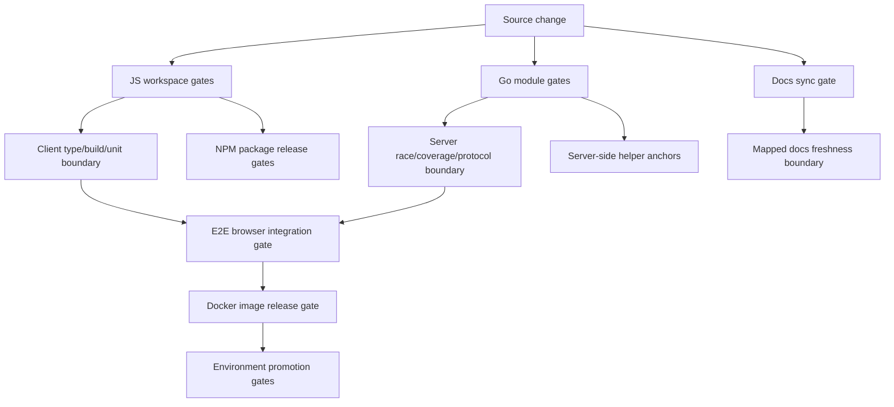
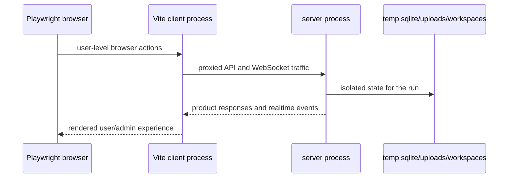

# E2E, Build, And Release Quality Gates

This module describes the architecture that proves Borgee can be built, tested, packaged, and released. It is not a runbook. The important design question is which system boundary is protected by which quality gate, and what failures are expected to stop before merge or release.

## Validation Architecture

| Protected Boundary | Gate Layer | What It Catches | What It Does Not Try To Catch |
|---|---|---|---|
| Client build boundary | JS workspace gate | TypeScript/build regressions and client-side unit behavior before browser integration | Server storage correctness or production host wiring |
| Server runtime boundary | Go module gate | API/storage regressions, data races, coverage drops, and protocol-envelope drift | Browser layout or npm package release readiness |
| Cross-process product boundary | E2E browser gate | Real browser plus real server behavior across HTTP, WebSocket, auth, admin, channel, DM, artifact, realtime, and host-bridge-related API surfaces | Exhaustive server branch coverage, visual design review, or real helper daemon/sandbox execution |
| Release artifact boundary | Docker gate | Whether the deployable image contains a compatible client bundle and server binary | Host-side compose/env correctness beyond workflow health checks |
| External integration boundary | NPM publish gate | Whether public integration packages build and can be published independently | Main web app deployability |
| Documentation freshness boundary | Docs sync gate | Whether changes under currently mapped modules update the matching current architecture docs | Unmapped modules, stale mappings, or deep semantic correctness of every doc statement |

The core design is layered rather than redundant: unit and module gates catch local failures cheaply, the E2E gate proves the browser/server contract, and release gates prove packaging and promotion artifacts. A failure at a lower layer should block before a higher layer spends time assembling or deploying artifacts.

## Dual Track Repository Organization

Borgee uses two build systems because it has two kinds of runtime units. The JavaScript workspace owns browser code, browser tests, and public TypeScript packages. The Go modules own server, helper daemon, and installer binaries. This separation keeps Node package resolution from becoming the source of truth for Go binaries, while still allowing CI and release gates to compose both tracks.

The JavaScript track is workspace-oriented: packages are selected by workspace membership and package name. That lets client build, E2E, remote-agent, and OpenClaw plugin checks run with targeted installs and targeted publishes.

The Go track is module-oriented: server, helper, and installer remain separately versioned dependency graphs. That matters architecturally because the server container, host-bridge daemon, and installer artifacts have different runtime constraints and should not share one binary dependency surface just for monorepo convenience.

## CI As Boundary Protection

CI is organized around failure domains, not around one monolithic test command. Client build and unit tests protect the browser package boundary. Server race and coverage jobs protect concurrent server behavior and coverage budgets. The default Go race gate remains a single `go test -tags sqlite_fts5 -timeout=180s -race ./...` job; it is not split into package shards. Protocol linting protects realtime/BPP envelope compatibility. The current host-bridge-adjacent default CI coverage is narrower: it protects server-side helper IPC primitive selectors plus host-grants and manifest endpoint anchors reached through server/E2E surfaces. It does not run the helper daemon runtime or sandbox integration as part of the default PR CI path.

Installer validation is a separate gate scoped to installer changes and manual dispatch, not proof that the helper daemon is running inside default CI. This split makes the signal actionable: a race failure points at server concurrency, a coverage failure points at Go test coverage policy, an E2E failure points at cross-process product behavior or endpoint wiring, and a publish workflow failure points at external package release readiness.

The docs sync gate is also scoped, not universal. It currently protects only modules present in the current-sync mapping. That mapping covers server, server command, admin, client, plugin, remote-agent, and E2E paths. It currently does not cover the helper module, the installer module, or a host-bridge docs subtree, and it still contains an old helper path mapping that does not match the current helper package path. Treat it as a mapped-module freshness guard, not as a full architecture-documentation completeness proof.

## E2E Harness Design

The E2E harness is intentionally a two-process local system. Playwright drives a real browser against a Vite-served client, while Vite proxies API and WebSocket traffic to a real server process. In CI mode the harness clears and recreates its temporary SQLite and file-storage directories before server boot, so repeated local CI-style runs do not inherit stale channels or websocket state from earlier attempts.

The default PR E2E gate is a single CI job, not a shard matrix. CI prebuilds the server binary and points Playwright at it with `E2E_SERVER_COMMAND=./bin/collab-e2e`, avoiding `go run` startup work inside the test phase. The workflow builds that binary with `sqlite_fts5 libsqlite3`, so CI uses Ubuntu's system SQLite headers/library instead of recompiling the bundled SQLite amalgamation on cold cache misses. The workflow caches that exact e2e binary by OS, architecture, Go version, SQLite linkage mode, and server-go source hash; cache hits skip the module prefetch and build steps, while misses rebuild from source. CI keeps `fullyParallel=false` so ordering inside each spec file remains deterministic, but sets `E2E_CI_WORKERS=6` so independent spec files can run concurrently in one runner without moving to a shard matrix. Local stress runs showed 7-8 workers overload invitation/reconnect websocket latency paths, so six workers is the current single-job ceiling. The Playwright server process sets `SQLITE_TXLOCK=immediate` so write transactions acquire SQLite locks up front instead of failing on deferred read-to-write upgrades under multi-worker load, sets `BORGEE_TEST_FAST_BCRYPT=1` so e2e user-registration fixtures use the existing test-only bcrypt MinCost path instead of paying production bcrypt cost on every seeded account, and sets `BORGEE_TEST_FAST_ADMIN_PASSWORD` so repeated e2e admin login fixtures do not pay cost-10 bcrypt compare on every invite seed. Admin bootstrap still uses the committed cost-10 admin hash. The Vite dev server sets `VITE_E2E_WS_RECONNECT_DELAY_MS=50` so reconnect-path tests exercise the same reconnect code without paying the production 1s first retry delay on every forced disconnect. Channel creation websocket fanout stays scoped to the created channel path; explicit member adds use `channel_added`, preventing unrelated parallel e2e clients from accumulating other tests' channels. CI runs Playwright with `--fail-on-flaky-tests`, so a retry pass is still a failed e2e signal. Trace and video collection are configurable through `E2E_TRACE_MODE` and `E2E_VIDEO_MODE`; the default CI workflow uses `on-first-retry` for both so clean runs avoid capture overhead while failures that reproduce on retry still collect diagnostics. Manual signoff screenshots are opt-in via `E2E_EVIDENCE_SCREENSHOTS=1`; the PR gate validates the same UI states without writing success-path evidence into the repository workspace. CI suppresses Playwright webServer stdout/stderr on the success path to avoid streaming high-volume server request logs; set `E2E_WEB_SERVER_LOGS=1` when a run needs raw server or Vite logs.

Client build/type safety remains owned by the separate `check` job. The E2E job installs the client and starts Vite for browser integration, but does not repeat `pnpm --filter @borgee/client build` locally inside the E2E job.

This design protects the contract that matters to users: the built client code, browser runtime, server API, realtime transport, auth state, admin rail, and storage side effects must work together. Its host-bridge-related coverage should be read as endpoint and source-anchor coverage, not as proof that the real helper daemon IPC loop or OS sandbox has run. The harness deliberately avoids binding tests to a shared local server, production-like host, or privileged daemon runtime; shared state and privileged host dependencies would make the gate less deterministic and harder to run safely in CI.

## Build And Release Gates

The Docker release path is the product release artifact. It binds the client bundle and the server binary into one container image, then environment gates validate specific image paths. The test deploy path is an independent manual environment build with stale-image and health checks. Staging and production share one built artifact: staging builds and pushes the timestamped image, and production retags that staging artifact before deploying it. Architecturally, Docker is the compatibility boundary between browser assets and the server process: if either side cannot build or cannot fit into the image, release stops.

Deploy workflows are promotion gates, not configuration owners. They build, push, retag, recreate containers, and perform health checks; runtime secrets and compose topology live on the target hosts. This keeps environment ownership outside the repo while still making stale image and health failures visible during promotion.

NPM publish gates are separate from Docker because remote-agent and OpenClaw plugin are external integration artifacts. They are public TypeScript packages with their own build and provenance flow. Their release readiness is related to the monorepo but not coupled to web app deployment.

## Module Interfaces

This module owns the quality-gate architecture for build, test, E2E, Docker deploy, and npm publish. It consumes server, client, plugin, remote-agent, helper-adjacent, and installer-adjacent surfaces only through the gates that actually run today.

It does not own server API semantics, client component design, plugin protocol behavior, helper daemon runtime/sandbox behavior, installer UX, or production host configuration. Those modules define behavior; this module defines where that behavior is verified or packaged.

## Implementation Anchors

Root orchestration and workspace shape:

- `package.json`
- `pnpm-workspace.yaml`
- `Makefile`

JavaScript package boundaries:

- `packages/client/package.json`
- `packages/client/vite.config.ts`
- `packages/client/vitest.config.ts`
- `packages/e2e/package.json`
- `packages/remote-agent/package.json`
- `packages/plugins/openclaw/package.json`

Go module boundaries:

- `packages/server-go/go.mod`
- `packages/server-go/Makefile`
- `packages/borgee-helper/`
- `packages/borgee-installer/`

E2E harness and test surface:

- `packages/e2e/playwright.config.ts`
- `packages/e2e/tests/`
- `packages/e2e/tests/production-surface-reverse-proof.spec.ts`: focused product-surface reverse proof for ArtifactComments production mount, ArtifactComments/ArtifactPanel forbidden states, and Settings PermissionsView empty/forbidden/error states.

Container and deployment release surface:

- `packages/server-go/Dockerfile`
- `.github/workflows/deploy-test.yml`
- `.github/workflows/deploy.yml`

CI, docs sync, installer, and package publication gates:

- `.github/workflows/ci.yml`
- `.github/workflows/lint.yml`
- `.github/lint-current-sync.yml`
- `.github/workflows/installer.yml`
- `.github/workflows/publish-openclaw-plugin.yml`
- `.github/workflows/publish-remote-agent.yml`
