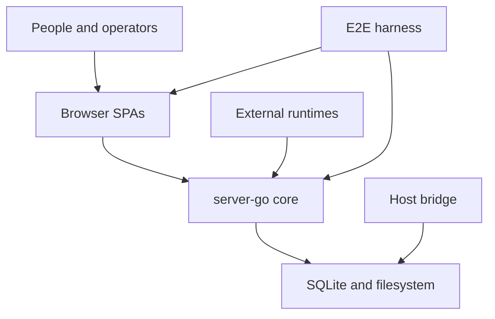

# Overall

`overall/` explains the system from the outside in. It starts with process roles, then expands into runtime topology, cross-process flows, and known implementation gaps.

## System Roles

| Role | Responsible For | Not Responsible For | Interfaces | Evidence |
| --- | --- | --- | --- | --- |
| Browser SPAs | User and admin interaction surfaces | Durable storage, plugin execution, remote filesystem IO | Static assets, REST, `/ws` | `packages/client/src/main.tsx`, `packages/client/src/admin/main.tsx`, `packages/client/vite.config.ts` |
| server-go core | HTTP routing, auth, Hub fanout, BPP dispatch, data access | OpenClaw process hosting, helper sandboxing, local remote-agent IO | `/api/v1/*`, `/admin-api/*`, `/ws`, `/ws/plugin`, `/ws/remote` | `packages/server-go/cmd/collab/main.go`, `packages/server-go/internal/server/server.go` |
| Persistence | Server-owned SQLite rows and server-managed file bytes | In-memory liveness and plugin cursor files | `DATABASE_PATH`, `UPLOAD_DIR`, `WORKSPACE_DIR`, `CLIENT_DIST` | `packages/server-go/internal/config/config.go`, `packages/server-go/internal/store/db.go` |
| External runtimes | OpenClaw plugin and remote-agent processes connected to server-go | server-go route registration or DB migrations | `/ws/plugin`, `/api/v1/stream`, `/api/v1/poll`, `/ws/remote` | `packages/plugins/openclaw/src/*`, `packages/remote-agent/src/agent.ts` |
| Host bridge | OS-level helper daemon and install flow | Chat realtime and plugin event consumption | UDS JSON-line IPC, `/api/v1/plugin-manifest`, read-only `host_grants` DB | `packages/borgee-helper/cmd/borgee-helper/main.go`, `packages/borgee-installer/internal/manifest/fetcher.go` |
| E2E harness | Starts server-go and Vite for browser tests | Production deployment | Playwright `webServer` entries | `packages/e2e/playwright.config.ts` |

## Directory Map

- `runtime-topology.md` expands the process graph and explains how each runtime is started or connected.
- `cross-process-flows.md` follows the main traffic paths across process boundaries.
- `known-gaps.md` records code-confirmed mismatches and non-goals that maintainers must not document as implemented behavior.

## Boundary Rule

Overall docs describe process relationships and module boundaries. Server-only mechanics belong in `server/`, OpenClaw package details belong in `plugin/`, and UI-specific state/rendering details belong in `client/` or `admin/`.
