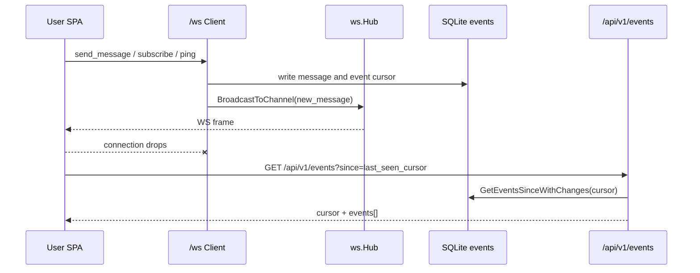
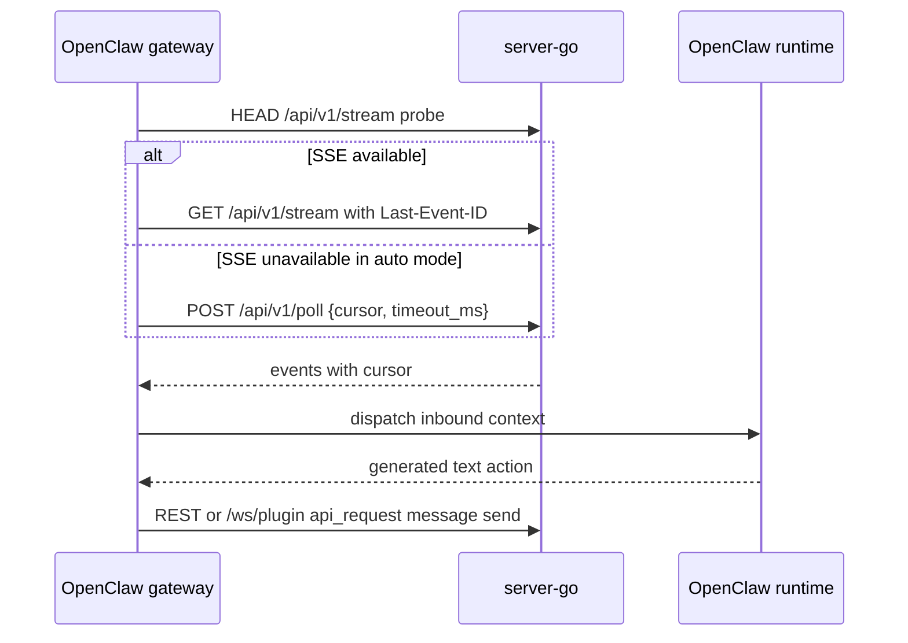
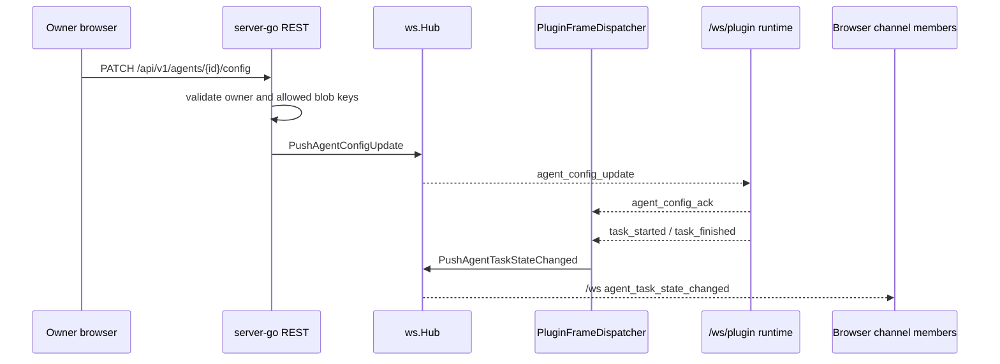
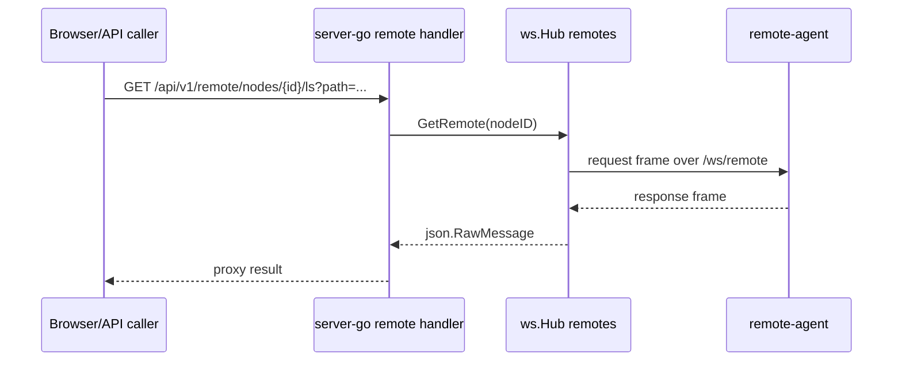

# Cross-Process Flows

This page follows the major flows that cross process boundaries. It stays at system level; detailed server mechanics are in `../server/realtime-and-events.md` and `../server/bpp-internals.md`, while OpenClaw package behavior is in `../plugin/`.

## Browser Realtime Write And Reconnect

Responsible for: showing how a browser write, websocket fanout, and reconnect backfill connect across browser and server. Not responsible for: reducer-level UI rendering details or BPP plugin lifecycle.

The browser opens `/ws`, re-subscribes known channels on reconnect, persists any numeric frame cursor, and calls `/api/v1/events?since=<last_seen_cursor>` before per-channel message reconciliation. The server side writes `store.Event` rows for message flows, signals Hub waiters, and backfills by `cursor > since`. Interfaces: `/ws`, `/api/v1/events`, message REST routes. Evidence: `packages/client/src/hooks/useWebSocket.ts`, `packages/server-go/internal/ws/client.go`, `packages/server-go/internal/api/poll.go`, `packages/server-go/internal/store/queries_phase3.go`.

## Plugin Event Consumption And Reply

Responsible for: showing how OpenClaw consumes Borgee events and sends replies. Not responsible for: server-side BPP dispatcher internals.

OpenClaw `auto` transport probes SSE and falls back to long-poll with periodic SSE recovery. Forced `sse` retries SSE without poll fallback; forced `poll` uses `/api/v1/poll`. Code also contains a `ws` branch to `/ws/plugin`, but that branch is not exposed by the current config schema; see `known-gaps.md`. Interfaces: `/api/v1/stream`, `/api/v1/poll`, `/ws/plugin`, message/reaction/edit/delete REST. Evidence: `packages/plugins/openclaw/src/gateway.ts`, `packages/plugins/openclaw/src/sse-client.ts`, `packages/plugins/openclaw/src/api-client.ts`, `packages/plugins/openclaw/src/outbound.ts`, `packages/server-go/internal/api/poll.go`.

## Server BPP Config And Task Lifecycle

Responsible for: showing server-to-plugin config push and plugin-to-server task lifecycle. Not responsible for: OpenClaw account config schema or client UI rendering of agent status.

server-go wires plugin-upstream handlers for `agent_config_ack`, `reconnect_handshake`, `cold_start_handshake`, `task_started`, and `task_finished`. Config update is best-effort point-to-point to the plugin connection; offline drops are logged and not queued. Task lifecycle pushes a browser `/ws` frame to channel subscribers. Interfaces: `/api/v1/agents/{id}/config`, `/ws/plugin`, browser `/ws`. Evidence: `packages/server-go/internal/server/server.go`, `packages/server-go/internal/api/agent_config.go`, `packages/server-go/internal/ws/agent_config_push.go`, `packages/server-go/internal/bpp/plugin_frame_dispatcher.go`, `packages/server-go/internal/bpp/task_lifecycle_handler.go`, `packages/server-go/internal/ws/agent_task_state_changed_frame.go`.

## Remote-Agent File Proxy

Responsible for: showing the intended remote node path. Not responsible for: host-helper grants or OpenClaw local file reads.

server-go owns remote-node records and bindings, while `remote-agent` owns local path checks and filesystem operations. The current request payload shape has a code-confirmed mismatch documented in `known-gaps.md`; treat this as the current boundary plus intended path, not a guarantee that all proxy calls succeed. Evidence: `packages/server-go/internal/api/remote.go`, `packages/server-go/internal/ws/remote.go`, `packages/server-go/internal/server/server.go`, `packages/remote-agent/src/agent.ts`.

## Installer And Helper

Responsible for: explaining how host bridge installation crosses server, installer, and helper. Not responsible for: chat realtime or OpenClaw event delivery.

The installer fetches `/api/v1/plugin-manifest`, verifies an ed25519 detached signature, and then deploys platform service artifacts. The helper runs as a separate daemon, requires a read-only SQLite grants DSN, applies sandboxing, and serves JSON-line IPC over a Unix domain socket. Interfaces: signed manifest HTTP, platform package/service install, UDS IPC, read-only `host_grants`. Evidence: `packages/borgee-installer/internal/manifest/fetcher.go`, `packages/borgee-helper/cmd/borgee-helper/main.go`.
