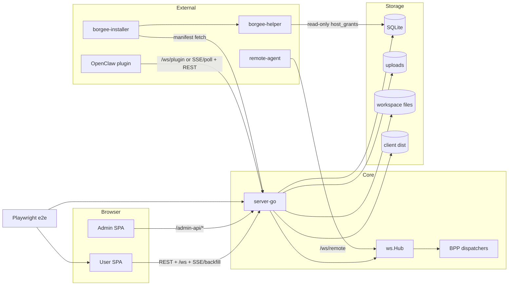

# Runtime Topology

This page expands the overall process graph. It describes what each runtime owns, what it delegates, and which code paths form the boundary.

## Process Graph

## Browser Runtime

The user SPA is the `index.html` Vite entry and mounts `App` from `packages/client/src/main.tsx`. It is responsible for user-facing chat state, websocket subscription control, reconnect handling, and dispatching signal-only frames to local UI consumers. It is not responsible for server authorization or durable event storage. Interfaces: REST `/api/v1/*`, `/ws`, `/api/v1/events` backfill, and static assets served by server-go. Evidence: `packages/client/src/main.tsx`, `packages/client/src/hooks/useWebSocket.ts`, `packages/client/src/hooks/useWsHubFrames.ts`.

The admin SPA is a separate Vite entry at `admin.html`, mounted through `packages/client/src/admin/main.tsx`. It is responsible for admin UI flows over the admin rail. It is not part of business-path `/api/v1/*` plugin/BPP traffic. Interfaces: `/admin-api/*` and static `admin.html`. Evidence: `packages/client/src/admin/main.tsx`, `packages/server-go/internal/server/server.go`.

In development and e2e, Vite proxies `/api`, `/admin-api`, `/health`, `/ws`, and `/uploads` to server-go. In production, server-go serves `admin.html` for `/admin` and `/admin/*`, serves existing static files from `CLIENT_DIST`, and falls back to `index.html` for extensionless SPA routes. Evidence: `packages/client/vite.config.ts`, `packages/server-go/internal/server/server.go`.

## server-go Runtime

The server process starts at `packages/server-go/cmd/collab/main.go`: it loads env config, opens SQLite, runs legacy and versioned migrations, bootstraps admin auth, constructs `server.New`, and serves `HOST:PORT`. It owns route registration, middleware, Hub construction, BPP dispatcher wiring, data access, and static serving. It does not run OpenClaw, remote-agent, or borgee-helper in-process. Evidence: `packages/server-go/cmd/collab/main.go`, `packages/server-go/internal/config/config.go`, `packages/server-go/internal/server/server.go`.

`server.New` constructs `ws.Hub`, wires presence tracking, creates the data-layer bundle, registers BPP plugin-upstream dispatchers, starts Hub browser heartbeat, and starts the BPP heartbeat watchdog. `SetupRoutes` mounts `/ws`, `/ws/plugin`, `/ws/remote`, `/api/v1/*`, `/admin-api/*`, `/uploads/*`, and static fallback. Evidence: `packages/server-go/internal/server/server.go`, `packages/server-go/internal/ws/hub.go`, `packages/server-go/internal/bpp/plugin_frame_dispatcher.go`, `packages/server-go/internal/bpp/heartbeat_watchdog.go`.

## Persistence Runtime

SQLite is opened from `DATABASE_PATH` and is the server's primary durable store. File storage is split by role: uploads under `UPLOAD_DIR`, workspace file bytes under `WORKSPACE_DIR`, and built SPA assets under `CLIENT_DIST`. These paths are owned by server-go configuration; they are not the OpenClaw cursor file store and not the helper audit log. Evidence: `packages/server-go/internal/config/config.go`, `packages/server-go/internal/store/db.go`, `packages/server-go/internal/api/upload.go`, `packages/server-go/internal/api/workspace.go`, `packages/server-go/internal/server/server.go`.

## OpenClaw Plugin Runtime

The OpenClaw package is `@codetreker/borgee-openclaw-plugin`, publishes `dist`, `openclaw.plugin.json`, and `skills`, and exposes a bundled channel entry from `./dist/index.js`. It owns OpenClaw-side account resolution, gateway startup, transport choice, inbound event conversion, outbound Borgee actions, cursor persistence, and optional local file reads over the plugin WS request path. It does not register server routes or server BPP handlers. Evidence: `packages/plugins/openclaw/package.json`, `packages/plugins/openclaw/openclaw.plugin.json`, `packages/plugins/openclaw/src/index.ts`, `packages/plugins/openclaw/src/gateway.ts`.

## Remote-Agent Runtime

The Node `remote-agent` connects to `${server}/ws/remote?token=...`, sends pings every 30 seconds, reconnects with exponential backoff up to 30 seconds, and handles server `request` frames for `ls`, `read`, and `stat` inside configured allowed directories. server-go owns the node records, online lookup, and REST proxy entrypoints. Evidence: `packages/remote-agent/src/agent.ts`, `packages/server-go/internal/ws/remote.go`, `packages/server-go/internal/api/remote.go`.

## Host Bridge Runtime

`borgee-helper` is a separate Go daemon for host bridge IPC. On Linux/macOS it listens on a Unix domain socket, requires `--grants-db`, reads `host_grants` from SQLite in read-only mode, applies sandbox restrictions, and serves JSON-line IPC. The installer fetches and verifies the signed plugin/helper manifest from server-go, then deploys platform service artifacts. These processes are not realtime chat transports. Evidence: `packages/borgee-helper/cmd/borgee-helper/main.go`, `packages/borgee-installer/internal/manifest/fetcher.go`.

## E2E Runtime

Playwright starts server-go with a temp SQLite/upload/workspace directory and starts the Vite client dev server with `VITE_E2E_API_TARGET` pointing at that server. Defaults are server `4901` and client `5174`. This is test orchestration, not production deployment topology. Evidence: `packages/e2e/playwright.config.ts`.
