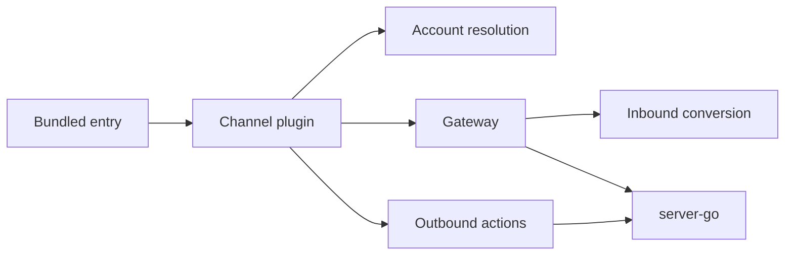

# Plugin Architecture

## Role

The plugin area documents the OpenClaw Borgee package. The package is an adapter between OpenClaw's channel runtime and Borgee's server contracts.

## Internal Architecture

## Boundary

| Module | Role | Collaborators | Out Of Scope |
| --- | --- | --- | --- |
| Package entry | Exposes the OpenClaw bundled channel | OpenClaw host | Server startup |
| Channel plugin | Defines Borgee chat capability and routing | OpenClaw channel SDK | Server authorization |
| Gateway | Runs event transport and cursor loop | Borgee server, account config | Durable server events |
| Inbound conversion | Turns Borgee events into OpenClaw contexts | OpenClaw runtime | Event persistence |
| Outbound actions | Sends OpenClaw replies/actions to Borgee | REST or plugin WS RPC | Message storage internals |

## Key Flows

- Gateway startup resolves account config, fetches bot identity, loads a cursor, and starts a transport.
- Inbound events become OpenClaw session contexts and can produce replies.
- Outbound actions use Borgee REST, with plugin WS RPC as an optional fast path when connected.

## Invariants

- Borgee server state is authoritative; plugin-local state is a resume aid.
- Server auth and channel policy are enforced by server contracts, not by OpenClaw routing.
- Plugin-local file access is separate from remote-agent and helper-daemon file access.

## Documents

- `openclaw-runtime.md` covers package shape, runtime modules, account config, inbound/outbound behavior.
- `transports.md` covers SSE, poll, and code-present WS transport behavior.
- `server-contracts.md` covers the server endpoints and frame shapes the plugin consumes.

## Implementation Anchors

- Package manifest and entry: `packages/plugins/openclaw/openclaw.plugin.json`, `packages/plugins/openclaw/package.json`, `packages/plugins/openclaw/src/index.ts`
- Channel and runtime: `packages/plugins/openclaw/src/channel.ts`, `packages/plugins/openclaw/src/runtime.ts`, `packages/plugins/openclaw/src/runtime-api.ts`
- Gateway and transports: `packages/plugins/openclaw/src/gateway.ts`, `packages/plugins/openclaw/src/sse-client.ts`, `packages/plugins/openclaw/src/ws-client.ts`
- Event conversion and actions: `packages/plugins/openclaw/src/inbound.ts`, `packages/plugins/openclaw/src/outbound.ts`, `packages/plugins/openclaw/src/api-client.ts`
