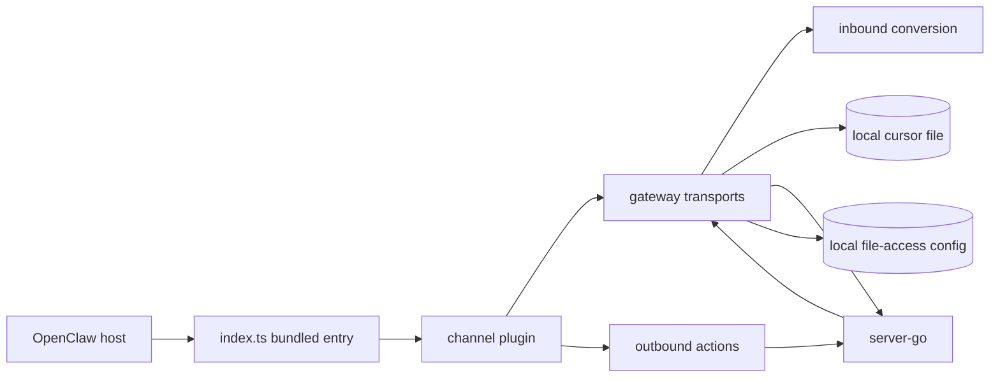

# Plugin

This directory documents the OpenClaw plugin package and its contracts with server-go. Server-side BPP dispatcher details live in `../server/bpp-internals.md`; this directory focuses on the package under `packages/plugins/openclaw`.

## Module Boundary

| Submodule | Responsible For | Not Responsible For | Interfaces | Evidence |
| --- | --- | --- | --- | --- |
| Package manifest | OpenClaw package identity, published files, extension entry, channel metadata | Runtime account secrets, server route registration | `openclaw.plugin.json`, `package.json` `openclaw.extensions` | `packages/plugins/openclaw/openclaw.plugin.json`, `packages/plugins/openclaw/package.json`, `packages/plugins/openclaw/src/index.ts` |
| Channel integration | `borgee` channel plugin, group/direct support, target parsing, account resolution, gateway startup, outbound hook | Server auth policy, BPP handler registration | OpenClaw channel SDK contracts | `packages/plugins/openclaw/src/channel.ts`, `packages/plugins/openclaw/src/accounts.ts`, `packages/plugins/openclaw/src/runtime-api.ts` |
| Gateway/transports | Fetch bot identity, persist cursor, select SSE/poll/WS code path, dispatch inbound events | Server event cursor allocation, browser websocket handling | `/api/v1/stream`, `/api/v1/poll`, `/ws/plugin` | `packages/plugins/openclaw/src/gateway.ts`, `packages/plugins/openclaw/src/sse-client.ts`, `packages/plugins/openclaw/src/ws-client.ts` |
| Inbound/outbound | Convert Borgee events to OpenClaw inbound contexts; send text/reactions/edit/delete back to Borgee | Server-side message persistence internals | OpenClaw `dispatchInboundReplyWithBase`, Borgee REST, plugin WS RPC | `packages/plugins/openclaw/src/inbound.ts`, `packages/plugins/openclaw/src/outbound.ts`, `packages/plugins/openclaw/src/api-client.ts` |
| Local process state | Cursor file and optional local file read allow-list | server-go SQLite, helper daemon grants | `OPENCLAW_DATA_DIR`, `~/.config/collab/file-access.json` | `packages/plugins/openclaw/src/cursor-store.ts`, `packages/plugins/openclaw/src/file-access.ts` |

## Reading Order

- `openclaw-runtime.md` describes package shape, channel registration, accounts, inbound/outbound behavior, and runtime status.
- `transports.md` describes SSE, poll, and code-present WS transport behavior.
- `server-contracts.md` lists the concrete server endpoints and frame shapes the plugin consumes.

## Current Caveats

The `ws` transport is present in TypeScript types and gateway code but not exposed by the config schema. The plugin WS client also expects `{type:"event"}` frames that the inspected server `/ws/plugin` path does not currently emit. These gaps are recorded in `../overall/known-gaps.md`. Evidence: `packages/plugins/openclaw/src/types.ts`, `packages/plugins/openclaw/src/config-schema.ts`, `packages/plugins/openclaw/src/gateway.ts`, `packages/plugins/openclaw/src/ws-client.ts`, `packages/server-go/internal/ws/plugin.go`.
