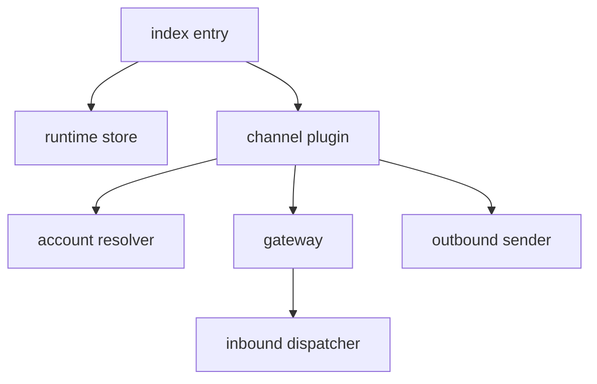

# OpenClaw Runtime

## Role

The OpenClaw plugin presents Borgee as an OpenClaw chat channel. It resolves account config, starts a gateway per account, converts Borgee events into OpenClaw inbound sessions, and sends generated actions back to Borgee.

## Boundary

| Area | Role | Collaborators | Out Of Scope |
| --- | --- | --- | --- |
| Package metadata | Identifies the plugin and bundled channel entry | OpenClaw host | Server manifest signing |
| Channel plugin | Defines chat type support, target parsing, routing, and setup | OpenClaw channel SDK | Borgee ACL decisions |
| Account resolution | Merges channel/account config into a runtime account | OpenClaw config runtime | Server agent config blobs |
| Runtime status | Reports configured/running account snapshots | OpenClaw status helpers | Server liveness tracking |

## Internal Architecture

## Key Flows

### Account Startup

The channel plugin resolves an account, checks that base URL and API key are present, fetches bot identity when needed, marks runtime status, loads the local cursor, and starts the selected transport loop.

### Inbound Message Handling

Borgee events are filtered to supported kinds. Self messages are skipped. Non-DM messages can require a mention depending on server-provided bot identity. Accepted events become OpenClaw inbound contexts, and generated text is sent back to the originating Borgee channel.

### Outbound Actions

OpenClaw outbound text resolves a `channel:` or `dm:` target. DM targets are created or found before sending. The plugin prefers a connected plugin WS RPC client when available and falls back to REST.

## Invariants

- Borgee account config must provide a base URL and API key before the gateway runs.
- API keys are redacted in runtime status.
- The plugin treats Borgee server state as authoritative; local cursor files are only resume hints.
- Plugin-local file reads are separate from remote-agent and helper-daemon file paths.

## Implementation Anchors

- Entry and runtime store: `packages/plugins/openclaw/src/index.ts`, `packages/plugins/openclaw/src/runtime.ts`, `packages/plugins/openclaw/src/runtime-api.ts`
- Channel plugin: `packages/plugins/openclaw/src/channel.ts`, `borgeePlugin`
- Account config: `packages/plugins/openclaw/src/accounts.ts`, `packages/plugins/openclaw/src/config-schema.ts`, `packages/plugins/openclaw/src/types.ts`
- Gateway and status: `packages/plugins/openclaw/src/gateway.ts`, `packages/plugins/openclaw/src/status.ts`
- Inbound/outbound: `packages/plugins/openclaw/src/inbound.ts`, `packages/plugins/openclaw/src/outbound.ts`
- Local state: `packages/plugins/openclaw/src/cursor-store.ts`, `packages/plugins/openclaw/src/file-access.ts`
