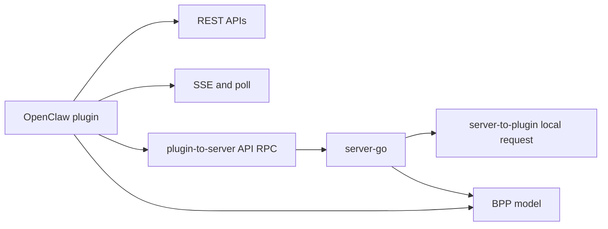

# Plugin Server Contracts

## Role

Server contracts define how the OpenClaw plugin talks to Borgee. The contracts are intentionally narrow: consume events, fetch identity, send chat actions, optionally use plugin-to-server API RPC, and optionally answer server-to-plugin local requests.

## Boundary

| Contract | Initiator | Authorization Source | Fallback Or Allow-List |
| --- | --- | --- | --- |
| Identity API | Plugin | Borgee API key | No local fallback |
| SSE stream | Plugin | Borgee API key | Poll fallback in auto mode |
| Poll | Plugin | Borgee API key | Retry/backoff in plugin loop |
| Outbound REST | Plugin | Borgee API key | Baseline write path |
| Plugin-to-server API RPC | Plugin | Plugin WS bearer API key replayed into server HTTP handling | Falls back to REST when unavailable or failed |
| Server-to-plugin local request | Server | Existing authenticated plugin WS connection | Plugin-local action allow-list, currently `read_file` |
| BPP frames | Either side, by frame direction | Plugin WS session identity plus BPP frame validation | Unknown upstream frames soft-skip on server |

## Internal Architecture

## Key Flows

### Identity And Event Consumption

The plugin fetches the authenticated Borgee user as bot identity, then consumes cursor-ordered events over SSE or poll. Event payloads are server-authored JSON and are filtered before OpenClaw dispatch. Message events include `channel_type` and `channel_name` display metadata so OpenClaw can distinguish group sessions from direct sessions without exposing raw channel ids as labels.

### Plugin-To-Server API RPC

Plugin-to-server API RPC is initiated by the plugin over `/ws/plugin`. The plugin sends an RPC envelope with method, path, and body. The server authorizes the websocket with the plugin's bearer API key, then replays the request into server HTTP handling using that API key. Outbound code treats this as an optimization: if the WS client is absent or the RPC fails, it falls back to direct REST.

### Server-To-Plugin Local Request

Server-to-plugin local request is initiated by the server over the already-authenticated plugin websocket. The plugin receives a `request` frame and dispatches only recognized local actions. The current local action is `read_file`; it is guarded by the plugin's local file-access allow-list and size limit. This is not the same boundary as Borgee remote-agent file access.

### Outbound Writes

Generated text, reactions, edits, deletes, and DM creation go back through Borgee server APIs. REST is the baseline path; plugin-to-server API RPC can be used when connected.

### BPP Touchpoint

BPP frame definitions and the Go SDK live in the server module. The OpenClaw TypeScript package uses Borgee HTTP/SSE/poll/WS RPC code paths and does not import that SDK.

## Invariants

- The server remains authoritative for auth, channel access, message persistence, and event cursor ordering.
- Plugin outbound actions must tolerate WS RPC absence by using HTTP fallback.
- Server-to-plugin local requests must stay behind plugin-local allow-lists.
- Local file reads in the plugin are separate from remote-agent file reads.
- `GET /api/v1/plugin-manifest` fails closed in production (HTTP 500, no placeholder signature) when `BORGEE_MANIFEST_SIGNING_KEY` is unset; the byte-identical placeholder signature is served only under a development config (`NodeEnv=development`). Wired in `server.go` as `AllowUnsignedPlaceholder: cfg.IsDevelopment()` (#1108 F3).

## Implementation Anchors

- REST client: `packages/plugins/openclaw/src/api-client.ts`, `BorgeeApiClient`
- Outbound actions: `packages/plugins/openclaw/src/outbound.ts`
- Event types: `packages/plugins/openclaw/src/types.ts`, `BorgeeEvent`
- Plugin WS RPC and local request handling: `packages/plugins/openclaw/src/ws-client.ts`, `PluginWsClient`
- Local file allow-list: `packages/plugins/openclaw/src/file-access.ts`
- Server event endpoints: `packages/server-go/internal/api/poll.go`, `PollHandler`
- Server plugin socket: `packages/server-go/internal/ws/plugin.go`, `PluginConn`
- Server BPP model: `packages/server-go/internal/bpp`, `packages/server-go/sdk/bpp`
