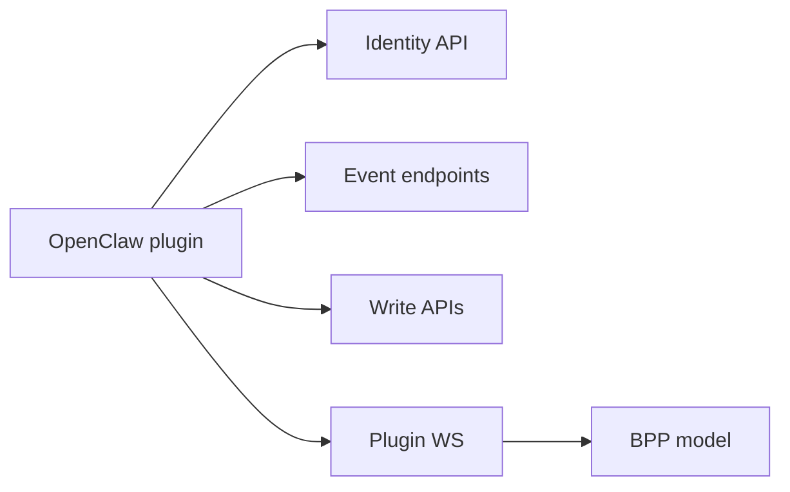

# Plugin Server Contracts

## Role

Server contracts define how the OpenClaw plugin talks to Borgee. They are intentionally narrow: consume events, fetch identity, send chat actions, optionally use plugin WS RPC, and obey server-side auth and channel policy.

## Boundary

| Contract | Plugin Role | Server Role | Notes |
| --- | --- | --- | --- |
| Identity | Fetch current bot identity | Authenticate API key | Used before gateway dispatch |
| SSE stream | Consume cursor-ordered events | Emit stream frames and heartbeat | Preferred event path |
| Poll | Long-poll with cursor | Filter events and wait for signals | Fallback path |
| Outbound REST | Send messages and actions | Persist and authorize writes | Main write fallback |
| Plugin WS RPC | Proxy API calls and local file requests | Replay RPC into HTTP handlers | Separate from browser WS |
| BPP | Control-plane frame family | Define and dispatch server/plugin frames | OpenClaw package does not use Go SDK |

## Internal Architecture

## Key Flows

### Identity And Event Consumption

The plugin fetches the authenticated Borgee user as bot identity, then consumes events over SSE or poll. Event payloads are server-authored JSON and are filtered before OpenClaw dispatch.

### Outbound Writes

Generated text, reactions, edits, deletes, and DM creation go back through Borgee server APIs. When a plugin WS client is connected, outbound code tries socket RPC first and falls back to HTTP.

### Plugin WS Request Handling

The plugin WS client can answer server `request` frames. The implemented local action is `read_file`, guarded by the plugin-local file access config.

### BPP Touchpoint

BPP frame definitions and the Go SDK live in the server module. The OpenClaw TypeScript package uses Borgee HTTP/SSE/poll/WS RPC code paths and does not import that SDK.

## Invariants

- The server remains authoritative for auth, channel access, message persistence, and event cursor ordering.
- Plugin outbound actions must tolerate WS RPC absence by using HTTP fallback.
- Local file reads in the plugin are governed by plugin-local allow-list config, not by remote-agent or helper grants.

## Implementation Anchors

- REST client: `packages/plugins/openclaw/src/api-client.ts`, `BorgeeApiClient`
- Outbound actions: `packages/plugins/openclaw/src/outbound.ts`
- Event types: `packages/plugins/openclaw/src/types.ts`, `BorgeeEvent`
- Plugin WS RPC: `packages/plugins/openclaw/src/ws-client.ts`, `PluginWsClient`
- Server event endpoints: `packages/server-go/internal/api/poll.go`, `PollHandler`
- Server plugin socket: `packages/server-go/internal/ws/plugin.go`, `PluginConn`
- Server BPP model: `packages/server-go/internal/bpp`, `packages/server-go/sdk/bpp`
