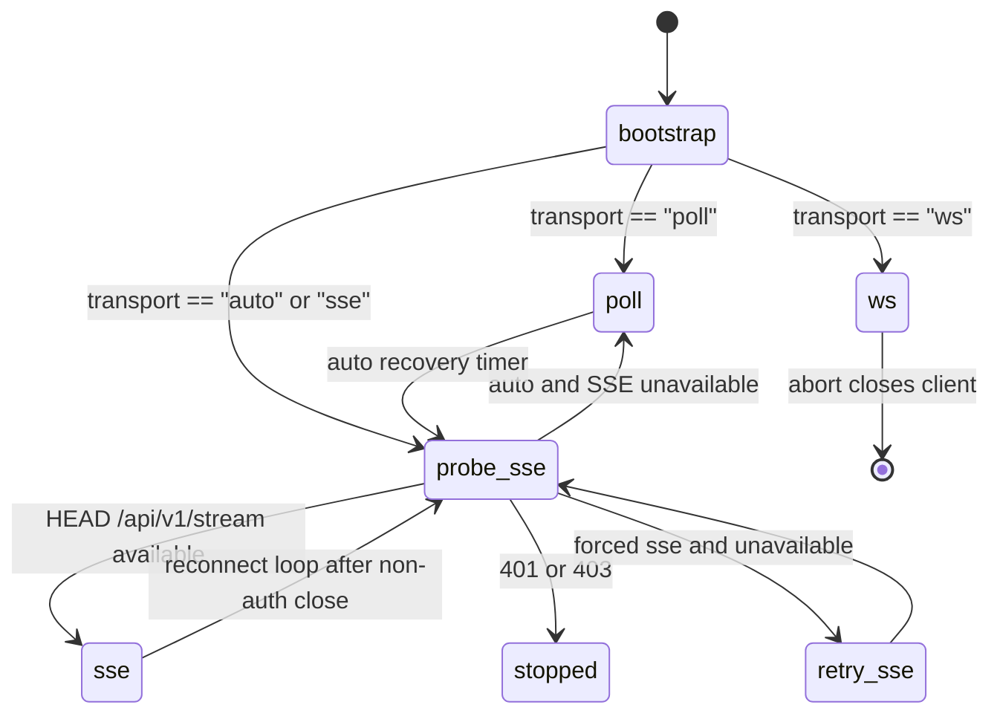

# Transports

This page documents OpenClaw-side Borgee transports. Server endpoint behavior is referenced as an interface and detailed in `../server/realtime-and-events.md`.

## Transport Selection

Responsible for: plugin-side transport choice and retry loops. Not responsible for: server cursor allocation or browser `/ws` reconnect.

`startBorgeeGateway` validates account config, fetches bot identity from `GET /api/v1/users/me` when needed, sets runtime status, loads a persisted cursor, and then selects `ws`, `poll`, or auto/SSE. Evidence: `packages/plugins/openclaw/src/gateway.ts`, `packages/plugins/openclaw/src/api-client.ts`, `packages/plugins/openclaw/src/cursor-store.ts`.

## SSE Transport

Responsible for: streaming server events and preserving cursor progress. Not responsible for: server SSE race avoidance implementation.

SSE connects to `/api/v1/stream` with bearer auth and optional `Last-Event-ID`. The parser reads `event`, `id`, and `data`; comment lines count as byte-level liveness but do not emit events. Heartbeat timeout defaults to 30 seconds in `runSSEOnce`; `runSSELoop` reconnects with exponential backoff up to 60 seconds and resets the backoff after a stable 30 second connection. Evidence: `packages/plugins/openclaw/src/sse-client.ts`.

On each message, SSE dispatch converts the frame into a `BorgeeEvent`, filters unsupported kinds, skips self messages, enforces `requireMention` for non-DM messages, and persists the cursor after successful dispatch. Auth failures return `reason: "auth"` and stop the loop. Evidence: `packages/plugins/openclaw/src/sse-client.ts`, `packages/plugins/openclaw/src/inbound.ts`.

## Poll Transport

Responsible for: long-poll fallback when SSE is unavailable or forced off. Not responsible for: server waiters implementation.

Poll calls `POST /api/v1/poll` with `{cursor, timeout_ms, channel_ids}` and bearer auth. On events, it updates the local cursor reference, persists the returned cursor, filters to message/edit/delete/reaction events, skips self events, and dispatches through the same inbound path as SSE. Consecutive poll errors back off from 1 second to 30 seconds. Evidence: `packages/plugins/openclaw/src/gateway.ts`, `packages/plugins/openclaw/src/api-client.ts`, `packages/plugins/openclaw/src/inbound.ts`.

In `auto` mode, a failed SSE probe starts poll and a recovery timer re-probes SSE every 5 minutes; when SSE is available again, the poll session is aborted and the gateway returns to SSE probing. In forced `sse` mode, failed probes retry SSE every 30 seconds instead of falling back. Evidence: `packages/plugins/openclaw/src/gateway.ts`, `packages/plugins/openclaw/src/sse-client.ts`.

## WS Transport Code Path

Responsible for: documenting the code-present plugin websocket branch. Not responsible for: claiming it is reachable through current config schema.

The `ws` branch constructs `PluginWsClient`, connects to `/ws/plugin` with bearer auth, registers an event handler for `{type:"event", event, data}` frames, registers a request handler for `read_file`, attaches the client to the resolved account for outbound WS-first calls, and closes on abort. Evidence: `packages/plugins/openclaw/src/gateway.ts`, `packages/plugins/openclaw/src/ws-client.ts`, `packages/plugins/openclaw/src/file-access.ts`, `packages/plugins/openclaw/src/ws-util.ts`.

Current caveats: `ws` is not allowed by `config-schema.ts`, and the inspected server `/ws/plugin` path does not emit `{type:"event"}` frames. The server does support `/ws/plugin` RPC and BPP upstream routing. Evidence: `packages/plugins/openclaw/src/config-schema.ts`, `packages/plugins/openclaw/src/types.ts`, `packages/server-go/internal/ws/plugin.go`, `packages/server-go/internal/bpp/plugin_frame_dispatcher.go`.

## Cursor Lifecycle

Responsible for: plugin-side high-water persistence. Not responsible for: server durable event cursor generation.

At gateway start, the plugin reads the local cursor file. If the cursor is absent or invalid, `bootstrapCursor` performs a short poll from cursor `0` and persists the server-returned cursor; if bootstrap fails, it starts from `0`. SSE obtains `Last-Event-ID` from the persisted cursor; poll uses the in-memory `cursorRef`. Evidence: `packages/plugins/openclaw/src/gateway.ts`, `packages/plugins/openclaw/src/cursor-store.ts`, `packages/plugins/openclaw/src/sse-client.ts`.
