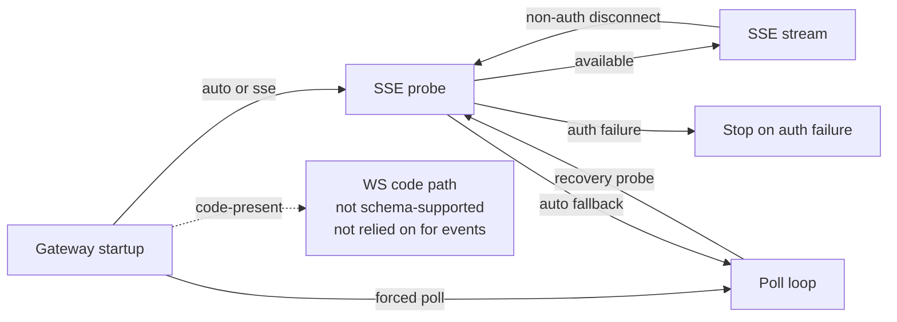

# Plugin Transports

## Role

Transports are how the OpenClaw plugin receives Borgee events and keeps a cursor high-water mark. SSE and poll are the current reliable event paths. WS is code-present for plugin socket behavior, but it is not schema-supported as an event transport and is not relied on for event delivery.

## Boundary

| Transport | Role | Collaborators | Out Of Scope |
| --- | --- | --- | --- |
| SSE | Preferred streaming event path | server event stream | Server cursor generation |
| Poll | Long-poll fallback or forced mode | server poll endpoint | Browser reconnect policy |
| Plugin WS | Code-present RPC/request path | server plugin socket | Reliable event transport |
| Cursor store | Local resume hint | transport loops | Durable source of truth |

## Internal Architecture

## Key Flows

### SSE

The plugin opens the server event stream with bearer auth and an optional last event id. Incoming frames are parsed into event name, id, and data. Any bytes count as liveness; heartbeat frames do not become inbound messages. Non-auth disconnects reconnect with backoff.

### Poll

Poll sends the current cursor and timeout to the server. If events arrive, the plugin advances and persists the cursor, then dispatches supported event kinds through the same inbound path as SSE. Consecutive errors back off.

### Auto Recovery

Auto mode probes SSE first. If unavailable, it falls back to poll and periodically probes SSE again. A successful recovery probe aborts the poll session and returns to SSE.

### WS Code Path

The WS branch connects to the plugin socket, can send RPC requests, and can answer server `request` frames for local file reads. It also has an event-frame handler, but current server behavior makes SSE/poll the event path to rely on. Treat WS as code-present, not schema-supported for transport selection, and not part of the reliable event path.

## Invariants

- Cursor persistence is best-effort and local to the plugin process.
- Event filtering happens before OpenClaw inbound dispatch.
- Auth failures stop the transport loop instead of silently switching accounts.
- `ws` is not exposed by the current config schema even though the code branch exists.

## Implementation Anchors

- Gateway selection: `packages/plugins/openclaw/src/gateway.ts`
- SSE client: `packages/plugins/openclaw/src/sse-client.ts`, `SSEConnection`, `SSELoopResult`
- Poll client: `packages/plugins/openclaw/src/api-client.ts`, `BorgeeApiClient`
- WS client: `packages/plugins/openclaw/src/ws-client.ts`, `PluginWsClient`
- Cursor store: `packages/plugins/openclaw/src/cursor-store.ts`
- Transport config: `packages/plugins/openclaw/src/config-schema.ts`, `packages/plugins/openclaw/src/types.ts`
