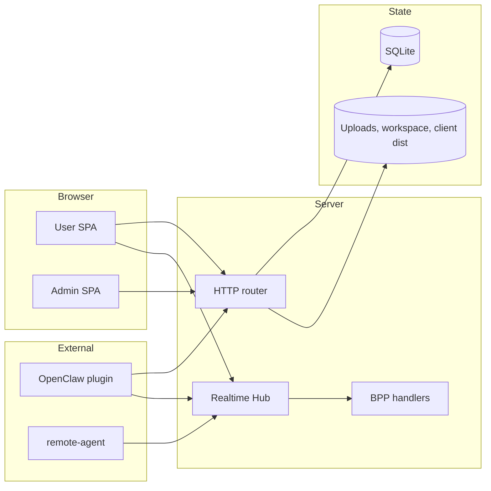

# Runtime Topology

Runtime topology is the process-level view of the system. The topology is intentionally simple: server-go sits in the middle, browser apps and external runtimes connect to it, and durable state stays behind it.

## Runtime Map

## Runtime Roles

| Runtime | Role | Collaborators | Simple Non-Goal |
| --- | --- | --- | --- |
| User SPA | User interaction and realtime subscription | server-go Hub and REST APIs | Does not persist truth |
| Admin SPA | Admin interaction | server-go admin rail | Does not join plugin control flow |
| server-go | Central coordinator | all runtimes, SQLite, filesystem | Does not host external runtimes in-process |
| OpenClaw plugin | Bridges Borgee events into OpenClaw and sends replies | server-go event/API/plugin sockets | Does not own Borgee policy |
| remote-agent | Performs user-machine file operations on request | server-go remote socket | Does not decide server ACL |

E2E and release validation start local processes for verification, but they are supporting architecture rather than product runtime roles.

## Startup And Ownership

server-go loads environment configuration, opens SQLite, runs migrations, bootstraps admin auth, builds the server, then starts HTTP serving. During server construction it creates the Hub, wires presence, registers BPP frame handlers, and starts heartbeat/watchdog loops.

Browser apps are static assets in production and Vite entries in development. OpenClaw and remote-agent are separate processes; they connect through public server contracts rather than sharing memory with server-go.

## Next Drill-Downs

| Need | Link |
| --- | --- |
| How startup wires routes, Hub, and rails | [Server startup and routing](server/startup-routing.md) |
| How data moves between runtimes | [Cross-process flows](cross-process-flows.md) |
| Browser process details | [Client](client/) and [admin SPA](admin/spa.md) |
| External runtime details | [Plugin](plugin/) and [remote-agent](remote-agent/) |
| Validation and release support, outside product runtime topology | [E2E / verification](e2e/) |

## Implementation Anchors

- Server startup and route composition: `packages/server-go/cmd/collab/main.go`, `packages/server-go/internal/server/server.go`
- Runtime configuration: `packages/server-go/internal/config/config.go`
- Browser entries and dev proxy: `packages/client/src/main.tsx`, `packages/client/src/admin/main.tsx`, `packages/client/vite.config.ts`
- Plugin runtime: `packages/plugins/openclaw/package.json`, `packages/plugins/openclaw/openclaw.plugin.json`, `packages/plugins/openclaw/src/index.ts`
- Remote agent daemon: `packages/borgee`
- E2E startup: `packages/e2e/playwright.config.ts`
