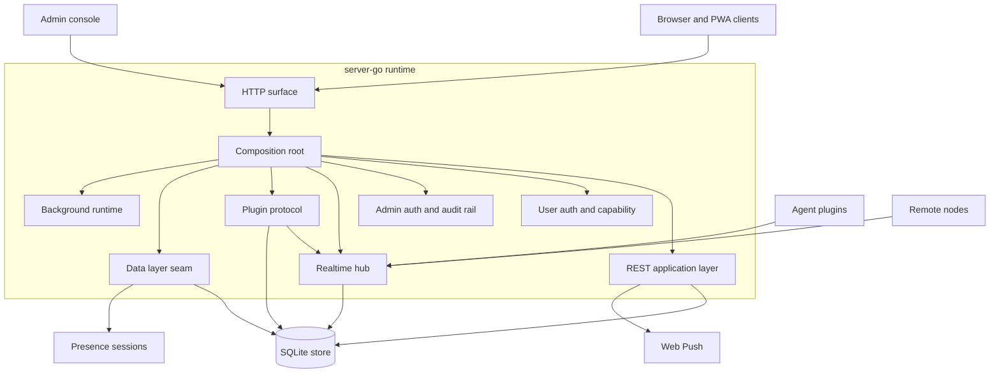

# Server

## Role

`server-go` is the central runtime for Borgee. It owns the process that accepts client, admin, plugin, and remote-node traffic; coordinates the live collaboration plane; and persists the canonical server-side state. It is intentionally a composition runtime: domain handlers, realtime sockets, plugin protocol handling, persistence, presence, push, and background maintenance are assembled here into one HTTP server.

The server is also the system's policy boundary. User traffic, admin traffic, plugin traffic, and remote-node traffic enter through different rails with different credentials and different authority. The server may connect those rails through explicit adapters, but a rail does not inherit another rail's identity or permissions.

## Boundary

The server owns state that must be trusted across clients: users, channels, messages, permissions, admin sessions, audit rows, remote node registrations, artifact data, agent runtime descriptors, hot realtime cursors, cold event records, presence sessions, and push subscriptions.

The server does not own the local agent runtime process or the model/provider internals behind an agent. It records agent descriptors, routes plugin frames, and enforces server-side permissions, but plugin execution remains outside the server process.

The server exposes four externally visible rails:

- User rail: browser/PWA REST, browser WebSocket, poll/SSE/backfill, uploads, and static client hosting.
- Admin rail: separate admin authentication, metadata views, audit and operational controls.
- Plugin rail: agent plugin WebSocket with BPP frames and in-process API proxying.
- Remote rail: remote-node WebSocket plus REST management around node bindings.

## Collaborators

The REST application layer owns request/response semantics and domain validation. It relies on the store for canonical rows, the realtime hub for live fanout, push notifiers for background delivery, and capability checks for user authority.

The realtime hub owns live browser, plugin, and remote-node connections. It is the only component that should know which sockets are currently connected, which users are online in-memory, and which plugin or remote node can receive a direct request.

The plugin protocol layer owns BPP frame schemas, frame direction, validation, task lifecycle semantics, reconnect/cold-start handling, and heartbeat liveness. The composition root supplies store and hub adapters so BPP can remain protocol-focused.

The data layer seam groups storage, presence, event bus, and repository interfaces. Its current implementation wraps the SQLite store and presence tracker, giving newer code a stable boundary while existing handlers still use the store directly.

The admin subsystem is separate from user auth. Admin identity is backed by admin sessions, and admin read surfaces are constrained to metadata-oriented views unless a route explicitly owns a narrow operation.

## Internal Architecture

The architecture is centered on a composition root. Startup builds the store, migrations, admin bootstrap, hub, data layer, BPP dispatchers, route surface, middleware stack, and background jobs. After composition, most runtime behavior flows through injected collaborators rather than global state.

The primary call direction is top-down: composition root to handlers, handlers to store/data layer, handlers to hub/push through small interfaces, hub to store for connection authentication and replay support, BPP to store/hub through server-owned adapters. Cross-package adapters are concentrated in the composition root so protocol, HTTP, and socket packages do not become mutually dependent.

The server has two event planes. The hot plane serves user-facing realtime delivery and cursor replay. The cold plane is the data-layer event stream for retained events and operational retention/offload work. A caller must intentionally choose which plane it writes to; a WebSocket frame is not automatically a cold event, and a cold event is not automatically a user replay cursor.

## Key Flows

Process startup loads config, opens the store, runs the consolidated schema baseline and the forward-only migration registry, bootstraps admin identity, builds the server runtime, and starts the HTTP server. Shutdown is coordinated through the HTTP server and the shared server lifetime context.

User requests enter the user rail, authenticate as a user or agent, optionally pass capability checks, mutate or read canonical state, and may fan out through WebSocket, poll/SSE wakeups, cold events, or push notification depending on the operation.

Admin requests enter the admin rail, resolve an opaque admin session, then operate on explicitly mounted admin surfaces. Admin traffic is not treated as a user acting inside channels or artifacts unless a specific user-facing grant flow exists.

Plugin connections authenticate as agents, register into the hub, exchange RPC-style API proxy frames, and send BPP event frames for lifecycle and task state. The server converts accepted plugin events into server-side state transitions, realtime fanout, and push fanout where appropriate.

Remote nodes authenticate with node connection tokens, register a live connection, and receive proxied filesystem-style requests from user-owned remote routes.

## Invariants

- User identity and admin identity are separate authority systems.
- The composition root is the place where REST, WS, BPP, datalayer, presence, push, and background jobs are wired together.
- Store rows are the canonical persisted state; hub state is live connection state.
- Agent runtime metadata is not the same as plugin socket presence or task busy/idle state.
- Hot cursor replay and cold data-layer events are separate streams.
- Admin read surfaces must avoid content-bearing payloads unless a route is intentionally designed otherwise.
- New cross-module calls should prefer narrow interfaces and server-owned adapters over direct package coupling.

## Non-Goals

The server does not run LLMs, own plugin-local secrets, or collapse admin authority into user authority.

## Subdocuments

- [startup-routing.md](startup-routing.md): composition root, HTTP surface, middleware, static hosting, and background runtime.
- [data-model-and-migrations.md](data-model-and-migrations.md): data ownership, core aggregates, migration strategy, and event/cursor layering.
- [api-auth-admin-rails.md](api-auth-admin-rails.md): user, admin, plugin, and remote rails with permission isolation.
- [realtime-and-events.md](realtime-and-events.md): detailed realtime frame and event behavior.
- [bpp-internals.md](bpp-internals.md): detailed plugin protocol behavior.

## Implementation Anchors

- `packages/server-go/cmd/collab/main.go`
- `packages/server-go/internal/server/server.go`
- `packages/server-go/internal/server/middleware.go`
- `packages/server-go/internal/api/`
- `packages/server-go/internal/auth/`
- `packages/server-go/internal/admin/`
- `packages/server-go/internal/store/`
- `packages/server-go/internal/migrations/`
- `packages/server-go/internal/datalayer/`
- `packages/server-go/internal/ws/`
- `packages/server-go/internal/bpp/`
- `packages/server-go/internal/presence/`
- `packages/server-go/internal/push/`
- `server.Server`
- `ws.Hub`
- `datalayer.DataLayer`
