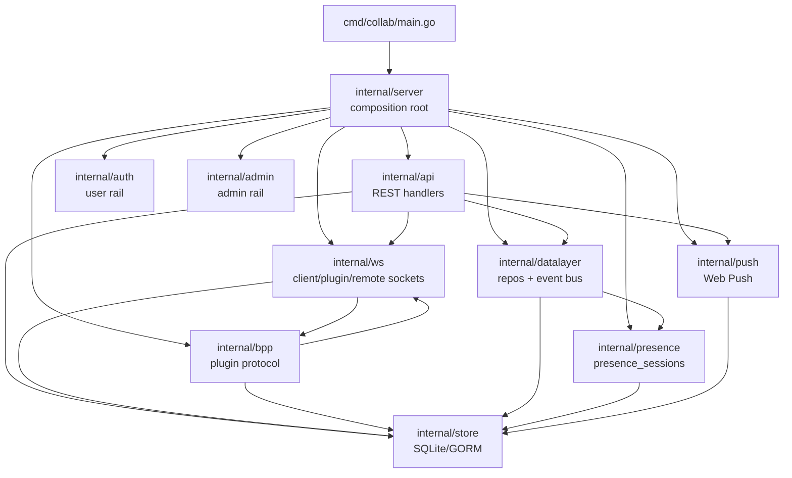

# Server

`server-go` 是当前后端的中心 runtime。生产入口在 `packages/server-go/cmd/collab/main.go`，组合根在 `packages/server-go/internal/server/server.go`；它启动 SQLite/GORM store、执行迁移、bootstrap admin、组装 REST/WS/BPP/datalayer/presence/push/admin/auth，并把这些模块挂到同一个 `http.Server` handler 上。

## 负责什么

`server-go` 负责进程生命周期：加载配置与 logger，打开 store，运行 baseline migration 与 forward-only migrations，bootstrap admin，创建 `server.Server`，启动 `http.Server`，并在 SIGINT/SIGTERM 后用 15 秒 timeout 关闭 HTTP server。证据：`packages/server-go/cmd/collab/main.go`、`packages/server-go/internal/store/db.go`、`packages/server-go/internal/store/migrations.go`、`packages/server-go/internal/migrations/migrations.go`、`packages/server-go/internal/admin/auth.go`。

`internal/server` 负责运行时装配和调用方向。`server.New` 创建 `ws.Hub`、DB-backed presence writer、`datalayer.DataLayer`、BPP plugin frame dispatcher、push notifier 和后台 jobs；`SetupRoutes` 统一挂载 REST、admin、WS、upload、static routes。证据：`packages/server-go/internal/server/server.go`、`packages/server-go/internal/ws/hub.go`、`packages/server-go/internal/datalayer/factory.go`、`packages/server-go/internal/bpp/plugin_frame_dispatcher.go`。

`internal/api` 负责 HTTP handler 的请求解析、校验、权限调用、响应 shape 和业务写入。多数 handler 直接依赖 `store.Store`，部分新路径通过 `datalayer.DataLayer` 或 server 提供的小接口触发 realtime/push side effect。证据：`packages/server-go/internal/api/channels.go`、`packages/server-go/internal/api/messages.go`、`packages/server-go/internal/api/agents.go`、`packages/server-go/internal/api/artifacts.go`、`packages/server-go/internal/server/server.go`。

`internal/store` 是当前持久化事实源：SQLite/GORM 连接、baseline schema、forward migration 入口、核心模型和查询 helper 都在这里或从这里进入。证据：`packages/server-go/internal/store/db.go`、`packages/server-go/internal/store/models.go`、`packages/server-go/internal/store/migrations.go`、`packages/server-go/internal/store/queries.go`。

`internal/ws` 负责浏览器 `/ws`、plugin `/ws/plugin`、remote node `/ws/remote` 的 live connection 管理、broadcast、event waiters、cursor allocation 和 plugin API proxy。证据：`packages/server-go/internal/ws/hub.go`、`packages/server-go/internal/ws/client.go`、`packages/server-go/internal/ws/plugin.go`、`packages/server-go/internal/ws/remote.go`、`packages/server-go/internal/ws/cursor.go`。

`internal/bpp` 负责 plugin protocol 的 frame schema、方向校验、dispatcher、task lifecycle、config ack、reconnect、cold-start 和 heartbeat watchdog 逻辑；它通过接口接收 `internal/server` 注入的 store/ws adapter。证据：`packages/server-go/internal/bpp/envelope.go`、`packages/server-go/internal/bpp/plugin_frame_dispatcher.go`、`packages/server-go/internal/bpp/task_lifecycle.go`、`packages/server-go/internal/bpp/heartbeat_watchdog.go`、`packages/server-go/internal/server/server.go`。

`internal/datalayer` 是当前的 data seam：v1 实现包装 `store.Store`、`presence.PresenceTracker`、in-process event bus 和 SQLite cold event store。证据：`packages/server-go/internal/datalayer/factory.go`、`packages/server-go/internal/datalayer/repository.go`、`packages/server-go/internal/datalayer/v1_sqlite.go`、`packages/server-go/internal/datalayer/events_store.go`。

`internal/presence` 和 `internal/push` 是 leaf services。presence 的 `SessionsTracker` 读写 `presence_sessions`，由 hub register/unregister 写入；push gateway 读取 web push subscription，并为 mention/task 通知提供 notifier。证据：`packages/server-go/internal/presence/tracker.go`、`packages/server-go/internal/ws/hub.go`、`packages/server-go/internal/push/gateway.go`、`packages/server-go/internal/push/mention_notifier.go`、`packages/server-go/internal/api/push_subscriptions.go`。

## 不负责什么

`server-go` 不承载 LLM runtime，也不保存 plugin 内部的 model、API key、prompt、temperature 等 runtime-only 字段；agent runtime 在 server 侧只是 `agent_runtimes` 的 process descriptor 与 plugin/BPP 连接状态。证据：`packages/server-go/internal/migrations/agent_runtimes.go`、`packages/server-go/internal/api/runtimes.go`、`packages/server-go/internal/bpp/agent_config_update_test.go`。

`server-go` 不把 admin 建模成 user。admin 使用独立 `admins` / `admin_sessions`，admin cookie 是 `borgee_admin_session`；user rail 仍使用 `users`、`user_permissions` 和 `borgee_token`。证据：`packages/server-go/internal/admin/auth.go`、`packages/server-go/internal/admin/middleware.go`、`packages/server-go/internal/migrations/admin_admins.go`、`packages/server-go/internal/auth/middleware.go`。

`server-go` 不让 admin rail 直接继承 user rail 权限。`RequirePermission` 明确没有 `users.role == admin` shortcut，admin endpoints 通过 `admin.RequireAdmin` 挂在 `/admin-api/*`。证据：`packages/server-go/internal/auth/permissions.go`、`packages/server-go/internal/admin/middleware.go`、`packages/server-go/internal/server/server.go`。

`server-go` 不把所有 realtime frame 都持久化到同一张事件表。当前有 hot `events.cursor` 路径，也有 datalayer cold `channel_events` / `global_events` 路径；是否进入哪条流由具体调用点决定。证据：`packages/server-go/internal/store/models.go`、`packages/server-go/internal/store/queries_phase3.go`、`packages/server-go/internal/ws/cursor.go`、`packages/server-go/internal/datalayer/events_store.go`。

## 和其他模块的接口

对 client 的接口是 REST、WS、SSE/poll/backfill、uploads 和静态文件 hosting。REST 主要在 `/api/v1/*`，admin 在 `/admin-api/*`，WS 在 `/ws`、`/ws/plugin`、`/ws/remote`，static fallback 从 `cfg.ClientDist` 服务 SPA。证据：`packages/server-go/internal/server/server.go`、`packages/server-go/internal/api/auth.go`、`packages/server-go/internal/api/poll.go`、`packages/server-go/internal/ws/client.go`、`packages/server-go/internal/ws/plugin.go`、`packages/server-go/internal/ws/remote.go`。

对 plugin/agent runtime 的接口是 `/ws/plugin` 与 BPP frames。`ws/plugin.go` 处理 RPC envelope，非 RPC BPP frame 交给 `PluginFrameDispatcher`；server 在启动时注册 config ack、reconnect、cold-start、task started、task finished。证据：`packages/server-go/internal/ws/plugin.go`、`packages/server-go/internal/server/server.go`、`packages/server-go/internal/bpp/plugin_frame_dispatcher.go`、`packages/server-go/internal/bpp/envelope.go`。

对 remote node 的接口是 REST remote routes 与 `/ws/remote`。remote node 通过 connection token 连接，server 用 hub proxy 远端 `ls/read` 等请求。证据：`packages/server-go/internal/api/remote.go`、`packages/server-go/internal/ws/remote.go`、`packages/server-go/internal/server/server.go`、`packages/server-go/internal/store/models.go`。

对 persistence 的接口是 `store.Store` 与 `datalayer.DataLayer`。当前 handler 仍大量直接使用 `store.Store`；datalayer 提供 User/Channel/Message repo、PresenceStore、Storage 和 EventBus 的统一 bundle。证据：`packages/server-go/internal/store/db.go`、`packages/server-go/internal/datalayer/factory.go`、`packages/server-go/internal/datalayer/repository.go`、`packages/server-go/internal/server/server.go`。

## 子文档

- `startup-routing.md` 展开 `cmd/collab/main.go`、`server.New`、route mount、middleware、static hosting 和后台 jobs。
- `data-model-and-migrations.md` 展开 SQLite/GORM store、核心模型、baseline/forward migrations、hot events/cursor 和 datalayer cold events。
- `api-auth-admin-rails.md` 展开 user rail、admin rail、auth/session/token/capability、admin metadata/privacy boundary。
- `realtime-and-events.md` 与 `bpp-internals.md` 属于相邻 server 子域；本文件只给边界，细节由对应文档展开。
