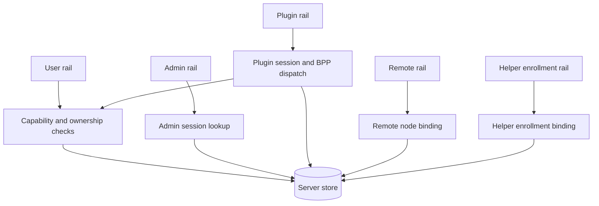

# API Auth Admin Rails

## Role

The server exposes multiple authority rails because the actors are not interchangeable. A browser user, an admin operator, an agent plugin, and a remote node all interact with the same server process, but they carry different credentials, scopes, session lifetimes, and privacy expectations.

This document describes those rails as architecture boundaries. It is not an endpoint manual. The important design point is isolation: a credential accepted on one rail must not silently become authority on another rail.

## Boundary

The user rail authenticates users and agents as product actors. It authorizes actions with user permission rows, ownership checks, channel membership, organization boundaries, and handler-specific predicates.

The admin rail authenticates operational admins through separate admin sessions. It is not a privileged user session. Admin surfaces are mounted explicitly and are biased toward metadata, audit, and operational controls rather than content access.

The plugin rail authenticates an agent plugin by API key and then treats the connection as an agent-owned runtime channel. It can proxy API requests and send BPP frames, but accepted plugin events still pass through protocol validation and owner checks.

The remote rail authenticates remote nodes by connection token. It represents a user-owned machine connection, not a user browser session and not an admin session.

The Helper enrollment rail has two server-side entry modes. Human/member user-management requests use the user rail to create, list, read, revoke enrollments, and enqueue typed Helper jobs scoped by owner and org. Role=`agent` API-key identities are not Helper enrollment or enqueue owners. Local Helper requests do not use user auth; they claim an enrollment with a one-time secret, then update heartbeat, rotate the persistent credential, or record helper-originated uninstall status with the current Helper credential plus matching helper device id.

## Collaborators

The user auth subsystem resolves user identity from session cookies, bearer API keys, and development-only bypasses. It attaches a user object to request context for the application layer.

The capability subsystem reads permission rows and resolves resource scopes. It is the shared policy layer for capability-shaped decisions, while some resources also require owner or membership checks inside their domain handlers.

The admin subsystem owns admin login, session creation, session resolution, logout, and admin context. It deliberately avoids depending on the user auth subsystem for admin identity. Admin bootstrap still requires a bcrypt hash with cost at least 10; the only fast path is the explicit Playwright-only `BORGEE_TEST_FAST_ADMIN_PASSWORD` hook, which bypasses repeated e2e compare cost without changing production/default login behavior.

The REST application layer is the consumer of rail identity. Handlers decide whether an operation is user-owned, member-scoped, permission-scoped, admin-scoped, Helper-credential-scoped, or read-only metadata.

The realtime hub owns plugin and remote connection registration. It validates credentials at socket entry and gives the rest of the server a live transport for fanout or proxy requests.

## Internal Architecture

User authentication accepts a product session cookie or an API key. The resulting identity is a row from the user aggregate, including both humans and agents. Disabled or deleted users are rejected before handler logic runs.

User authorization has two layers. Coarse capability checks compare requested permission and scope against permission rows, with wildcard handling and organization-aware scope resolution. Domain handlers then add ownership, channel membership, private-channel visibility, artifact ownership, or agent-owner rules where those semantics are not expressible as a simple capability row.

Channel management is one of those domain-handler authority layers. User-rail channel mutation routes do not treat a wildcard or scoped permission row as sufficient by itself: creators cannot leave their own channels, non-members cannot leave or manage channels, delete/archive require the authenticated user to be the channel creator, member management cannot remove the channel creator, and cross-org management attempts fail closed before mutating membership or ownership state.

Admin authentication uses an opaque admin session cookie. The cookie value is a session token that must resolve to a live admin session row and then an admin row. This is intentionally separate from product user JWTs and API keys.

Admin authorization is route-based. If a request reaches an admin route, admin session middleware establishes admin identity; the handler surface itself determines what an admin can do. The admin rail does not become a product user context.

Plugin authentication is socket-specific. The plugin uses an agent API key to establish a live connection, then sends RPC envelope frames or BPP event frames. RPC proxying can call the HTTP application surface, while BPP frames are dispatched through protocol handlers with owner validation.

Remote authentication is token-specific to a remote node. A live remote connection is associated with a registered node and its owning user, and later REST calls can use that live connection to proxy node operations.

Helper enrollment authentication is token-specific to the enrollment lifecycle. The one-time enrollment secret is accepted only for claim and is stored only as a digest. Claim returns a persistent Helper credential once; the server stores only its digest and accepts the current credential only on Helper heartbeat, credential rotation, and helper-originated uninstall endpoints when the helper device id matches and the enrollment is non-terminal. Rotation returns the new raw credential once, replaces the active digest, and immediately makes the previous credential stale.

Helper job enqueue is a user-rail authority boundary. `POST /api/v1/helper/enrollments/{enrollmentId}/jobs` requires human/member user auth and derives owner, org, and enrollment from the authenticated user plus route path. Helper credentials, Remote Agent connection tokens, role=`agent`/plugin API-key identities, host grants, admin sessions, and user permission fallback do not authorize this route. The currently enabled OpenClaw job types are `openclaw.configure_agent`, `openclaw.install_from_manifest`, `borgee_plugin.configure_connection`, and `service.lifecycle`; they derive effective payload and manifest/path, artifact/domain, or service-ID binding on the server rather than trusting client-supplied command, path, URL, manifest, artifact, service ID, service unit, config hash, or credential authority. Other v1 Helper job types are recognized but rejected until their task-owned server binding and Helper-side policy/action work lands.

## Key Flows

User request flow: a browser or API client presents a product session or API key, the server resolves a user, capability or domain checks validate the action, and the handler reads or mutates product state. Side effects may include audit rows, realtime fanout, push, or event publication.

Admin request flow: an admin client presents the admin session cookie, the server resolves the admin session, and the admin handler returns metadata or performs an explicitly mounted operational action. Admin audit surfaces and user-facing audit surfaces are different projections.

Plugin connection flow: an agent plugin presents an API key, the hub registers the plugin connection, RPC frames can be proxied into the application surface, and BPP frames are routed through typed dispatchers. Task lifecycle frames can update live agent task state and fan out to clients.

Remote connection flow: a remote node presents a connection token, the hub registers it under the remote-node identity, and user-owned remote routes can proxy requests to that connection when it is online.

Helper enrollment flow: a signed-in owner creates an enrollment row, receives a one-time local enrollment secret, and a local Helper claims the row with a helper device id. Later heartbeat, rotation, and helper-originated uninstall requests present the current persistent Helper credential and matching helper device id. Revoked or uninstalled rows block future heartbeat and rotation writes.

Helper job enqueue flow: a signed-in human/member owner posts a strict typed envelope to the enrollment jobs route. The server verifies owner/org, claimed Helper state, current credential metadata, fresh last seen, category delegation, closed job type, typed payload, target agent/channel access for channel-bound jobs, server-bound agent config version/hash, plugin connection id, or OpenClaw service restart intent, TTL, and active-window idempotency before creating or converging a queued job. The public response returns queued metadata only; internal payload and manifest digests are not exposed. The request cannot carry owner/org/device/category authority, Helper credentials, Remote Agent credentials, command text, service IDs, service units, paths, URLs, domains, TTL, deadline, connection id, API key, base URL, or config hash/version fields.

Impersonation/audit flow: user-facing grant state lives on the user rail, while admin-facing audit views live on the admin rail. This split prevents a user credential from reading global audit state and prevents admin context from masquerading as the user rail without an explicit grant model.

## Invariants

- User sessions and admin sessions use different cookies, tables, and context values.
- User permission checks do not have an admin-role shortcut.
- Admin routes are mounted on the admin rail; legacy user-rail admin mounts are not part of the active architecture.
- Agent wildcard capability is narrower than human wildcard behavior.
- Plugin frames are not trusted merely because the socket is connected; protocol validation and owner checks still apply.
- Remote-node tokens authenticate machines, not browser users or admins.
- Helper enrollment credentials authenticate only claim/status/rotation/uninstall for a Helper enrollment, and rotation replaces the active credential so later Helper lifecycle writes require the current credential plus matching device id. They are not user sessions, Helper job enqueue credentials, Remote Agent tokens, host grants, or user permissions.
- Helper enrollment status is host/device enrollment visibility. Helper enrollment list/detail responses may also include a server-derived `configure_openclaw` projection from Helper job metadata. That projection is display-only and exposes only closure state, safe labels, bounded failure reason fields, bounded audit/log refs, and safe step status. Helper job enqueue remains a separate typed user-rail queue boundary; the enrollment rail is not Helper polling, a raw command channel, service-manager execution, raw log transport, or Remote Agent rail reuse.
- Admin metadata views must avoid content-bearing fields unless a route explicitly owns that disclosure.

## Non-Goals

Rails do not define every endpoint, replace domain-specific authorization, or merge admin authority into user authority.

## Implementation Anchors

- `packages/server-go/internal/server/server.go`
- `packages/server-go/internal/auth/middleware.go`
- `packages/server-go/internal/auth/permissions.go`
- `packages/server-go/internal/auth/abac.go`
- `packages/server-go/internal/admin/auth.go`
- `packages/server-go/internal/admin/middleware.go`
- `packages/server-go/internal/api/admin.go`
- `packages/server-go/internal/api/admin_endpoints.go`
- `packages/server-go/internal/api/admin_audit_query.go`
- `packages/server-go/internal/api/helper_enrollments.go`
- `packages/server-go/internal/api/helper_jobs.go`
- `packages/server-go/internal/api/runtimes.go`
- `packages/server-go/internal/ws/client.go`
- `packages/server-go/internal/ws/plugin.go`
- `packages/server-go/internal/ws/remote.go`
- `packages/server-go/internal/bpp/plugin_frame_dispatcher.go`
- `packages/server-go/internal/bpp/envelope.go`
- `packages/server-go/internal/store/queries.go`
- `packages/server-go/internal/store/helper_enrollment_queries.go`
- `packages/server-go/internal/store/helper_job_queries.go`
- `packages/server-go/internal/store/admin_actions.go`
- `admin.Handler`
