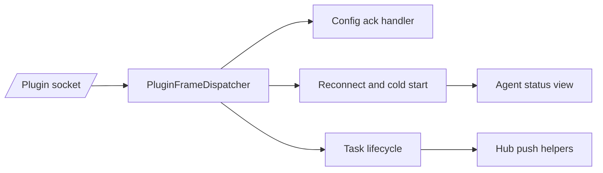

# BPP Internals

## Role

BPP is the server/plugin control plane. It carries plugin lifecycle signals, config update acknowledgements, reconnect and cold-start handshakes, task lifecycle updates, and server-to-plugin control frames.

## Boundary

| Component | Role | Collaborators | Out Of Scope |
| --- | --- | --- | --- |
| Envelope model | Defines frame names, fields, and direction | Plugin socket, SDK, handlers | OpenClaw account schema |
| Plugin frame dispatcher | Routes plugin-to-server BPP frames | `/ws/plugin`, typed handlers | RPC `api_request` execution |
| Hub BPP send helpers | Sends server-to-plugin frames to live plugin connections | Agent config API, authz paths | Persistent delivery queues |
| Agent state bridge | Converts BPP lifecycle into agent status signals | Agent APIs, browser Hub | Runtime process supervision |

## Internal Architecture

The socket boundary belongs to realtime, but BPP owns the meaning of non-RPC plugin frames. The dispatcher only registers plugin-to-server frames. Server-to-plugin frames go through Hub helpers that look up the current plugin connection.

## Key Flows

### Agent Config Update

An owner updates an agent config through the server API. The server validates ownership and server-owned config fields, stores the new schema version, then sends `agent_config_update` to the live plugin connection. The plugin can answer with `agent_config_ack`.

### Reconnect And Cold Start

Reconnect carries the plugin's last known cursor and resolves incremental replay. Cold start represents a plugin process restart without cursor state; the server clears error state and does not replay history by default.

### Task Lifecycle

Plugin `task_started` and `task_finished` frames are the source of busy/idle task state. The server validates them, stores or derives agent status, and fans out `agent_task_state_changed` to browser subscribers.

### Heartbeat And Liveness

Heartbeat is modeled as a BPP frame, but current liveness is based on inbound plugin socket activity. A watchdog scans plugin last-seen timestamps and marks stale agents as network-unreachable errors.

## Invariants

- Frame direction matters: server-to-plugin frames are not registered as plugin-upstream handlers.
- Unknown plugin-upstream BPP frames are soft-skipped for compatibility.
- Server-to-plugin frames are point-to-point to the current plugin connection and are not queued when offline.
- Agent status is a merge view: error outranks task state, task state outranks online/offline presence.

## Implementation Anchors

- Envelopes: `packages/server-go/internal/bpp/envelope.go`, `BPPEnvelope`, `Direction`
- Session resume model: `packages/server-go/internal/bpp/frame_schemas.go`, `SessionResumeRequest`, `SessionResumeAck`
- Plugin dispatcher: `packages/server-go/internal/bpp/plugin_frame_dispatcher.go`, `PluginFrameDispatcher`
- Handler wiring: `packages/server-go/internal/server/server.go`, `Server`
- Server-to-plugin pushes: `packages/server-go/internal/ws/agent_config_push.go`, `packages/server-go/internal/ws/permission_denied_frame.go`
- Task state push: `packages/server-go/internal/ws/agent_task_state_changed_frame.go`
- SDK surface: `packages/server-go/sdk/bpp`
