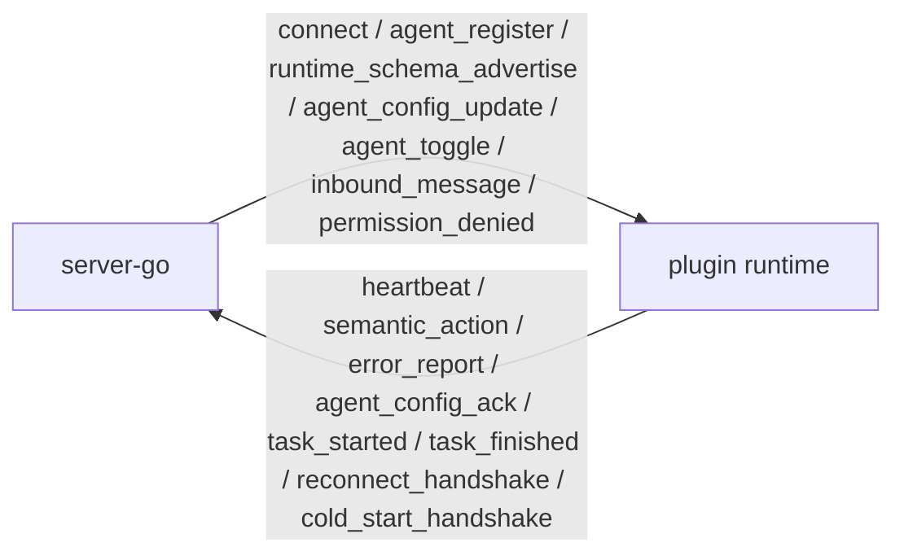
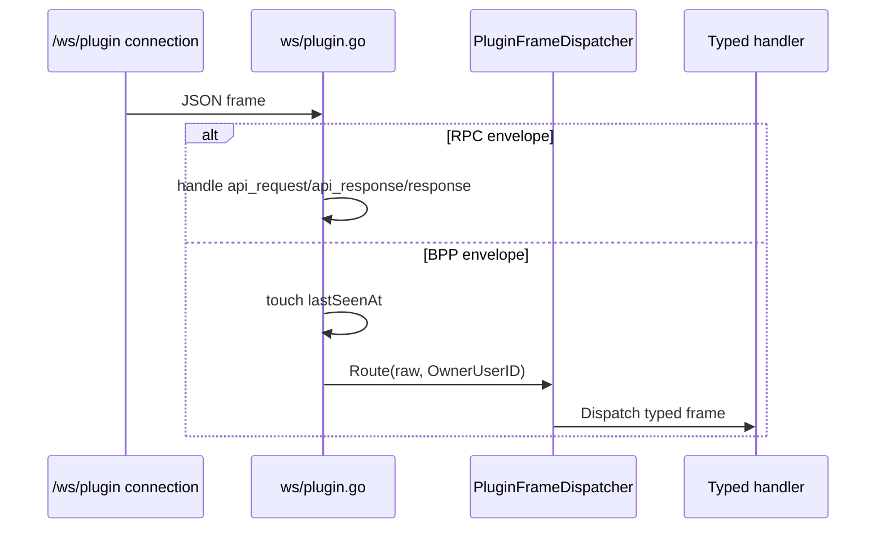
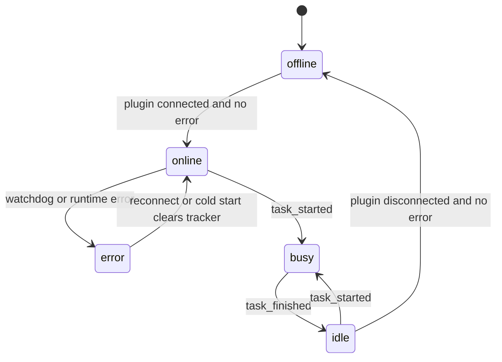

# BPP Internals

This page covers server-side BPP internals: envelope definitions, dispatcher wiring, Hub send helpers, heartbeat/reconnect/cold-start handling, SDK caveats, and agent status integration. OpenClaw package behavior is documented in `../plugin/`.

## Responsibility Boundary

| Area | Responsible For | Not Responsible For | Interfaces | Evidence |
| --- | --- | --- | --- | --- |
| Envelope model | BPP frame names, JSON fields, direction locks | OpenClaw package schema, browser `/ws` frame types | `BPPEnvelope`, `FrameTypeBPP*`, `Direction*` | `packages/server-go/internal/bpp/envelope.go`, `packages/server-go/internal/bpp/frame_schemas.go` |
| Plugin upstream dispatcher | Routing plugin-to-server BPP frames after `/ws/plugin` auth | RPC `api_request` handling, server-to-plugin frame sending | `PluginFrameDispatcher.Route` | `packages/server-go/internal/bpp/plugin_frame_dispatcher.go`, `packages/server-go/internal/ws/plugin.go` |
| Hub server-to-plugin send helpers | Point-to-point `agent_config_update` and `permission_denied` writes | Persistent queues, plugin-side reload logic | `Hub.PushAgentConfigUpdate`, `Hub.PushPermissionDenied` | `packages/server-go/internal/ws/agent_config_push.go`, `packages/server-go/internal/ws/permission_denied_frame.go` |
| Lifecycle handlers | Config ack, reconnect, cold start, task_started/task_finished | Browser UI state rendering, OpenClaw transport fallback | Registered frame handlers in `server.New` | `packages/server-go/internal/server/server.go`, `packages/server-go/internal/bpp/*handler.go` |
| Agent state merge | Error tracker, busy/idle rows, online/offline presence fallback | Runtime process supervision implementation | `GET /api/v1/agents/{id}/status` | `packages/server-go/internal/agent/state.go`, `packages/server-go/internal/api/agent_status.go` |

## Envelope And Direction Model

`internal/bpp/envelope.go` is the server-side source for BPP frame names, JSON structs, and direction locks. Server-to-plugin frames include `connect`, `agent_register`, `runtime_schema_advertise`, `agent_config_update`, `agent_toggle`, `inbound_message`, and `permission_denied`. Plugin-to-server frames include `heartbeat`, `semantic_action`, `error_report`, `agent_config_ack`, `task_started`, `task_finished`, `reconnect_handshake`, and `cold_start_handshake`. Evidence: `packages/server-go/internal/bpp/envelope.go`.

`session.resume` and `session.resume_ack` are modeled separately in `frame_schemas.go`. `ResolveResume` supports `incremental`, `none`, and explicit `full` modes, but unknown modes default to incremental rather than full. Evidence: `packages/server-go/internal/bpp/frame_schemas.go`, `packages/server-go/internal/bpp/session_resume.go`.

## Plugin Upstream Dispatch Lifecycle

`/ws/plugin` owns the wire boundary. It handles RPC frames directly and sends every other parsed frame type to `PluginFrameDispatcher` with `OwnerUserID` from the authenticated API-key user. The dispatcher only accepts plugin-to-server frame registrations; unknown frame types are logged and soft-skipped. Evidence: `packages/server-go/internal/ws/plugin.go`, `packages/server-go/internal/bpp/plugin_frame_dispatcher.go`.

`server.New` registers plugin-upstream handlers for `agent_config_ack`, `reconnect_handshake`, `cold_start_handshake`, `task_started`, and `task_finished`. It does not register every plugin-to-server frame currently modeled in `envelope.go`; see `../overall/known-gaps.md` for heartbeat/connect caveats. Evidence: `packages/server-go/internal/server/server.go`, `packages/server-go/internal/bpp/agent_config_ack_dispatcher.go`, `packages/server-go/internal/bpp/reconnect_handler.go`, `packages/server-go/internal/bpp/cold_start_handler.go`, `packages/server-go/internal/bpp/task_lifecycle_handler.go`.

## Server-To-Plugin Frames

`agent_config_update` starts at `PATCH /api/v1/agents/{id}/config`. The API validates owner-only access, rejects runtime-only blob keys, performs an atomic SQLite upsert that increments `schema_version`, and best-effort pushes a BPP frame through the Hub pusher seam. Evidence: `packages/server-go/internal/api/agent_config.go`, `packages/server-go/internal/ws/agent_config_push.go`, `packages/server-go/internal/bpp/agent_config_update.go`.

`PushAgentConfigUpdate` allocates a Hub cursor, builds `bpp.AgentConfigUpdateFrame`, sends it to `h.plugins[agentID]`, and logs a `bpp.frame_dropped_plugin_offline` audit event when the plugin is offline. It does not queue the frame. Evidence: `packages/server-go/internal/ws/agent_config_push.go`, `packages/server-go/internal/bpp/dead_letter.go`.

`permission_denied` follows the same point-to-point plugin connection pattern, with fields for request id, attempted action, required capability, current scope, and denied timestamp. It is server-to-plugin only. Evidence: `packages/server-go/internal/ws/permission_denied_frame.go`, `packages/server-go/internal/bpp/envelope.go`.

## Plugin-To-Server Handlers

| Frame | Current Server Effect | Evidence |
| --- | --- | --- |
| `agent_config_ack` | Validates ack status/reason/owner and logs applied, stale, or rejected config outcome. | `packages/server-go/internal/bpp/agent_config_ack_dispatcher.go`, `packages/server-go/internal/api/agent_config_ack_handler.go` |
| `reconnect_handshake` | Verifies owner, resolves incremental resume from `last_known_cursor`, logs cursor regression, clears agent error state. | `packages/server-go/internal/bpp/reconnect_handler.go`, `packages/server-go/internal/bpp/session_resume.go` |
| `cold_start_handshake` | Verifies owner, appends online transition when needed with `runtime_crashed`, clears in-memory error state, does not replay history. | `packages/server-go/internal/bpp/cold_start_handler.go`, `packages/server-go/internal/agent/reasons/reasons.go` |
| `task_started` | Validates non-empty subject, derives busy state, pushes `agent_task_state_changed`. | `packages/server-go/internal/bpp/task_lifecycle.go`, `packages/server-go/internal/bpp/task_lifecycle_handler.go`, `packages/server-go/internal/ws/agent_task_state_changed_frame.go` |
| `task_finished` | Validates outcome/reason, derives idle state, pushes `agent_task_state_changed`. | `packages/server-go/internal/bpp/task_lifecycle.go`, `packages/server-go/internal/bpp/task_lifecycle_handler.go`, `packages/server-go/internal/ws/agent_task_state_changed_frame.go` |

The semantic action dispatcher exists as an internal allow-list routing layer with an `ActionHandler` seam, but this worktree's `server.New` does not wire `semantic_action` into `PluginFrameDispatcher`. Evidence: `packages/server-go/internal/bpp/dispatcher.go`, `packages/server-go/internal/server/server.go`, `packages/server-go/internal/bpp/plugin_frame_dispatcher.go`.

## Heartbeat, Reconnect, Cold Start

Plugin liveness is watchdog-driven. Every inbound `/ws/plugin` frame updates `PluginConn.lastSeenAt`; `HeartbeatWatchdog` scans `Hub.SnapshotPluginLastSeen()` every 10 seconds and marks stale agents as `error` with `network_unreachable` after 30 seconds. Evidence: `packages/server-go/internal/ws/plugin.go`, `packages/server-go/internal/ws/hub.go`, `packages/server-go/internal/bpp/heartbeat_watchdog.go`, `packages/server-go/internal/agent/state.go`.

Reconnect is plugin-upstream `reconnect_handshake` with `last_known_cursor`. Cold start is plugin-upstream `cold_start_handshake` without a cursor. Reconnect resolves incremental resume; cold start clears state and intentionally does not replay history. Evidence: `packages/server-go/internal/bpp/reconnect_handler.go`, `packages/server-go/internal/bpp/cold_start_handler.go`, `packages/server-go/internal/bpp/session_resume.go`.

## Agent Status Integration

The state diagram is an API merge model, not one persisted table. `internal/agent.Tracker` retains error snapshots only; online/offline are derived from Hub plugin presence. `GET /api/v1/agents/{id}/status` merges `error > busy > idle > online > offline`; busy/idle come from `agent_status` rows written by BPP task lifecycle paths, and `PATCH /status` always returns 405 because busy/idle is BPP-driven. Evidence: `packages/server-go/internal/agent/state.go`, `packages/server-go/internal/api/agent_status.go`, `packages/server-go/internal/bpp/task_lifecycle_handler.go`.

## SDK Boundary

The in-tree Go SDK under `packages/server-go/sdk/bpp` imports server `internal/bpp` structs rather than redefining frame schemas. It can connect, send heartbeat, reconnect with `lastKnownCursor`, cold-start with reset cursor, run a 30 second heartbeat loop, and perform grant retry using server retry constants. Current `/ws/plugin` server auth is API-key-at-upgrade; the SDK `ConnectFrame` caveat is documented in `../overall/known-gaps.md`. Evidence: `packages/server-go/sdk/bpp/client.go`, `packages/server-go/sdk/bpp/reconnect.go`, `packages/server-go/internal/bpp/request_retry_cache.go`, `packages/server-go/internal/ws/plugin.go`.
