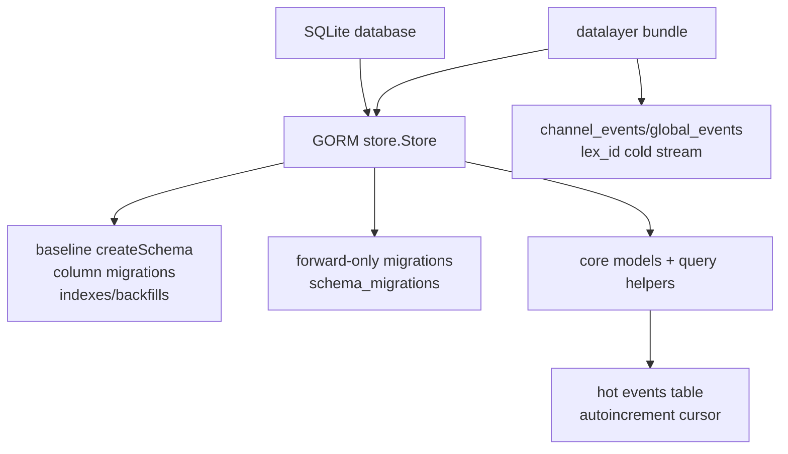

# Data Model And Migrations

当前 server-go 的持久化 runtime 是 SQLite + GORM，入口是 `store.Open` 和 `Store.Migrate`。schema 由 legacy baseline SQL 与 `internal/migrations` forward-only registry 共同维护；事件数据分成 hot `events.cursor` 与 datalayer cold `channel_events` / `global_events` 两条边界。证据：`packages/server-go/internal/store/db.go`、`packages/server-go/internal/store/migrations.go`、`packages/server-go/internal/migrations/migrations.go`、`packages/server-go/internal/migrations/registry.go`、`packages/server-go/internal/datalayer/events_store.go`。

## 负责什么

`internal/store` 负责当前 SQLite/GORM 连接、baseline schema、核心 GORM model、query helper、permissions、hot events、remote nodes、admin actions、agent state log 等持久化路径。证据：`packages/server-go/internal/store/db.go`、`packages/server-go/internal/store/models.go`、`packages/server-go/internal/store/migrations.go`、`packages/server-go/internal/store/queries.go`、`packages/server-go/internal/store/admin_actions.go`、`packages/server-go/internal/store/agent_state_log.go`。

`internal/migrations` 负责 numbered forward-only migration。它创建 `schema_migrations`，校验 version/name/Up，按 version 升序在单独 transaction 内执行 pending migration，并记录 applied row。证据：`packages/server-go/internal/migrations/migrations.go`、`packages/server-go/internal/migrations/registry.go`。

`internal/datalayer` 负责当前 DataLayer seam。它把 `store.Store` 包成 User/Channel/Message repository，把 presence tracker 包成 PresenceStore，把 EventBus 接到 SQLite cold event store。证据：`packages/server-go/internal/datalayer/factory.go`、`packages/server-go/internal/datalayer/repository.go`、`packages/server-go/internal/datalayer/v1_sqlite.go`、`packages/server-go/internal/datalayer/events_store.go`。

## 不负责什么

baseline migration 不负责承接新增 schema 变更。当前代码注释和 registry 约束都要求新 schema 追加到 `internal/migrations` 的 numbered migration，而不是继续扩张 legacy baseline blob。证据：`packages/server-go/internal/store/migrations.go`、`packages/server-go/internal/migrations/migrations.go`、`packages/server-go/internal/migrations/registry.go`。

forward-only engine 不提供 `Down()`。代码契约是已应用 migration 不编辑，通过追加新 migration 演进；engine 只记录和跳过 applied version。证据：`packages/server-go/internal/migrations/migrations.go`。

datalayer cold events 不等于 hot realtime replay。`EventBus.Publish` 才进入 `channel_events` / `global_events`；legacy hot `events` 由 store/API/WS 写入或 cursor allocator 分配。证据：`packages/server-go/internal/datalayer/v1_sqlite.go`、`packages/server-go/internal/datalayer/events_store.go`、`packages/server-go/internal/store/models.go`、`packages/server-go/internal/ws/cursor.go`。

## 和其他模块的接口

REST handlers 主要通过 `store.Store` query helpers 和 `Store.DB()` 访问数据；server 在 `SetupRoutes` 中把同一个 store 注入各 handler。证据：`packages/server-go/internal/server/server.go`、`packages/server-go/internal/api/channels.go`、`packages/server-go/internal/api/messages.go`、`packages/server-go/internal/api/admin.go`、`packages/server-go/internal/api/runtimes.go`。

WebSocket hub 通过 store 校验 API key、channel membership、remote node token，并使用 cursor allocator 与 event waiter 支撑 realtime。证据：`packages/server-go/internal/ws/client.go`、`packages/server-go/internal/ws/plugin.go`、`packages/server-go/internal/ws/remote.go`、`packages/server-go/internal/ws/hub.go`、`packages/server-go/internal/ws/cursor.go`。

DataLayer 对 server/api 暴露 `Storage`、`Presence`、`EventBus`、`UserRepo`、`ChannelRepo`、`MessageRepo`；当前实现仍落回 SQLite store 与 presence tracker。证据：`packages/server-go/internal/datalayer/factory.go`、`packages/server-go/internal/datalayer/storage.go`、`packages/server-go/internal/datalayer/presence.go`、`packages/server-go/internal/datalayer/eventbus.go`、`packages/server-go/internal/datalayer/repository.go`。

## SQLite/GORM Store

`store.Open(dsn)` 使用 GORM SQLite driver。file-backed DB 启用 `PRAGMA journal_mode=WAL`；所有 DB 执行 `PRAGMA foreign_keys=ON` 和 `PRAGMA busy_timeout=5000`；`:memory:` 设置 max open conns 为 1。证据：`packages/server-go/internal/store/db.go`。

`Store.DB()` 暴露底层 `*gorm.DB`。这不是只给 migration 使用：admin、artifact、runtime、datalayer event store 等当前路径也会直接执行 raw SQL 或 GORM scan。证据：`packages/server-go/internal/store/db.go`、`packages/server-go/internal/api/admin.go`、`packages/server-go/internal/api/artifacts.go`、`packages/server-go/internal/api/runtimes.go`、`packages/server-go/internal/datalayer/events_store.go`。

## Core Models

| 领域 | 当前存储 | 当前边界和证据 |
| --- | --- | --- |
| User / Agent | `users` | human 与 agent 共用 `users`；agent 通过 `role='agent'`、`owner_id`、API key 表达。user 还带 email/password hash、last seen、require mention、soft delete、disabled、org_id。证据：`packages/server-go/internal/store/models.go`、`packages/server-go/internal/api/agents.go`、`packages/server-go/internal/store/queries.go`。 |
| Channel | `channels`、`channel_members`、`channel_groups`、`user_channel_layout` | channel 带 visibility/type/topic/creator/org/position/group/archive/history；membership 是 `(channel_id,user_id)`，layout 是用户个人 channel preference。证据：`packages/server-go/internal/store/models.go`、`packages/server-go/internal/migrations/channel_user_channel_layout.go`、`packages/server-go/internal/api/channels.go`。 |
| Message | `messages`、`message_reactions` | message channel-scoped，带 sender/content/reply/edit/delete/org/edit_history/pinned_at；reaction 独立表。证据：`packages/server-go/internal/store/models.go`、`packages/server-go/internal/migrations/messages_edit_history.go`、`packages/server-go/internal/migrations/message_messages_pinned_at.go`、`packages/server-go/internal/api/messages.go`。 |
| Mention | `mentions`、`message_mentions` | baseline `mentions` 存 message/user/channel；forward migration `message_mentions` 用于 `@<target_user_id>` 路径和去重。证据：`packages/server-go/internal/store/models.go`、`packages/server-go/internal/store/migrations.go`、`packages/server-go/internal/migrations/message_mentions.go`、`packages/server-go/internal/api/mention_dispatch.go`。 |
| Event | hot `events`、cold `channel_events`、cold `global_events` | hot `events` 用 autoincrement cursor；cold events 用 lexicographic id、kind、payload、created_at、retention_days。证据：`packages/server-go/internal/store/models.go`、`packages/server-go/internal/migrations/channel_events.go`、`packages/server-go/internal/migrations/global_events.go`、`packages/server-go/internal/datalayer/events_store.go`。 |
| RemoteNode | `remote_nodes`、`remote_bindings` | remote node 属于 user，带 connection token、machine name、last seen、org_id；binding 把 node path 挂到 channel。证据：`packages/server-go/internal/store/models.go`、`packages/server-go/internal/api/remote.go`、`packages/server-go/internal/ws/remote.go`。 |
| Artifact | `artifacts`、`artifact_versions`、`artifact_anchors`、`anchor_comments`、message-backed comments | artifact channel-scoped，当前 schema 包括 type/title/body/current_version/archive/lock；version append-only；anchor/comment 有独立表，artifact comment 走 message namespace。证据：`packages/server-go/internal/migrations/canvas_artifacts.go`、`packages/server-go/internal/migrations/canvas_anchor_comments.go`、`packages/server-go/internal/api/artifacts.go`、`packages/server-go/internal/api/anchors.go`、`packages/server-go/internal/api/artifact_comments.go`。 |
| Iteration | `artifact_iterations` | iteration 是 artifact 上的 agent work request，记录 requested_by、intent_text、target_agent_id、state、created artifact version、error_reason、created/completed time。证据：`packages/server-go/internal/migrations/canvas_artifact_iterations.go`、`packages/server-go/internal/api/iterations.go`。 |
| Admin | `admins`、`admin_sessions`、`admin_actions`、`impersonation_grants` | admin 不在 `users`；session 是 opaque token；admin_actions 是 audit row；impersonation grant 单独存储。证据：`packages/server-go/internal/migrations/admin_admins.go`、`packages/server-go/internal/migrations/admin_sessions.go`、`packages/server-go/internal/migrations/admin_actions.go`、`packages/server-go/internal/migrations/admin_impersonation_grants.go`、`packages/server-go/internal/admin/auth.go`。 |
| Agent state | `agent_runtimes`、`agent_status`、`agent_state_log`、`agent_configs`、`presence_sessions`、`agent_invitations` | runtime process metadata、busy/idle/status、append-only state transition、server-owned config、live presence、agent invitation 是分表表达。证据：`packages/server-go/internal/migrations/agent_runtimes.go`、`packages/server-go/internal/migrations/agent_status.go`、`packages/server-go/internal/migrations/agent_state_log.go`、`packages/server-go/internal/migrations/agent_configs.go`、`packages/server-go/internal/migrations/agent_presence_sessions.go`、`packages/server-go/internal/migrations/community_agent_invitations.go`、`packages/server-go/internal/store/agent_state_log.go`。 |

## Baseline Migration

`Store.Migrate()` 先关闭 FK constraint，执行 `createSchema()`，再执行 guarded `applyColumnMigrations()` 和 `createSchemaIndexes()`，然后重新打开 FK。证据：`packages/server-go/internal/store/migrations.go`。

baseline `createSchema()` 创建原始核心表：`channels`、`users`、`messages`、`channel_members`、`mentions`、`events`、`user_permissions`、`invite_codes`、`message_reactions`、`workspace_files`、`remote_nodes`、`remote_bindings`、`channel_groups`。证据：`packages/server-go/internal/store/migrations.go`。

baseline column migration 用 `columnExists` guard 添加老表补列，例如 `users.email/password_hash/last_seen_at/owner_id/deleted_at/disabled`、`channels.type/visibility/deleted_at/position/group_id`、`messages.deleted_at`、`channel_members.last_read_at`。证据：`packages/server-go/internal/store/migrations.go`。

baseline 后置 backfill 和 cleanup 包括 default permissions、creator channel permissions、agent owner、positions、duplicate DM cleanup 和 extra DM members cleanup。证据：`packages/server-go/internal/store/migrations.go`。

## Forward-Only Migrations

`internal/migrations.Engine` 的 `EnsureSchema` 创建 `schema_migrations(version, applied_at, name)`，`Applied` 读取已应用版本，`Pending` 过滤并排序，`Run` 按 version 执行。证据：`packages/server-go/internal/migrations/migrations.go`。

engine validation 要求 version 大于 0、version 唯一、name 非空、`Up` 非 nil；每个 migration 在 `db.Transaction` 中执行，成功后插入 `schema_migrations`。证据：`packages/server-go/internal/migrations/migrations.go`。

registry 当前覆盖 organizations、agent invitations、admins/sessions、onboarding/default permissions/org backfills、presence sessions、artifacts、mentions、agent runtimes/configs/status/state log、admin actions、web push、edit history、cold events、capability backfill 等。证据：`packages/server-go/internal/migrations/registry.go`、`packages/server-go/internal/migrations/*`。

`cmd/collab/main.go` 在 `Store.Migrate()` 之后再次运行 `migrations.Default(s.DB()).Run(0)`；因为 engine 用 `schema_migrations` 跳过 applied migration，所以重复调用不会重复执行已记录的 version。证据：`packages/server-go/cmd/collab/main.go`、`packages/server-go/internal/store/migrations.go`、`packages/server-go/internal/migrations/migrations.go`。

## Hot Events And Cursor

hot realtime stream 的 durable table 是 baseline `events`：`cursor INTEGER PRIMARY KEY AUTOINCREMENT`、`kind`、`channel_id`、`payload`、`created_at`。证据：`packages/server-go/internal/store/models.go`、`packages/server-go/internal/store/migrations.go`。

poll/SSE/backfill 使用 hot `events` 和 hub waiters。`api.PollHandler` 挂 `/api/v1/poll`、`/api/v1/stream`、`/api/v1/events`；store 查询以 cursor 和 channel membership 过滤。证据：`packages/server-go/internal/api/poll.go`、`packages/server-go/internal/store/queries_phase3.go`、`packages/server-go/internal/ws/hub.go`。

WS cursor allocator 从 store 中的最新 cursor seed，然后为 artifact/task/iteration 等 realtime frame 发放 monotonic cursor。维护者不能假设每个 WS frame 都有一条对应 `events` row，必须看具体 push/write 调用点。证据：`packages/server-go/internal/ws/cursor.go`、`packages/server-go/internal/ws/artifact_updated_frame.go`、`packages/server-go/internal/ws/agent_task_state_changed_frame.go`、`packages/server-go/internal/store/queries_phase3.go`。

## Cold DataLayer Events

DataLayer EventBus 当前是 in-process fanout 加 SQLite cold store。`Publish` 先向 topic subscribers best-effort fanout，再异步把 payload 持久化到 `channel_events` 或 `global_events`。证据：`packages/server-go/internal/datalayer/v1_sqlite.go`、`packages/server-go/internal/datalayer/eventbus.go`、`packages/server-go/internal/datalayer/events_store.go`。

cold event routing 由 kind 决定：`channel.` 和 `message.` 前缀是 channel-scoped，topic 形如 `<kind>:<channelID>` 且 channel id 非空时进 `channel_events`；其它 kind 进 `global_events`。证据：`packages/server-go/internal/datalayer/v1_sqlite.go`、`packages/server-go/internal/datalayer/events_store.go`。

`channel_events` 和 `global_events` schema 都有 `lex_id`、`kind`、`payload`、`created_at`、`retention_days`；channel 表额外有 `channel_id` 和 `(channel_id, lex_id DESC)` 索引，global 表有 kind/lex 和 created 索引。证据：`packages/server-go/internal/migrations/channel_events.go`、`packages/server-go/internal/migrations/global_events.go`。

must-persist policy 定义在 `must_persist_kinds.go`：`perm.`、`impersonate.`、`agent.state`、`admin.force_` 不应被 retention 删除；默认 retention 函数返回 channel/message 30 天、agent_task/artifact 60 天、其它 90 天、must-persist -1。证据：`packages/server-go/internal/datalayer/must_persist_kinds.go`。

当前实现边界：SQLite `PersistChannel` / `PersistGlobal` 插入时没有写 `retention_days`；`EventsRetentionSweeper.RunOnce` 只删除 `retention_days IS NOT NULL AND retention_days >= 0` 的行。因此 policy 已定义，但当前 writer 不会自动把默认天数落到新 cold event row。证据：`packages/server-go/internal/datalayer/events_store.go`、`packages/server-go/internal/datalayer/events_retention.go`、`packages/server-go/internal/datalayer/must_persist_kinds.go`。

archive offloader 与 retention 分开。它统计 `channel_events` 行数，超过阈值时 attach sidecar SQLite，复制 cutoff 前 rows 到 `events_archive_<yyyy-mm>.db`，删除 source rows，并通过 EventBus 发布 `events.archive_offload` audit。证据：`packages/server-go/internal/datalayer/events_archive_offloader.go`、`packages/server-go/internal/server/server.go`。
