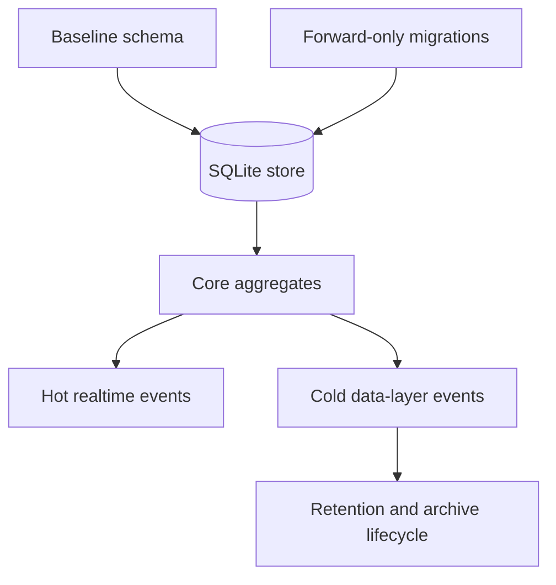

# Data Model And Migrations

## Role

The server data model is the authoritative persisted memory of the product. It stores identity, channel collaboration, messages, permissions, admin audit, remote-node registration, artifacts, agent runtime descriptors, presence-backed reachability, and event streams. The store is not just a database wrapper; it defines which concepts are durable, which are live-only, and which are append-only audit records.

Migrations define how that durable model evolves. The current architecture keeps an older baseline schema path and a numbered forward-only migration registry. The baseline keeps existing bootstraps and tests stable; the forward-only registry is the schema change mechanism for additive product work.

## Boundary

The store owns durable state. The realtime hub owns live socket presence, in-memory connection maps, and transient delivery buffers. The data layer owns abstraction boundaries over store-backed repositories, presence reads, storage, and cold events. These boundaries overlap deliberately, but they are not interchangeable.

Core user collaboration state is persisted in relational aggregates: users/agents, channels/memberships, messages/mentions/reactions, permissions, files, remote nodes, Helper enrollments, Helper jobs, artifacts/versions/comments/iterations, admin records, and agent state tables.

Channel membership carries agent attention policy. `channel_members.require_mention_policy` is a tri-state durable field with `inherit`, `on`, and `off`. `inherit` resolves through the agent user's global `require_mention` flag, `on` forces explicit mention in that channel, and `off` allows non-mention delivery only when the agent's global owner-controlled setting already permits broader delivery. Existing and legacy memberships default to `inherit`; policy changes do not rewrite historical messages or mention rows.

Event state is split. Hot events use a numeric cursor stream for user-facing realtime replay. Cold data-layer events use lexicographic ids and can carry row-level retention metadata for longer-lived event records. A feature must choose the correct stream explicitly.

## Collaborators

The REST layer reads and writes aggregates through store helpers or direct database access where a typed model has not been extracted. It also owns much of the validation around aggregate transitions.

The realtime hub depends on store state for authentication, channel access checks, remote-node lookup, and cursor seeding. It should not become the durable source of truth for collaboration state.

The auth layer depends on user and permission rows. Capability checks interpret permission rows and resource scope, including organization boundaries.

The admin layer depends on its own admin tables and audit tables. Admin sessions and user sessions are intentionally different aggregates. Canonical server audit storage is `audit_events`; `admin_actions` remains the compatibility view and store facade used by existing helpers.

The data layer wraps selected store behavior behind interfaces and provides the cold event writer. It gives newer code a stable seam without requiring every legacy handler to migrate at once.

## Internal Architecture

The storage runtime is SQLite through GORM. File-backed databases run with WAL and busy-timeout pragmas; in-memory test databases use a single connection to avoid isolated per-connection databases.

The baseline migration creates the original core tables, applies guarded column additions, creates indexes, performs backfills, and cleans up legacy direct-message state. It remains part of boot because the server still supports databases that were born before the numbered migration registry.

The forward-only migration engine is the additive schema mechanism. Each migration has a positive unique version, a name, and an `Up` function. Applied versions are recorded so startup can safely run the registry more than once. There is no rollback path in the engine; corrections are expressed as later migrations.

Core aggregates are intentionally not normalized into one generic resource table. Users, channels, messages, remote nodes, Helper enrollments, artifacts, admin rows, and agent state each retain domain-specific tables because they carry different ownership, privacy, and retention rules.

Helper enrollment state is stored in `helper_enrollments`. The row is the server-side Helper identity/status authority and binds `owner_user_id`, `org_id`, host label, optional `helper_device_id`, closed allowed-category JSON, status, last-seen timestamps, active credential lifecycle metadata, and terminal revoke/uninstall timestamps. One-time enrollment secrets and persistent Helper credentials are stored only as digests; raw values are returned only once by the API path that creates, claims, or rotates them. The active credential digest is replaced on rotation, while `credential_created_at`, `credential_rotated_at`, and `credential_generation` record lifecycle metadata. The table is separate from `remote_nodes`, `host_grants`, and `user_permissions`.

Helper enqueue state is stored in `helper_jobs`. The current aggregate records server-derived owner, org, enrollment, helper device, closed job type, category gate, schema version, normalized payload digest, server-owned manifest digest/binding metadata, optional bounded idempotency key, active-window idempotency scope, status, failure metadata, and server-generated TTL timestamps. Active idempotency is enforced through a partial unique index on `active_idempotency_scope`, so expired or terminal rows do not permanently block the same effective job later. The enabled OpenClaw/Plugin task types are `openclaw.configure_agent`, `openclaw.install_from_manifest`, `borgee_plugin.configure_connection`, and `service.lifecycle`; they use server-derived effective payloads and manifest/path, artifact/domain, or service-ID bindings. Plugin channel binding jobs derive a server-owned `borgee-plugin:` connection id and recheck owner/org/channel plus target-agent channel access before queueing. Service lifecycle jobs accept only `target=openclaw` plus `operation=restart`, store a payload containing only `operation=restart`, and bind to the logical service ID `openclaw-user`. State write, status collect, delegation revoke, and helper uninstall job types remain recognized but disabled until their task-owned authority lands. The table does not store raw Helper credentials, Remote Agent credentials, command text, service units, arbitrary service IDs, arbitrary paths, arbitrary domains, private file content, or unbounded logs. Payload and manifest digests remain internal storage/idempotency fields and are not part of the public enqueue response.

Agent state is deliberately multi-part: runtime process metadata, plugin socket liveness, presence sessions, busy/idle task state, and append-only state transitions are separate concepts. Collapsing them would lose information about whether an agent process is registered, connected, reachable, executing work, or historically failed.

## Key Flows

Boot migration flow: opening the store prepares SQLite runtime settings, baseline migration ensures the legacy schema shape, forward-only migrations apply additive schema, and backfills reconcile older rows with current invariants.

Write flow: a handler validates the operation, writes one or more aggregate rows, and then chooses side effects such as hot event rows, WebSocket fanout, cold event publication, audit rows, or push notification. Persistence and fanout are related but not automatically coupled.

Helper enrollment write flow: the human/member owner creates or revokes enrollment rows through user-authenticated routes scoped by owner and org. Role=`agent` API-key identities are not Helper enrollment owners. The local Helper claims with a one-time enrollment secret, then updates heartbeat, rotates its credential, or records helper-originated uninstall status with the current persistent Helper credential and matching helper device id. Rotation replaces the active credential digest; the previous credential becomes stale immediately and cannot heartbeat, rotate, or uninstall. Revoked or uninstalled rows are terminal for future heartbeat and rotation writes. Offline freshness is derived from `last_seen_at`; it is recoverable by the same valid Helper credential and device id, including the new credential after rotation.

Helper job enqueue flow: a human/member user-authenticated request to an enrolled Helper creates a queued job only after the server verifies owner, org, claimed Helper identity, non-terminal state, fresh `last_seen_at`, category delegation, closed job type, typed payload, target agent/channel access where applicable, and server-owned config/manifest binding. The client cannot supply owner, org, device, category, TTL, deadline, config version/hash, connection id, base URL, API key, credentials, command text, service ID, service unit, path, URL, or domain authority. Accepted jobs begin as `queued` with server TTL metadata; rejected enqueue attempts do not create executable queue rows.

Channel member attention-policy flow: a channel manager can update an agent member's per-channel policy through the user rail. The target must be an agent member of the same channel, DM channels are rejected, and cross-org callers fail before permission checks. Setting `off` is rejected when the agent's global `require_mention` remains true, so channel management can reduce or require attention but cannot broaden agent delivery beyond owner authorization. Channel member listing returns both the stored `require_mention_policy` and server-derived `effective_require_mention` so clients can display current delivery state without recomputing authority.

Channel membership and ownership mutations layer domain checks on top of permission rows. Leaving requires the caller to be a current member and not the channel creator. Adding/removing members and changing member attention policy require the manager to be a current channel member, and member removal cannot target the channel creator. Delete/archive require the authenticated user to be the channel creator after the relevant permission check, and cross-org channel management attempts fail closed.

`@Everyone` message flow: message creation treats `@Everyone` as a reserved content token and does not accept client-supplied recipient ids. The server computes recipients from channel membership, excludes the sender and soft-deleted users, records the computed targets in `message_mentions`, and dispatches through the same mention fanout path as explicit mentions. Explicit mentions are also parsed from persisted message content, not trusted from client recipient arrays. The flow adds no schema table or migration; it uses existing `channel_members`, `users`, `messages`, and `message_mentions` rows.

Hot event flow: user-facing realtime replay is based on an autoincrement cursor. Polling, streaming, and backfill clients consume cursor-ordered state, while WebSocket frame producers may allocate cursors for live delivery.

Cold event flow: data-layer publishers write to an in-process bus first and asynchronously persist to channel-scoped or global cold event tables. The cold event retention job is started by the server runtime, but its current sweeper only reaps rows with an explicit non-negative `retention_days`. The ordinary cold event writers currently insert without `retention_days`, so the per-kind default policy is not effective for those rows. Archive offload remains a separate cold table lifecycle path.

Admin audit flow: admin actions and impersonation grants are durable audit-oriented records. User-facing audit views and admin-facing audit views are different projections over related audit data.

## Invariants

- The SQLite store is the canonical persisted source for server-owned state.
- Baseline migration may remain for compatibility, but additive schema belongs in numbered forward-only migrations.
- Forward migrations are immutable once applied; changes are made by appending a later migration.
- Admin identity is stored outside the user aggregate.
- Agents are users for ownership and API-key purposes, but agent runtime state is stored in separate runtime/state aggregates.
- Helper enrollments and Helper jobs are distinct server-owned aggregates. Helper credentials do not authorize Remote Agent filesystem proxying, host grants, user API actions, app permissions, or user-rail Helper job enqueue. Helper jobs are typed enqueue records, not raw command execution records.
- Hot cursor events and cold data-layer events are separate streams with different identifiers and retention behavior; default per-kind cold retention is policy intent, not current behavior for rows written without `retention_days`.
- Append-only audit/state-log tables should not be rewritten to hide history.
- Organization and ownership fields are part of authorization, not merely display metadata.
- Channel-level agent attention policy is membership-scoped. It can narrow attention locally, but it cannot override the agent owner's global require-mention ceiling.
- `@Everyone` recipient history is server-computed from channel membership. Request-body recipient ids are rejected on message create.

## Non-Goals

The data model does not model plugin-local runtime secrets, LLM provider configuration, or a universal event table for all delivery paths. Helper jobs currently model enqueue authority, active-window idempotency, server-owned service lifecycle service-ID binding, and the metadata used to derive the read-only Configure OpenClaw closure projection. They do not model service-manager execution, local policy execution, credential history beyond current active-digest metadata, raw/bulk logs, or client-supplied Configure OpenClaw success state.

## Implementation Anchors

- `packages/server-go/internal/store/db.go`
- `packages/server-go/internal/store/models.go`
- `packages/server-go/internal/store/migrations.go`
- `packages/server-go/internal/store/queries.go`
- `packages/server-go/internal/store/helper_enrollment_queries.go`
- `packages/server-go/internal/store/helper_job_queries.go`
- `packages/server-go/internal/store/require_mention_policy.go`
- `packages/server-go/internal/api/messages.go`
- `packages/server-go/internal/api/mention_dispatch.go`
- `packages/server-go/internal/store/admin_actions.go`
- `packages/server-go/internal/store/agent_state_log.go`
- `packages/server-go/internal/migrations/migrations.go`
- `packages/server-go/internal/migrations/registry.go`
- `packages/server-go/internal/migrations/admin_admins.go`
- `packages/server-go/internal/migrations/admin_sessions.go`
- `packages/server-go/internal/migrations/agent_runtimes.go`
- `packages/server-go/internal/migrations/agent_state_log.go`
- `packages/server-go/internal/migrations/canvas_artifacts.go`
- `packages/server-go/internal/migrations/canvas_artifact_iterations.go`
- `packages/server-go/internal/migrations/channel_events.go`
- `packages/server-go/internal/migrations/global_events.go`
- `packages/server-go/internal/migrations/helper_enrollments.go`
- `packages/server-go/internal/migrations/helper_jobs.go`
- `packages/server-go/internal/migrations/channel_member_require_mention_policy.go`
- `packages/server-go/internal/datalayer/factory.go`
- `packages/server-go/internal/datalayer/v1_sqlite.go`
- `packages/server-go/internal/datalayer/events_store.go`
- `packages/server-go/internal/datalayer/events_retention.go`
- `packages/server-go/internal/datalayer/events_archive_offloader.go`
- `store.Store`
- `migrations.Engine`
- `datalayer.DataLayer`
