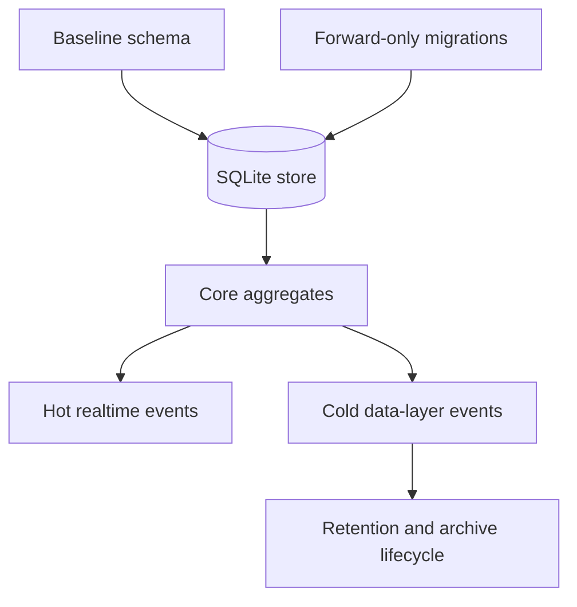

# Data Model And Migrations

## Role

The server data model is the authoritative persisted memory of the product. It stores identity, channel collaboration, messages, permissions, admin audit, remote-node registration, artifacts, agent runtime descriptors, presence-backed reachability, and event streams. The store is not just a database wrapper; it defines which concepts are durable, which are live-only, and which are append-only audit records.

Migrations define how that durable model evolves. The current architecture keeps an older baseline schema path and a numbered forward-only migration registry. The baseline keeps existing bootstraps and tests stable; the forward-only registry is the schema change mechanism for additive product work.

## Boundary

The store owns durable state. The realtime hub owns live socket presence, in-memory connection maps, and transient delivery buffers. The data layer owns abstraction boundaries over store-backed repositories, presence reads, storage, and cold events. These boundaries overlap deliberately, but they are not interchangeable.

Core user collaboration state is persisted in relational aggregates: users/agents, channels/memberships, messages/mentions/reactions, permissions, files, remote nodes, Helper enrollments, artifacts/versions/comments/iterations, admin records, and agent state tables.

Event state is split. Hot events use a numeric cursor stream for user-facing realtime replay. Cold data-layer events use lexicographic ids and can carry row-level retention metadata for longer-lived event records. A feature must choose the correct stream explicitly.

## Collaborators

The REST layer reads and writes aggregates through store helpers or direct database access where a typed model has not been extracted. It also owns much of the validation around aggregate transitions.

The realtime hub depends on store state for authentication, channel access checks, remote-node lookup, and cursor seeding. It should not become the durable source of truth for collaboration state.

The auth layer depends on user and permission rows. Capability checks interpret permission rows and resource scope, including organization boundaries.

The admin layer depends on its own admin tables and audit tables. Admin sessions and user sessions are intentionally different aggregates. Canonical server audit storage is `audit_events`; `admin_actions` remains the compatibility view and store facade used by existing helpers.

The data layer wraps selected store behavior behind interfaces and provides the cold event writer. It gives newer code a stable seam without requiring every legacy handler to migrate at once.

## Internal Architecture

The storage runtime is SQLite through GORM. File-backed databases run with WAL and busy-timeout pragmas; in-memory test databases use a single connection to avoid isolated per-connection databases.

The baseline migration creates the original core tables, applies guarded column additions, creates indexes, performs backfills, and cleans up legacy direct-message state. It remains part of boot because the server still supports databases that were born before the numbered migration registry.

The forward-only migration engine is the additive schema mechanism. Each migration has a positive unique version, a name, and an `Up` function. Applied versions are recorded so startup can safely run the registry more than once. There is no rollback path in the engine; corrections are expressed as later migrations.

Core aggregates are intentionally not normalized into one generic resource table. Users, channels, messages, remote nodes, Helper enrollments, artifacts, admin rows, and agent state each retain domain-specific tables because they carry different ownership, privacy, and retention rules.

Helper enrollment state is stored in `helper_enrollments`. The row is the server-side Helper identity/status authority and binds `owner_user_id`, `org_id`, host label, optional `helper_device_id`, closed allowed-category JSON, status, last-seen timestamps, and terminal revoke/uninstall timestamps. One-time enrollment secrets and persistent Helper credentials are stored only as digests; raw values are returned only once by the API path that creates or claims them. The table is separate from `remote_nodes`, `host_grants`, and `user_permissions`.

Agent state is deliberately multi-part: runtime process metadata, plugin socket liveness, presence sessions, busy/idle task state, and append-only state transitions are separate concepts. Collapsing them would lose information about whether an agent process is registered, connected, reachable, executing work, or historically failed.

## Key Flows

Boot migration flow: opening the store prepares SQLite runtime settings, baseline migration ensures the legacy schema shape, forward-only migrations apply additive schema, and backfills reconcile older rows with current invariants.

Write flow: a handler validates the operation, writes one or more aggregate rows, and then chooses side effects such as hot event rows, WebSocket fanout, cold event publication, audit rows, or push notification. Persistence and fanout are related but not automatically coupled.

Helper enrollment write flow: the owner user creates or revokes enrollment rows through user-authenticated routes scoped by owner and org. The local Helper claims with a one-time enrollment secret, then updates heartbeat or helper-originated uninstall status with the persistent Helper credential and matching helper device id. Revoked or uninstalled rows are terminal for future heartbeat writes. Offline freshness is derived from `last_seen_at`; it is recoverable by the same valid Helper credential and device id.

Hot event flow: user-facing realtime replay is based on an autoincrement cursor. Polling, streaming, and backfill clients consume cursor-ordered state, while WebSocket frame producers may allocate cursors for live delivery.

Cold event flow: data-layer publishers write to an in-process bus first and asynchronously persist to channel-scoped or global cold event tables. The cold event retention job is started by the server runtime, but its current sweeper only reaps rows with an explicit non-negative `retention_days`. The ordinary cold event writers currently insert without `retention_days`, so the per-kind default policy is not effective for those rows. Archive offload remains a separate cold table lifecycle path.

Admin audit flow: admin actions and impersonation grants are durable audit-oriented records. User-facing audit views and admin-facing audit views are different projections over related audit data.

## Invariants

- The SQLite store is the canonical persisted source for server-owned state.
- Baseline migration may remain for compatibility, but additive schema belongs in numbered forward-only migrations.
- Forward migrations are immutable once applied; changes are made by appending a later migration.
- Admin identity is stored outside the user aggregate.
- Agents are users for ownership and API-key purposes, but agent runtime state is stored in separate runtime/state aggregates.
- Helper enrollments are distinct server-owned aggregates. Their credentials do not authorize Remote Agent filesystem proxying, host grants, user API actions, or app permissions.
- Hot cursor events and cold data-layer events are separate streams with different identifiers and retention behavior; default per-kind cold retention is policy intent, not current behavior for rows written without `retention_days`.
- Append-only audit/state-log tables should not be rewritten to hide history.
- Organization and ownership fields are part of authorization, not merely display metadata.

## Non-Goals

The data model does not model plugin-local runtime secrets, LLM provider configuration, or a universal event table for all delivery paths. Helper enrollment currently does not model a job queue, lease/result state, service lifecycle execution, local policy engine, credential rotation history, or Configure OpenClaw success state.

## Implementation Anchors

- `packages/server-go/internal/store/db.go`
- `packages/server-go/internal/store/models.go`
- `packages/server-go/internal/store/migrations.go`
- `packages/server-go/internal/store/queries.go`
- `packages/server-go/internal/store/helper_enrollment_queries.go`
- `packages/server-go/internal/store/admin_actions.go`
- `packages/server-go/internal/store/agent_state_log.go`
- `packages/server-go/internal/migrations/migrations.go`
- `packages/server-go/internal/migrations/registry.go`
- `packages/server-go/internal/migrations/admin_admins.go`
- `packages/server-go/internal/migrations/admin_sessions.go`
- `packages/server-go/internal/migrations/agent_runtimes.go`
- `packages/server-go/internal/migrations/agent_state_log.go`
- `packages/server-go/internal/migrations/canvas_artifacts.go`
- `packages/server-go/internal/migrations/canvas_artifact_iterations.go`
- `packages/server-go/internal/migrations/channel_events.go`
- `packages/server-go/internal/migrations/global_events.go`
- `packages/server-go/internal/migrations/helper_enrollments.go`
- `packages/server-go/internal/datalayer/factory.go`
- `packages/server-go/internal/datalayer/v1_sqlite.go`
- `packages/server-go/internal/datalayer/events_store.go`
- `packages/server-go/internal/datalayer/events_retention.go`
- `packages/server-go/internal/datalayer/events_archive_offloader.go`
- `store.Store`
- `migrations.Engine`
- `datalayer.DataLayer`
