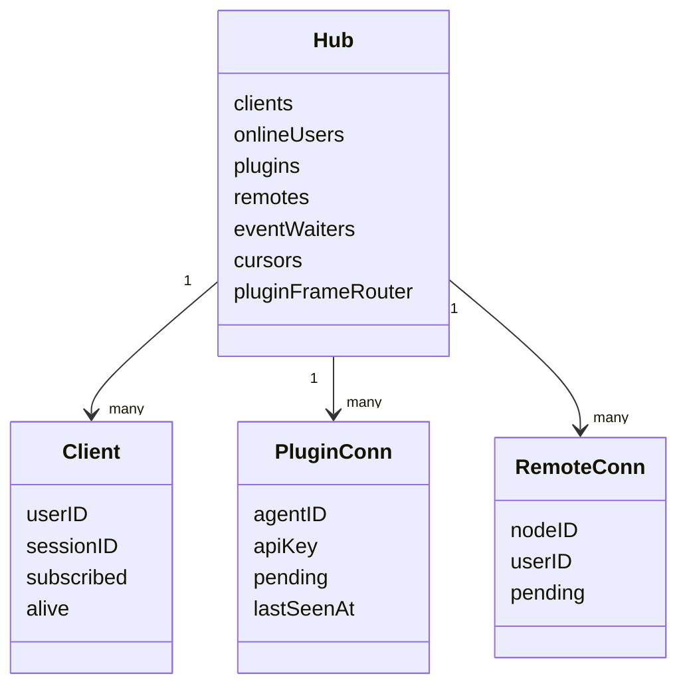
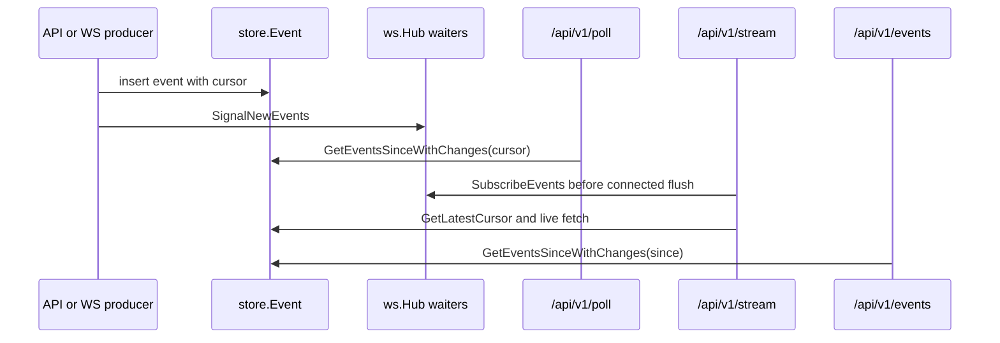

# Realtime And Events

This page covers only server-side realtime and event delivery. Browser hook behavior is cited only as an interface consumer, and OpenClaw package internals are covered under `../plugin/`.

## Responsibility Boundary

| Area | Responsible For | Not Responsible For | Interfaces | Evidence |
| --- | --- | --- | --- | --- |
| `ws.Hub` | In-memory browser clients, plugin connections, remote connections, event waiters, cursor allocator, broadcast helpers | Durable event history, OpenClaw account config, browser reducers | `BroadcastToChannel`, `BroadcastToUser`, `SubscribeEvents`, `SignalNewEvents`, plugin/remote maps | `packages/server-go/internal/ws/hub.go` |
| `/ws` | Browser websocket auth, subscribe/unsubscribe, typing, send_message, command registration, heartbeat | SSE/poll fallback, plugin BPP dispatch, remote-agent request proxy | WebSocket `/ws` | `packages/server-go/internal/ws/client.go` |
| `/api/v1/poll` and `/api/v1/stream` | Cursor fallback, long-poll waiters, SSE event stream, reconnect backfill | Browser UI merge logic, plugin package retry policy | `POST /api/v1/poll`, `GET/HEAD /api/v1/stream`, `GET /api/v1/events` | `packages/server-go/internal/api/poll.go` |
| `/ws/plugin` | Plugin socket auth, RPC replay into server HTTP handler, upstream BPP frame routing, plugin liveness timestamp | OpenClaw transport selection, SDK package API | WebSocket `/ws/plugin` | `packages/server-go/internal/ws/plugin.go`, `packages/server-go/internal/bpp/plugin_frame_dispatcher.go` |
| `/ws/remote` | Remote node token auth, online map, request/response frame plumbing | remote-agent local filesystem implementation | WebSocket `/ws/remote` | `packages/server-go/internal/ws/remote.go` |

## Hub Object Model

`ws.Hub` owns five in-memory coordination maps: browser `clients`, `onlineUsers`, plugin connections by agent/user id, remote connections by node id, and long-poll/SSE event waiters. It also owns `CursorAllocator`, the command store, optional presence writer, and the plugin BPP frame router seam. Evidence: `packages/server-go/internal/ws/hub.go`.

Browser `Client` objects carry user id, session id, optional agent id, subscribed channel set, send queue, and heartbeat liveness. Register/unregister updates Hub maps and, when the presence writer is wired, `presence_sessions`. Evidence: `packages/server-go/internal/ws/client.go`, `packages/server-go/internal/ws/hub.go`, `packages/server-go/internal/server/server.go`.

`PluginConn` carries agent id, API key, send queue, pending RPC request map, and `lastSeenAt`; every inbound frame touches `lastSeenAt`. `RemoteConn` carries node id, user id, send queue, and pending request map. Evidence: `packages/server-go/internal/ws/plugin.go`, `packages/server-go/internal/ws/remote.go`, `packages/server-go/internal/ws/hub.go`.

## Browser `/ws`

`/ws` authenticates by WebSocket subprotocol `Bearer,<api_key>`, `Authorization: Bearer`, `?token=`, auth cookie, or development bypass. After accept, the server registers the client, updates `last_seen`, broadcasts presence, starts a write pump, and reads JSON messages. Evidence: `packages/server-go/internal/ws/client.go`.

Supported inbound browser message types are `ping`, `pong`, `subscribe`, `unsubscribe`, `typing`, `send_message`, and `register_commands`. `send_message` validates channel membership/content type, writes the message, inserts a `store.Event`, signals event waiters, and broadcasts `new_message` to subscribed clients. Evidence: `packages/server-go/internal/ws/client.go`, `packages/server-go/internal/store/models.go`, `packages/server-go/internal/store/queries.go`.

The browser heartbeat is server-driven every 30 seconds: `Hub.StartHeartbeat` calls `heartbeatTick`; alive clients receive `{"type":"ping"}`, while stale clients are closed asynchronously. Evidence: `packages/server-go/internal/ws/hub.go`.

Client-side `useWebSocket` expects this interface: it re-subscribes channels on open, sends client pings every 25 seconds, persists numeric cursors, fetches `/api/v1/events` on reconnect, and normalizes wrapped versus direct push frame shapes. Evidence: `packages/client/src/hooks/useWebSocket.ts`, `packages/client/src/hooks/useWsHubFrames.ts`.

## Event Cursor, Poll, SSE, Backfill

The hot fallback cursor is `store.Event.Cursor`. `POST /api/v1/poll`, `GET /api/v1/stream`, and `GET /api/v1/events` all read through `GetEventsSinceWithChanges` or related cursor helpers, filtered to the authenticated user's accessible channels. Evidence: `packages/server-go/internal/api/poll.go`, `packages/server-go/internal/store/models.go`, `packages/server-go/internal/store/queries_phase3.go`.

`POST /api/v1/poll` accepts bearer/body API key/cookie auth, `cursor` or `since_id`, optional `timeout_ms`, and optional `channel_ids`. It clamps timeout to 60 seconds, returns up to 100 events, and waits on `Hub.SubscribeEvents` when no events are immediately available. Evidence: `packages/server-go/internal/api/poll.go`.

`GET /api/v1/stream` is SSE. It authenticates by bearer, `api_key` query, or cookie; subscribes to Hub waiters and snapshots `GetLatestCursor()` before writing `:connected`; sends heartbeat events every 15 seconds; refreshes channel membership every 60 seconds; supports `Last-Event-ID` backfill; and emits `event`, `id`, and `data` fields. Evidence: `packages/server-go/internal/api/poll.go`.

`GET /api/v1/events?since=N&limit=M` is synchronous reconnect backfill. It requires `since`, returns only `cursor > since`, clamps limit to 500, filters by channel membership, and mirrors the poll response envelope. Evidence: `packages/server-go/internal/api/poll.go`, `packages/server-go/internal/api/events_backfill_test.go`.

`CursorAllocator` is separate from the durable `store.Event` autoincrement. It is seeded from the latest durable cursor and is used for typed push frames such as `artifact_updated`, `agent_config_update`, `permission_denied`, and `agent_task_state_changed`. Evidence: `packages/server-go/internal/ws/cursor.go`, `packages/server-go/internal/ws/agent_config_push.go`, `packages/server-go/internal/ws/permission_denied_frame.go`, `packages/server-go/internal/ws/agent_task_state_changed_frame.go`.

## Plugin And Remote Sockets As Realtime Peers

`/ws/plugin` authenticates by bearer header or `?apiKey=`, resolves the key to a user, registers that user id as the plugin `agentID`, and reads frames. RPC frames use `{type,id,data}` for `api_request`, `api_response`, and `response`; `api_request` is replayed into the server HTTP handler with the plugin API key as bearer auth. Non-RPC frames are treated as BPP frames and routed through `PluginFrameDispatcher`. Evidence: `packages/server-go/internal/ws/plugin.go`, `packages/server-go/internal/server/server.go`, `packages/server-go/internal/bpp/plugin_frame_dispatcher.go`.

`/ws/remote` authenticates by bearer token or `?token=`, looks up `remote_nodes.connection_token`, updates last seen, registers a `RemoteConn`, and handles `ping`, `pong`, and `response`. REST remote-node handlers call the Hub adapter, which checks `Hub.GetRemote` and sends a request frame. Evidence: `packages/server-go/internal/ws/remote.go`, `packages/server-go/internal/api/remote.go`, `packages/server-go/internal/server/server.go`.

## Server-Side Non-Responsibilities

This page does not document OpenClaw account config, transport fallback implementation, outbound action mapping, or plugin local cursor files; those belong in `../plugin/`. It also does not describe admin SPA rendering or client reducer state; those belong in `../admin/` and `../client/`.
