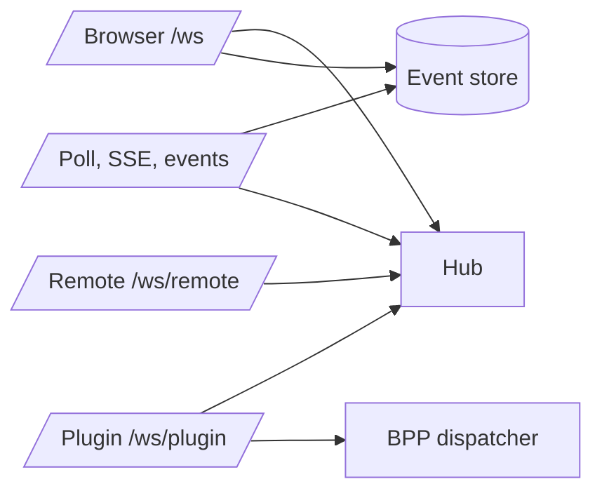

# Realtime And Events

## Role

The server realtime layer turns committed collaboration changes into live signals, and gives disconnected consumers a cursor-based way to catch up. It serves browsers, plugins, and remote agents, but keeps their socket protocols separate.

## Boundary

| Surface | Role | Collaborators | Out Of Scope |
| --- | --- | --- | --- |
| Browser websocket | Low-latency user fanout and channel subscription | User SPA, Hub, store | Plugin control protocol |
| Poll and SSE | Cursor-based event recovery and plugin-friendly streaming | Store, Hub waiters, browser/plugin clients | UI merge policy |
| Plugin websocket | Plugin RPC plus BPP ingress boundary | OpenClaw plugin, BPP dispatcher | General event broadcast to plugins |
| Remote websocket | Remote node liveness and request/response transport | remote-agent, remote REST handlers | Local filesystem policy |

## Internal Architecture

The Hub is the in-memory coordination point. It tracks browser clients, online users, plugin connections, remote connections, event waiters, and a cursor allocator for typed push frames. Durable event history stays in the store; the Hub only wakes waiters and fans out live frames.

Agent runtime status is derived from plugin liveness plus the runtime error tracker. The server exposes that derived snapshot through agent status reads and through agent direct-message peer payloads, so REST list responses can provide the same initial online/offline/error state that live websocket presence frames later refine in the browser.

## Key Flows

### Browser Push Plus Backfill

A browser websocket can subscribe to channels and send messages. The server validates and commits the write, records an event cursor, broadcasts a frame to subscribed clients, and wakes poll/SSE waiters. On reconnect, the browser asks for events after its last cursor before doing broader message reconciliation.

### SSE And Poll

SSE is a streaming view over the same cursor model, with heartbeat events and `Last-Event-ID` backfill. Poll is the long-poll fallback: it returns available events immediately or waits on a Hub signal until timeout. Both filter events through channel membership.

Message events carry the persisted message payload plus channel display metadata. `channel_type` distinguishes channel and DM conversations, and `channel_name` gives consumers a display-safe channel name while the raw channel id remains the routing key.

Mention dispatch has two target sources. Explicit `@agent` tokens are validated against channel membership, persisted to `message_mentions`, and dispatched through the mention fanout path. Agents whose effective per-channel require-mention policy resolves to off are also dispatched on ordinary channel messages, but those implicit delivery targets do not create `message_mentions` rows or alter the persisted message body. Offline agent fallback continues to use the existing owner system-DM path and does not forward the raw message body.

### Plugin Socket

The plugin socket has two shapes. RPC frames let a plugin call server HTTP handlers over the socket. Non-RPC frames are treated as plugin-to-server BPP frames and passed to the BPP dispatcher.

An active plugin socket is the liveness input for agent runtime status. Runtime errors recorded by the tracker take precedence over socket liveness; otherwise a connected plugin resolves as online and a missing plugin resolves as offline. This read path is shared by agent status endpoints and DM peer serialization.

### Remote Socket

The remote socket authenticates a remote node token and gives server REST handlers a live request/response channel to that node. The remote-agent process owns local filesystem operations.

## Invariants

- Durable event ordering is cursor-based.
- Live websocket fanout is best-effort; recovery uses poll/SSE/backfill or REST pull paths.
- Browser, plugin, and remote sockets are distinct protocols even though they share the Hub process.
- Plugin liveness is interpreted from plugin socket activity; browser heartbeat is separate.
- Per-channel non-mention agent delivery is server-derived from channel membership and agent owner policy; clients do not supply implicit recipient ids.

## Implementation Anchors

- Hub model: `packages/server-go/internal/ws`, `Hub`, `Client`, `PluginConn`, `RemoteConn`, `CursorAllocator`
- Browser websocket: `packages/server-go/internal/ws/client.go`
- Plugin websocket: `packages/server-go/internal/ws/plugin.go`
- Remote websocket: `packages/server-go/internal/ws/remote.go`
- Poll, SSE, backfill: `packages/server-go/internal/api/poll.go`
- Message and mention dispatch: `packages/server-go/internal/api/messages.go`, `packages/server-go/internal/api/mention_dispatch.go`
- Browser consumer contract: `packages/client/src/hooks/useWebSocket.ts`, `packages/client/src/hooks/useWsHubFrames.ts`
