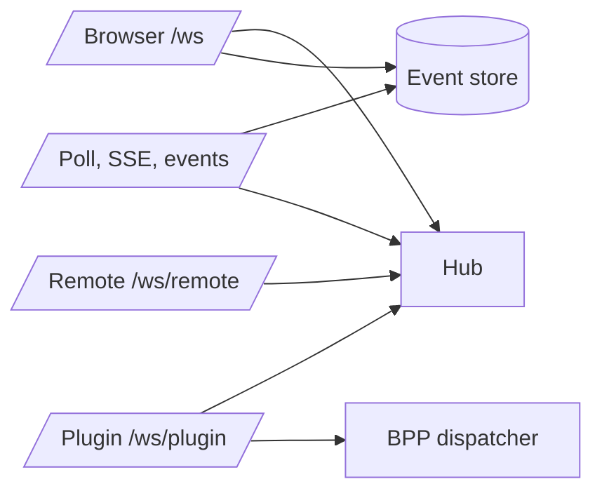

# Realtime And Events

## Role

The server realtime layer turns committed collaboration changes into live signals, and gives disconnected consumers a cursor-based way to catch up. It serves browsers, plugins, and remote agents, but keeps their socket protocols separate.

## Boundary

| Surface | Role | Collaborators | Out Of Scope |
| --- | --- | --- | --- |
| Browser websocket | Low-latency user fanout and channel subscription | User SPA, Hub, store | Plugin control protocol |
| Poll and SSE | Cursor-based event recovery and plugin-friendly streaming | Store, Hub waiters, browser/plugin clients | UI merge policy |
| Plugin websocket | Plugin RPC plus BPP ingress boundary | OpenClaw plugin, BPP dispatcher | General event broadcast to plugins |
| Remote websocket | Remote node liveness and request/response transport | remote-agent, remote REST handlers | Local filesystem policy |

## Internal Architecture

The Hub is the in-memory coordination point. It tracks browser clients, online users, plugin connections, remote connections, event waiters, and a cursor allocator for typed push frames. Durable event history stays in the store; the Hub only wakes waiters and fans out live frames.

## Key Flows

### Browser Push Plus Backfill

A browser websocket can subscribe to channels and send messages. The server validates and commits the write, records an event cursor, broadcasts a frame to subscribed clients, and wakes poll/SSE waiters. On reconnect, the browser asks for events after its last cursor before doing broader message reconciliation.

### SSE And Poll

SSE is a streaming view over the same cursor model, with heartbeat events and `Last-Event-ID` backfill. Poll is the long-poll fallback: it returns available events immediately or waits on a Hub signal until timeout. Both filter events through channel membership.

### Plugin Socket

The plugin socket has two shapes. RPC frames let a plugin call server HTTP handlers over the socket. Non-RPC frames are treated as plugin-to-server BPP frames and passed to the BPP dispatcher.

### Remote Socket

The remote socket authenticates a remote node token and gives server REST handlers a live request/response channel to that node. The remote-agent process owns local filesystem operations.

## Invariants

- Durable event ordering is cursor-based.
- Live websocket fanout is best-effort; recovery uses poll/SSE/backfill or REST pull paths.
- Browser, plugin, and remote sockets are distinct protocols even though they share the Hub process.
- Plugin liveness is interpreted from plugin socket activity; browser heartbeat is separate.

## Implementation Anchors

- Hub model: `packages/server-go/internal/ws`, `Hub`, `Client`, `PluginConn`, `RemoteConn`, `CursorAllocator`
- Browser websocket: `packages/server-go/internal/ws/client.go`
- Plugin websocket: `packages/server-go/internal/ws/plugin.go`
- Remote websocket: `packages/server-go/internal/ws/remote.go`
- Poll, SSE, backfill: `packages/server-go/internal/api/poll.go`
- Browser consumer contract: `packages/client/src/hooks/useWebSocket.ts`, `packages/client/src/hooks/useWsHubFrames.ts`
