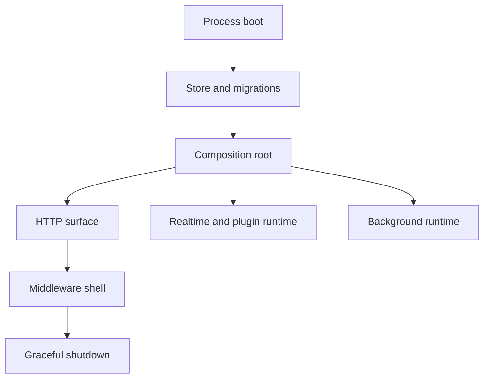

# Startup Routing

## Role

Startup and routing define how the server runtime becomes a process: configuration is converted into a store, migrations, admin identity, HTTP surface, realtime hub, plugin protocol handlers, middleware, static hosting, and background maintenance loops. This document describes that composition design, not the full endpoint catalog.

The routing layer is not just URL registration. It is the point where rails become enforceable: user REST routes get user auth, admin routes get admin session auth, WebSocket routes keep endpoint-specific authentication, and static hosting is kept behind API-aware fallbacks.

## Boundary

Startup owns process assembly and lifetime. It decides which concrete components exist in a running server and how they share a lifetime context. It does not own business decisions inside handlers, frame semantics inside BPP, or query semantics inside the store.

Routing owns the public HTTP shape at the rail level. It decides which rail a request enters, which middleware protects that rail, and which fallback catches unknown API/static paths. It does not make every route equivalent: user, admin, plugin, and remote-node paths keep different identity models.

The background runtime owns periodic work that should start with the server and stop with the server. These jobs are part of runtime health and data lifecycle, not request handlers hidden behind endpoints.

## Collaborators

The composition root collaborates with the store first because most other components need a stable database handle. Migrations and admin bootstrap run before request serving so the HTTP surface starts against a known schema and known admin identity model.

The realtime hub is constructed early because many handlers need live fanout interfaces. The hub also receives the server handler after routing is assembled so plugin API proxy frames can call into the same HTTP application surface without opening another network listener.

The data layer is built once and passed to handlers that use repository, presence, storage, or event-bus seams. Its concrete implementation is selected at composition time.

The BPP layer is wired through dispatchers and adapters. Plugin upstream frames remain protocol-owned, while the composition root supplies the concrete state and fanout sinks those frames need.

## Internal Architecture

Startup has three phases:

1. Process prerequisites: load config, build logger, open the store, run migrations, bootstrap admin.
2. Runtime composition: create hub, presence writer, data layer, server struct, routes, BPP dispatchers, push notifiers, and adapters.
3. Service lifetime: wrap the mux in middleware, start HTTP serving, run background loops, and stop on process cancellation.

The HTTP surface is a single mux with rail-specific protection. Public health/auth/manifest/static paths are intentionally limited. User REST paths are wrapped with user authentication and optional capability checks. Admin paths are wrapped with admin session authentication. WebSocket paths are mounted directly because their authentication must handle protocol-specific credential locations.

Middleware is a shell around the whole mux. Recovery sits outermost, request ID and logging wrap the request, CORS and security headers apply before route logic, and the rate limiter guards the final route execution. This keeps cross-cutting behavior uniform without embedding it into individual handlers.

Static hosting is part of routing but not a substitute for API errors. API-like and WebSocket-like paths must return API-shaped misses; browser routes can fall back to the SPA entrypoint.

## Key Flows

Boot flow: config and logger are created, the store opens, schema migration runs, admin identity is bootstrapped, the server runtime is composed, and HTTP serving begins. The store and server lifetime context are shared by the components created during composition.

Route flow: a request first crosses the global middleware shell, then enters the mux. The route selected by the mux determines whether user auth, admin auth, WebSocket endpoint auth, file serving, or static fallback handles the request.

Plugin proxy flow: after routes are mounted, the hub receives the full server handler. A plugin API request frame can then be translated into an in-process HTTP request against the same handler tree used by external clients.

Background flow: hub heartbeat, BPP heartbeat watchdog, retention sweepers, threshold monitoring, archive offload, and push-related notifiers run under the server lifetime model. They are not request scoped and must be safe to stop when the server context is cancelled.

Shutdown flow: the process listens for termination signals, shuts down HTTP serving with a bounded timeout, and cancels the server lifetime context so context-aware goroutines can exit.

## Invariants

- The production process has one server composition root.
- Schema and admin bootstrap complete before serving requests.
- User and admin routes are mounted on separate rails with separate middleware.
- WebSocket endpoints authenticate inside the endpoint handler because their credentials may live in headers, subprotocols, query params, or cookies.
- Plugin API proxying reuses the server handler; it does not create a second application stack.
- Background jobs are tied to the server lifetime context.
- API-like unknown paths must not fall through to the SPA.

## Non-Goals

Startup/routing does not define business authorization rules, migration contents, or BPP frame semantics.

## Implementation Anchors

- `packages/server-go/cmd/collab/main.go`
- `packages/server-go/internal/server/server.go`
- `packages/server-go/internal/server/middleware.go`
- `packages/server-go/internal/api/auth.go`
- `packages/server-go/internal/admin/auth.go`
- `packages/server-go/internal/admin/middleware.go`
- `packages/server-go/internal/auth/middleware.go`
- `packages/server-go/internal/ws/client.go`
- `packages/server-go/internal/ws/plugin.go`
- `packages/server-go/internal/ws/remote.go`
- `packages/server-go/internal/bpp/plugin_frame_dispatcher.go`
- `packages/server-go/internal/bpp/heartbeat_watchdog.go`
- `packages/server-go/internal/datalayer/events_retention.go`
- `packages/server-go/internal/datalayer/events_threshold.go`
- `packages/server-go/internal/datalayer/events_archive_offloader.go`
- `server.Server`
