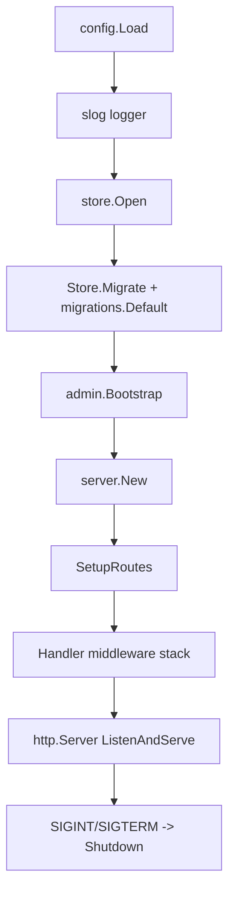

# Startup Routing

本文件从进程入口逐层展开到 route、middleware、static hosting 和后台 jobs。server 启动路径只有一个生产入口：`packages/server-go/cmd/collab/main.go` 调 `server.New(ctx, cfg, logger, s)`，`server.New` 再调用 `SetupRoutes()` 完成路由装配。证据：`packages/server-go/cmd/collab/main.go`、`packages/server-go/internal/server/server.go`。

## 负责什么

启动层负责把配置、logger、store、migration、admin bootstrap、server 组合根和 HTTP lifecycle 串起来。它不做业务 route 注册；业务 route 注册集中在 `Server.SetupRoutes()`。证据：`packages/server-go/cmd/collab/main.go`、`packages/server-go/internal/server/server.go`。

路由层负责把 public/user/admin/ws/static/upload 全部挂到一个 `http.ServeMux`，并把 user rail 包在 `auth.AuthMiddleware`、admin rail 包在 `admin.RequireAdmin`。证据：`packages/server-go/internal/server/server.go`、`packages/server-go/internal/auth/middleware.go`、`packages/server-go/internal/admin/middleware.go`。

middleware 层负责请求级 cross-cutting behavior：panic recovery、request id、request logging、CORS、安全响应头和 rate limit。证据：`packages/server-go/internal/server/server.go`、`packages/server-go/internal/server/middleware.go`。

后台 job 层负责跟 server lifetime context 绑定的 heartbeat、watchdog、retention、threshold monitor 和 archive offload。证据：`packages/server-go/internal/server/server.go`、`packages/server-go/internal/ws/hub.go`、`packages/server-go/internal/bpp/heartbeat_watchdog.go`、`packages/server-go/internal/datalayer/events_retention.go`、`packages/server-go/internal/datalayer/events_threshold.go`、`packages/server-go/internal/datalayer/events_archive_offloader.go`。

## 不负责什么

启动层不决定 handler 业务语义，也不把 admin/user 权限混在一起。`cmd/collab/main.go` 只执行 boot sequence，权限边界在 `internal/auth`、`internal/admin` 和 route mount 上体现。证据：`packages/server-go/cmd/collab/main.go`、`packages/server-go/internal/auth/permissions.go`、`packages/server-go/internal/admin/middleware.go`、`packages/server-go/internal/server/server.go`。

`internal/server` 不把 `api`、`ws`、`bpp` 互相直接耦合成循环依赖。它用 `hubBroadcastAdapter`、`hubPluginAdapter`、`pluginFrameRouterAdapter`、`hubLivenessAdapter`、`channelScopeAdapter`、`channelMemberFetcherAdapter` 等 adapter 做包边界胶水。证据：`packages/server-go/internal/server/server.go`、`packages/server-go/internal/ws/hub.go`、`packages/server-go/internal/bpp/plugin_frame_dispatcher.go`。

static hosting 不替代 API 404。`handleStatic` 遇到 `/api/`、`/admin-api`、`/ws` 前缀时返回 JSON 404，不把这些路径 fallback 到 SPA。证据：`packages/server-go/internal/server/server.go`。

## 和其他模块的接口

`cmd/collab` 只通过 Go package 调用 `config.Load`、`store.Open`、`Store.Migrate`、`migrations.Default(...).Run(0)`、`admin.Bootstrap` 和 `server.New`。证据：`packages/server-go/cmd/collab/main.go`。

`internal/server` 对外暴露 `Handler()` 和 `Hub()`；生产 HTTP server 只使用 `Handler()`，测试或相邻模块可读取 hub。证据：`packages/server-go/internal/server/server.go`。

`SetupRoutes` 对 `internal/api` 的接口是 handler struct + `RegisterRoutes` 风格方法；server 负责传入 `Store`、`DataLayer`、`Logger`、`Config`、auth middleware 和 hub/push adapters。证据：`packages/server-go/internal/server/server.go`、`packages/server-go/internal/api/*`。

## Process Startup

`cmd/collab/main.go` 先调用 `config.Load()`；development 使用 text slog handler，非 development 使用 JSON slog handler。证据：`packages/server-go/cmd/collab/main.go`、`packages/server-go/internal/config`。

数据库打开由 `store.Open(cfg.DatabasePath)` 完成。SQLite file DB 启用 WAL，所有 DB 打开 `foreign_keys=ON` 和 `busy_timeout=5000`，`:memory:` 限制为单连接。证据：`packages/server-go/cmd/collab/main.go`、`packages/server-go/internal/store/db.go`。

迁移执行两层：`s.Migrate()` 运行 baseline schema、guarded column migration、index/backfill/cleanup，并在内部运行 forward-only registry；`cmd/collab/main.go` 随后再次调用 `migrations.Default(s.DB()).Run(0)`，因为 `schema_migrations` 会跳过已应用版本，所以该调用是幂等的。证据：`packages/server-go/cmd/collab/main.go`、`packages/server-go/internal/store/migrations.go`、`packages/server-go/internal/migrations/migrations.go`。

admin bootstrap 在 server 创建前执行，缺少或错误的 admin env 会让生产入口 fail loud；`SetupRoutes` 里还会再次调用一次并记录错误。证据：`packages/server-go/cmd/collab/main.go`、`packages/server-go/internal/server/server.go`、`packages/server-go/internal/admin/auth.go`。

生产入口创建 `srvCtx` 传给 `server.New`，`http.Server` 使用 `srv.Handler()`，收到 SIGINT/SIGTERM 后用 15 秒 context 调 `httpServer.Shutdown`。证据：`packages/server-go/cmd/collab/main.go`。

## server.New

`server.New` 是 server-go 的组合根。它先创建 `ws.NewHub(s, logger, cfg)`，再尝试创建 `presence.NewSessionsTracker(s.DB())` 并注入 hub 的 presence writer。证据：`packages/server-go/internal/server/server.go`、`packages/server-go/internal/ws/hub.go`、`packages/server-go/internal/presence/tracker.go`。

`server.New` 随后创建 `datalayer.NewDataLayer(s, presenceTracker, logger)`。当前 DataLayer 包含 `Storage`、`Presence`、`EventBus`、`UserRepo`、`ChannelRepo`、`MessageRepo`，实现落在 SQLite store wrapper 与 in-process/cold event bus。证据：`packages/server-go/internal/server/server.go`、`packages/server-go/internal/datalayer/factory.go`、`packages/server-go/internal/datalayer/v1_sqlite.go`。

`Server` struct 创建后立即调用 `srv.SetupRoutes()`。随后 `hub.SetHandler(srv.Handler())` 让 plugin `api_request` 可以通过 in-process recorder 代理到同一套 HTTP handler。证据：`packages/server-go/internal/server/server.go`、`packages/server-go/internal/ws/plugin.go`。

BPP wiring 也在 `server.New` 完成。server 创建 `PluginFrameDispatcher`，注册 `agent_config_ack`、`reconnect_handshake`、`cold_start_handshake`、`task_started`、`task_finished`，再通过 `pluginFrameRouterAdapter` 注入 hub。证据：`packages/server-go/internal/server/server.go`、`packages/server-go/internal/bpp/plugin_frame_dispatcher.go`、`packages/server-go/internal/bpp/envelope.go`、`packages/server-go/internal/ws/plugin.go`。

`server.New` 启动两类 live goroutine：`hub.StartHeartbeat(ctx)` 和 `bpp.HeartbeatWatchdog.Run(ctx)`。watchdog 通过 `hubLivenessAdapter` 读取 plugin last seen，并通过 `agent.Tracker` 标记 stale agent error。证据：`packages/server-go/internal/server/server.go`、`packages/server-go/internal/ws/hub.go`、`packages/server-go/internal/bpp/heartbeat_watchdog.go`、`packages/server-go/internal/agent/state.go`。

## Route Mount

`SetupRoutes` 先挂 `GET /health` 和 user auth routes，再把 `GET /api/v1/users/me` 放在 `auth.AuthMiddleware` 后面。证据：`packages/server-go/internal/server/server.go`、`packages/server-go/internal/api/auth.go`。

user rail `/api/v1/*` 覆盖 users、layout、me grants、agent configs、host grants、agent state/recover/lifecycle、push subscriptions、PWA manifest、plugin manifest、channels/DM/messages/reactions/search/pin/edit、presence、agents/runtimes/invitations、commands、upload、workspace、remote、poll/SSE/events、artifacts/anchors/comments/iterations。证据：`packages/server-go/internal/server/server.go`、`packages/server-go/internal/api/channels.go`、`packages/server-go/internal/api/messages.go`、`packages/server-go/internal/api/agents.go`、`packages/server-go/internal/api/runtimes.go`、`packages/server-go/internal/api/artifacts.go`、`packages/server-go/internal/api/iterations.go`、`packages/server-go/internal/api/poll.go`。

admin rail 挂在 `/admin-api/*`。admin auth handler 挂 `/admin-api/auth/*` 和 `/admin-api/v1/auth/*`；业务 admin handler 挂 `/admin-api/v1/stats/users/invites/channels`，并额外挂 runtime metadata、audit log、multi-source audit、retention override、heartbeat lag、部分 readonly history endpoints。证据：`packages/server-go/internal/server/server.go`、`packages/server-go/internal/admin/auth.go`、`packages/server-go/internal/api/admin.go`、`packages/server-go/internal/api/runtimes.go`、`packages/server-go/internal/api/admin_endpoints.go`、`packages/server-go/internal/api/admin_audit_query.go`。

WebSocket routes 是 `/ws`、`/ws/plugin`、`/ws/remote`。三者都挂在 mux 上，不经过 HTTP user/admin middleware；各自 handler 内部执行自己的 token/cookie 校验。证据：`packages/server-go/internal/server/server.go`、`packages/server-go/internal/ws/client.go`、`packages/server-go/internal/ws/plugin.go`、`packages/server-go/internal/ws/remote.go`。

fallback 顺序在 `SetupRoutes` 末尾：`/api/v1/` 返回 not implemented，`/uploads/` 用 `http.FileServer` 服务 `cfg.UploadDir`，`/` 交给 `handleStatic`。证据：`packages/server-go/internal/server/server.go`。

## Middleware

`Server.Handler()` 的赋值顺序是 rate limit、security headers、CORS、logger、request id、recover；实际入站执行顺序是 recover -> request id -> logger -> CORS -> security headers -> rate limit -> mux。证据：`packages/server-go/internal/server/server.go`、`packages/server-go/internal/server/middleware.go`。

rate limiter 按 `(client IP, isAuth)` 建 token bucket；`/api/v1/auth/register` 使用 auth bucket，其它走 API bucket。development 且 header `X-E2E-Test: 1` 时跳过 rate limit。证据：`packages/server-go/internal/server/middleware.go`。

CORS 在 development 回显非空 Origin，非 development 只允许 `cfg.CORSOrigin`；它允许 credentials，并处理 OPTIONS preflight。证据：`packages/server-go/internal/server/middleware.go`。

request id middleware 生成 UUID 写入 `X-Request-ID` 和 request context；logger middleware 记录 method、path、status、duration、request_id；recover middleware 捕获 panic 并返回 500 JSON。证据：`packages/server-go/internal/server/middleware.go`。

## Static Client Hosting

`handleStatic` 对 `/admin` 和 `/admin/*` 优先服务 `admin.html`，其它非 API/WS 路径尝试从 `cfg.ClientDist` 找文件。证据：`packages/server-go/internal/server/server.go`。

如果请求路径没有扩展名且实际文件不存在，`handleStatic` fallback 到 `index.html`，用于 SPA route。带扩展名的缺失文件返回 `http.NotFound`。证据：`packages/server-go/internal/server/server.go`。

## Background Jobs

`server.New` 启动 hub heartbeat 和 BPP heartbeat watchdog。hub heartbeat 维护 live socket liveness；BPP watchdog 用 plugin last seen 阈值把 stale agent 标记为 error。证据：`packages/server-go/internal/server/server.go`、`packages/server-go/internal/ws/hub.go`、`packages/server-go/internal/bpp/heartbeat_watchdog.go`。

`SetupRoutes` 启动 auth retention sweeper、heartbeat retention sweeper、datalayer event retention sweeper、DB threshold monitor 和 events archive offloader。它们都使用 `s.ctx`，跟 server lifetime 绑定。证据：`packages/server-go/internal/server/server.go`、`packages/server-go/internal/auth/expires_sweeper.go`、`packages/server-go/internal/auth/heartbeat_retention_sweeper.go`、`packages/server-go/internal/datalayer/events_retention.go`、`packages/server-go/internal/datalayer/events_threshold.go`、`packages/server-go/internal/datalayer/events_archive_offloader.go`。

push gateway 在 `SetupRoutes` 中为 mention dispatcher 和 task lifecycle fanout 初始化。VAPID 配置不可用时降级到 noop gateway，不阻止 server 启动。证据：`packages/server-go/internal/server/server.go`、`packages/server-go/internal/push/gateway.go`、`packages/server-go/internal/push/mention_notifier.go`。
