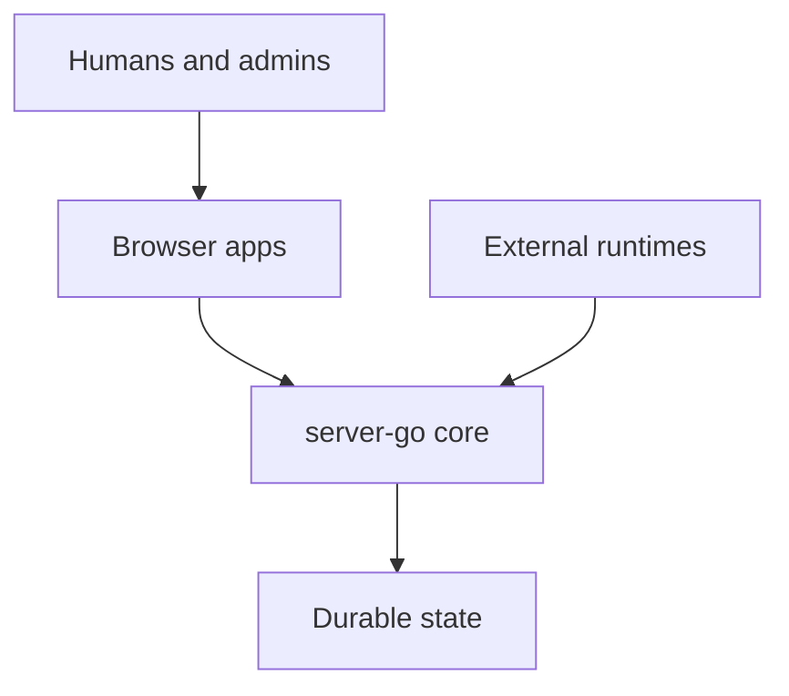

# System Overview

Borgee is a browser-first collaboration system with a Go server at the center. The server owns identity, authorization, durable collaboration state, static assets, realtime fanout, plugin protocol routing, and remote-node coordination. Browser apps, OpenClaw plugins, and remote agents connect to that core through narrow process boundaries.

## System Shape

The important design choice is centralization: server-go is the only component that owns collaboration state and policy. External runtimes can observe, send, or proxy through server contracts, but they do not become peer sources of truth.

## Boundaries

| Boundary | What Crosses It | Why It Exists |
| --- | --- | --- |
| Browser to server | User API calls, realtime frames, cursor backfill | Keeps UI optimistic but server-authoritative |
| Plugin to server | Event consumption, outbound actions, BPP/RPC frames | Lets OpenClaw act as a runtime without owning Borgee state |
| Remote-agent to server | File listing/read requests and responses | Keeps machine-local IO outside server-go |

## Design Principles

- The server is the source of truth for users, channels, messages, permissions, agent config, event cursors, and plugin liveness interpretation.
- Realtime is best-effort delivery plus cursor recovery; clients and plugins use backfill or pull paths to converge.
- BPP is a server/plugin control plane, not a replacement for all browser realtime.
- Remote-agent file access is a separate path from OpenClaw plugin-local file reads.

## Out Of Scope

This page does not describe UI component state, admin screen layout, or individual database migrations.

## Next Drill-Downs

| Need | Link |
| --- | --- |
| Process/runtime view | [Runtime topology](runtime-topology.md) |
| Request and event paths across processes | [Cross-process flows](cross-process-flows.md) |
| Data and state model | [server durable model](server/data-model-and-migrations.md), [client app state](client/app-shell-state.md), [realtime reconciliation](client/realtime-sync.md), [admin privacy/audit state](admin/privacy-audit.md) |
| Known limitations and review targets | [Known gaps](known-gaps.md) |
| Module entry points | [Server](server/), [client](client/), [admin](admin/), [plugin](plugin/), [remote-agent](remote-agent/), [security](security/), [E2E](e2e/) |

## Implementation Anchors

- Server composition: `packages/server-go/internal/server/server.go`, `Server`
- Hub and realtime model: `packages/server-go/internal/ws`, `Hub`, `Client`, `PluginConn`, `RemoteConn`
- Plugin package: `packages/plugins/openclaw/src`, `BorgeeEvent`, `ResolvedBorgeeAccount`
- Remote agent daemon: `packages/borgee`
